# Дизайн-документ: Прогрессия зданий

Этот документ описывает уровни, специализации и цепочки развития зданий.
Он намеренно устроен поперек эр: многие линии зданий проходят через несколько
эр, поэтому их проще читать как единую прогрессию.

Дизайн-описание эр находится в [eras_overview.md](eras_overview.md). Точные
условия переходов между эрами находятся в
[era_progression_gates.md](era_progression_gates.md).

## 1. Принципы апгрейдов

Улучшение здания не должно быть монотонным "+10% к эффективности". Каждый новый
уровень обязан давать хотя бы один заметный результат:

* уменьшать ручную рутину;
* визуально менять здание или поселение;
* открывать ресурс, рецепт, роль либо новый способ работы;
* повышать устойчивость к рискам текущей эры.

Улучшение требует ресурсов со склада. Обычные здания можно строить, сносить и
перестраивать. Уникальные landmark-здания улучшаются только на существующем
месте.

## 2. Общие правила

* Стартовые и временные постройки обычно имеют 2-3 уровня и затем заменяются
  капитальными зданиями следующей эры.
* Жилые здания имеют несколько уровней внутри эры. Каждый уровень повышает
  вместимость, комфорт и базовый Wellbeing.
* Производственные здания могут ветвиться при улучшении. Выбор специализации
  постоянен для конкретной постройки.
* Технологический потолок задается текущей эрой. Здание нельзя улучшить до
  материала или функции, которые недоступны в каталоге этой эры.
* Цепочка может быть "заменой", а не прямым апгрейдом. Например, палаточная
  кухня завершается костром для готовки 3-го уровня, а следующая эра строит
  `dugout_kitchen`.

## 3. Карта основных цепочек

```mermaid
graph TD
    subgraph Пища
        K1[Костер для готовки ур. 1 - cook_campfire] --> K2[Костер для готовки ур. 2 - cook_campfire_lvl2]
        K2 --> K3[Костер для готовки ур. 3 - cook_campfire_lvl3]
        K3 -. следующая эра .-> K4[Земляная кухня - dugout_kitchen]
        K4 --> K5[Глиняная пекарня - clay_bakery]
        K5 --> K6[Столовая - canteen]
        K6 --> K7[Каменная таверна - stone_tavern]
        K7 --> K8[Кирпичный ресторан - brick_restaurant]
    end

    subgraph Жилье
        H1[Жилая палатка ур. 1] --> H2[Жилая палатка ур. 2]
        H2 --> H3[Жилая палатка ур. 3]
        H3 -. Earth .-> E1[Землянка / земляной дом]
        E1 -. Clay .-> C1[Глиняный дом]
        C1 -. Wood .-> W1[Деревянный дом ур. 1]
        W1 --> W2[Деревянный дом ур. 2]
        W2 --> W3[Деревянный дом ур. 3]
        W3 -. Stone/Brick .-> B1[Каменный и кирпичный дом]
    end

    subgraph Торговля
        T0[Палаточный рынок - trade_tent] --> T1[Земляной рынок - earth_market]
        T1 --> T2[Глиняный рынок - clay_market]
        T2 --> T3[Деревянный рынок - wood_market]
        T3 --> T4[Каменный рынок - stone_market]
        T4 --> T5[Кирпичный рынок - brick_market]
    end

    subgraph Гигиена
        WC1[Туалет палаточный ур. 1] --> WC2[Туалет палаточный ур. 2]
        WC2 --> WC3[Туалет палаточный ур. 3]
        WC3 -. Earth .-> WE1[Земляной туалет ур. 1]
        WE1 --> WE2[Земляной туалет ур. 2]
        WE2 --> WE3[Земляной туалет ур. 3]
        WE3 -. Clay/Wood/Stone/Brick .-> WCN[Туалеты следующих эр]
    end

    subgraph Производство
        MY1[Двор материалов ур. 1] --> MY2[Двор материалов ур. 2]
        MY2 --> MY3[Двор материалов ур. 3]
        Saw[Пилорама - sawmill] -->|потребительская ветка| Furniture[Мебельная фабрика]
        Saw -->|строительная ветка| Construction[Завод стройматериалов]
    end
```

## 4. Палаточная эра

Палаточная эра намеренно неоднородна: одни постройки растут внутри лагеря,
другие являются одноуровневыми инструментами или мостом в `Era.EARTH`.

| Здание | Уровни | Прогрессия |
| :--- | :---: | :--- |
| **Главный костер** | 3 | Уникальный landmark. Ур. 1 занимает будущий footprint, снимает страх темноты и холода и открывает исследования. Ур. 2 добавляет общественное место и рабочее место чиновника. Ур. 3 открывает третий тир исследований и палаточный рынок. |
| **Жилая палатка** | 3 | Вместимость 1, 2 и 3 жителя. Улучшения отражают лучший каркас, утепление и внутренний порядок. |
| **Временная палатка** | 1 | Стартовое аварийное жилье на 4 жителей. Доступна сразу, но разбирается утром. |
| **Сборщик росы** | 3 | Базовый тент, улучшенный купол, затем резервуар 3x3 с фильтрацией. Растут скорость и запас воды. |
| **Палатка охотников-собирателей** | 3 | Ур. 1 добывает еду. Ур. 2 добавляет второго работника, охоту и шанс кожи. Ур. 3 повышает стабильность добычи кожи. |
| **Ремесленная палатка** | 3 | Растут скорость производства, число рабочих мест и качество изделий. |
| **Костер для готовки** | 3 | Ур. 1 -- малый костер с котлом, доступный со старта. Ур. 2 изучается и увеличивает запас еды. Ур. 3 добавляет навес и завершает палаточную кухонную ветку перед `dugout_kitchen`. |
| **Склад** | 2 | Ур. 1 -- открытая куча на 24 единицы. Ур. 2 (`warehouse_lvl2`) -- палаточный навес на 48 единиц с защитой от обычной порчи. |
| **Двор материалов** | 3 | Создает штатные места сборщиков и постепенно автоматизирует добычу веток и травы. |
| **Палаточный рынок** | 1 | Открывается главным костром ур. 3 у входной таблички. Расширяет торговлю и позволяет купить инструменты для `Era.EARTH`. |
| **Бадминтонная площадка** | 1 | Место отдыха и общения без обязательных улучшений. |

Полный сценарий стартовой прогрессии, ночи, порча, входная табличка и
выживание описаны в [tent_era_survival.md](tent_era_survival.md).

## 5. Земляная эра

Земляная эра заменяет временные палаточные решения более защищенными, но все еще
простыми постройками.

Ключевые линии:

* жилье: землянки и земляные дома;
* кухня: `dugout_kitchen` после `cook_campfire_lvl3`;
* рынок: `earth_market`;
* управление: `earth_assembly`;
* производство: `smithy`, `hide_worker`;
* гигиена: `toilet_earth -> toilet_earth_lvl2 -> toilet_earth_lvl3`;
* логистика: почта как ранний кандидат на постоянных курьеров.

Дизайн-роль: снизить уязвимость лагеря, закрепить профессии, дать первые
дороги и подготовить ремесленный переход к глине.

## 6. Глиняная эра

Глиняная эра открывает обжиг, посуду, улучшенную гигиену и более широкий
ассортимент товаров.

Ключевые линии:

* жилье: `clay_house`, `clay_lodge`;
* кухня: `clay_bakery`;
* производство: `clay_workshop`;
* рынок: `clay_market`;
* образование: `school` как ранняя школа;
* гигиена: `toilet_clay -> toilet_clay_lvl2 -> toilet_clay_lvl3`.

Дизайн-роль: превратить общину в ремесленное поселение и подготовить спрос на
дерево, доски и более сложную торговлю.

## 7. Деревянная эра

Деревянная эра строится вокруг пилорамы, досок, ратуши и полноценных домов.

Ключевые линии:

* производство: `sawmill`;
* еда: `farm`, `canteen`;
* управление: `wood_town_hall`;
* жилье: `house -> house_lvl2 -> house_lvl3`;
* рынок: `wood_market`;
* отдых: `park`;
* гигиена: `toilet_wood -> toilet_wood_lvl2 -> toilet_wood_lvl3`.

Дизайн-роль: расширить экономику, увеличить расстояния между зонами и сделать
логистику, дороги и транспорт заметной частью планирования.

## 8. Каменная эра

Каменная эра закрепляет городское управление, долговечные здания и постоянное
строительство.

Ключевые линии:

* управление: `stone_prefecture`;
* производство: `masonry_workshop`;
* строительство: `builders_guild`;
* еда и отдых: `stone_tavern`;
* жилье: `stone_house`;
* рынок: `stone_market`;
* гигиена: `toilet_stone -> toilet_stone_lvl2 -> toilet_stone_lvl3`.

Дизайн-роль: открыть более формальную экономику, автоматизировать строительство
и подготовить плотную кирпичную застройку.

## 9. Кирпичная эра

Кирпичная эра завершает доиндустриальный слой и подводит поселение к
мануфактурам, автомобилям и крупным сервисам.

Ключевые линии:

* производство: `brick_factory`, `materials_factory`;
* управление: `brick_city_hall`, `employment_office`;
* строительство: `construction_company`;
* еда: `brick_restaurant`;
* жилье: `brick_house`;
* рынок: `brick_market`;
* гигиена: `toilet_brick -> toilet_brick_lvl2 -> toilet_brick_lvl3`.

Дизайн-роль: перейти от поселкового масштаба к городскому, с плотной застройкой,
разделением труда и большими потоками ресурсов.

## 10. Эффекты высоких уровней

1. **Эффективность труда:** меньше работников производят тот же объем продукции.
2. **Экономия сырья и износа:** снижаются брак, расход материалов и износ
   инструментов.
3. **Логистика и зона действия:** склады расширяют радиус сбора, общественные
   здания покрывают больше жителей, рабочие здания публикуют более стабильные
   заказы.
4. **Уникальные рецепты:** высокий уровень производства открывает сложные
   товары, детали транспорта, мебель, инструменты и товары для Wellbeing.
5. **Визуальный прогресс:** новые уровни должны быть видны в мире, особенно в
   FPP.
