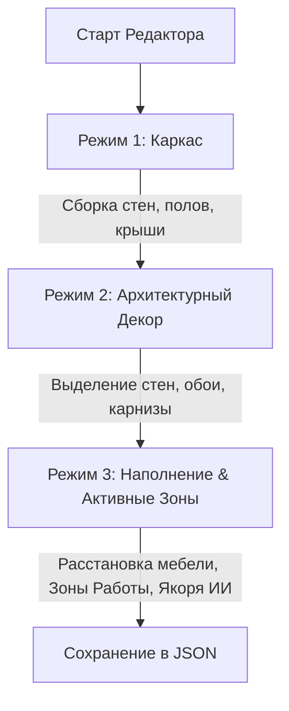
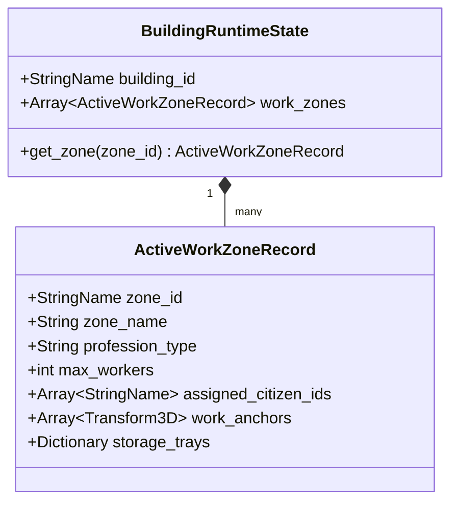
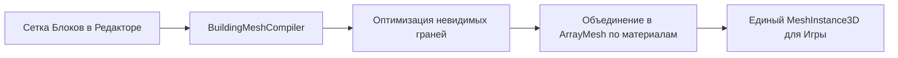

# Дизайн-документ: Модульный Редактор Зданий и Активные Рабочие Зоны

## 1. Концепция и Назначение

Модульный Редактор Зданий — это унифицированная система создания, отделки и настройки функциональности зданий для игры *Go To Happyness*. 

Главные цели:
1. **Единый код и формат**: Один и тот же редактор и открытый JSON-формат данных (`.gdbuilding.json`) используются как разработчиками для создания базовых чертежей (синек), так и игроками для строительства и отделки пользовательских построек.
2. **Многофункциональные здания и Активные Зоны**: Здание перестаёт быть монолитным объектом «одной профессии». Внутри одного здания (торговый центр, офисный комплекс, многоуровневый подземный бункер) можно создавать **несколько Активных Рабочих Зон** с индивидуальными профессиями, рабочими точками для ИИ жителей и локальными складами.
3. **Трехрежимный процесс постройки**: Поэтапная сборка от блочного каркаса до отделки поверхностей и расстановки мебели/зон.

---

## 2. Сетка и Модульные Блоки (Спецификация)

### 2.1. Воксельная сетка и Габариты
- **Базовый воксель**: $1.0\text{м} \times 1.0\text{м} \times 1.0\text{м}$ (`Vector3i`).
- **Суб-сетка для объектов/мебели**: $0.25\text{м} \times 0.25\text{м} \times 0.25\text{м}$.

### 2.2. Категории строительных блоков
| Тип блока | Размеры (м) | Назначение |
| :--- | :--- | :--- |
| **Полный куб (Cube)** | $1.0 \times 1.0 \times 1.0$ | Фундамент, массивные каменные/бетонные стены, колонны. |
| **Плита (Slab / Half-Block)** | $1.0 \times 0.5 \times 1.0$ | Межэтажные перекрытия, полы, потолки, низкие ступенчатые платформы. |
| **Стеновая панель (Wall Panel)** | $1.0 \times 1.0 \times 0.15$ | Тонкие перегородки, внешние и внутренние стены. |
| **Сдвоенный блок (Double Span)** | $1.0 \times 2.0 \times 0.15$ или $2.0 \times 1.0 \times 0.15$ | Каркасы двойных окон, дверных проемов, въездных ворот. |
| **Уголок (Corner Panel)** | $0.15 \times 1.0 \times 0.15$ | Стыки внешних и внутренних углов стен. |
| **Крышный скат (Roof Pitch)** | $1.0 \times 1.0 \times 1.0$ (клиновидный) | Скатные крыши, мансарды, пандусы. |
| **Лестница (Stairs)** | $1.0 \times 1.0 \times 1.0$ | Прямые и винтовые лестничные пролеты. |
| **Балюстрада / Забор** | $1.0 \times 0.5 \times 0.1$ | Ограждения балконов, перила лестниц, заборчики. |

---

## 3. Три Режима Редактирования (Workflow)



### 3.1. Режим 1: Строительство каркаса (Frame Construction)
- **Инструменты**: Установка блока, Кисть (протягивание стены/пола по линии/прямоугольнику), Ластик, Поворот (0°, 90°, 180°, 270°).
- **Выбор типа постройки**:
  - *Наземное здание*: Сетка ориентирована относительно земной поверхности; блоки фундамента автоматически заполняют неровности ландшафта.
  - *Подземный бункер*: Формирует «корпус бункера» и автоматически генерирует объем выемки грунта (маску вырезания ландшафта).

### 3.2. Режим 2: Архитектурный декор и отделка (Decor & Surface Finishes)
- **Умное выделение стен (Smart Wall Selector)**: Клик по панели стены автоматически выделяет всю непрерывную компланарную плоскость стены помещения.
- **Покраска и Материалы**: Нанесение материалов (обои, штукатурка, кирпич, фасадные панели, плинтусы) на выделенные плоскости.
- **Авто-карнизы и Профили (Perimeter Auto-Trim)**:
  - Алгоритм обхода контура стен замеряет замкнутый периметр комнаты или внешних стен на выбранной высоте $H$.
  - Автоматически инстанцирует 3D-профиль карниза, плинтуса или водосточного желоба по всему контуру.

### 3.3. Режим 3: Наполнение и Активные Зоны (Interior & Active Work Zones)
- **Расстановка объектов**: Мебель, станки, кровати, лампы, декор с привязкой к суб-сетке $0.25$м или со свободной ориентацией.
- **Инструмент «Создать Активную Зону»**:
  - Игрок/разработчик выделяет прямоугольную или свободную зону внутри здания.
  - Назначает **Название Зоны** (например, «Пекарня», «Аптека», «Кабинет Чиновника», «Грядки Гидропоники»).
  - Назначает **Профессию** (пекарь, врач, чиновник, исследователь, повар) и **Лимит Рабочих** (например, 2 человека).
  - Размещает **Якоря Работы ИИ (AI Work Anchors)**: Точные точки, где житель стоит/сидит во время работы (например, у печи, за столом, у кассы).
  - Размещает **Локальные Склады (Storage Trays)**: Входной поддон для сырья и выходной поддон для готовой продукции этой конкретной зоны.

---

## 4. Архитектура Активных Рабочих Зон (Active Work Zones System)

### 4.1. Связь с ИИ и Управлением Поселением
Раньше житель привязывался к зданию целиком. В новой системе:
1. **Чиновник (Bureaucrat)** или игрок в меню поселения видит список **Активных Зон** конкретного здания.
2. Житель назначается на конкретную **Активную Зону** (`zone_id`).
3. При наступлении рабочей смены `CitizenBrain` получает цель `WorkGoal`, путь ведут не просто к двери здания, а к **Якорю Работы** (`work_anchor`) внутри указанной зоны.



### 4.2. Примеры Многофункциональных Зданий
- **Торговый центр**: Зона 1 = «Продуктовая лавка» (Продавец), Зона 2 = «Магазин одежды» (Продавец), Зона 3 = «Столовая» (Повар).
- **Подземный бункер**: Зона 1 = «Теплица» (Ботаник), Зона 2 = «Генераторная» (Инженер), Зона 3 = «Лаборатория» (Исследователь), Зона 4 = «Спальный блок» (Жилые места).
- **Офисный центр**: Зона 1 = «Кабинет Чиновника», Зона 2 = «Архив», Зона 3 = «Исследовательский отдел».

---

## 5. Интеграция Разработчика и Игрока (Dev vs Player Mode)

### 5.1. Единый UI Сцены (`building_editor.tscn`)
Редактор реализован как стандартная 3D UI-сцена Godot: `res://game/features/buildings/presentation/editor/building_editor.tscn`.

- **Режим Игрока (Player Mode)**:
  - Путь сохранения: `user://custom_buildings/` и `user://saves/buildings/`.
  - Отображается игровой интерфейс строительства.
- **Режим Разработчика (Dev Mode)**:
  - Включается при запуске сцены с флагом `dev_mode = true` или из меню Godot `Tools -> Launch Building Editor`.
  - Открывает панели:
    - Сохранение напрямую в `res://data/blueprints/`.
    - Редактор рецептов и ресурсов для постройки (стоимость в дереве, камне и т.д.).
    - Экспорт оптимизированного меша в формат `.tres` / `.gltf`.
    - Визуализация навигационной сетки (NavMesh) и зон проходимости ИИ.

---

## 6. Открытый JSON-Формат (`.gdbuilding.json`)

```json
{
  "version": 1,
  "id": "bunker_alpha_complex",
  "name": "Bunker Alpha Multi-Block",
  "building_type": "underground",
  "grid_bounds": {"x": 12, "y": 4, "z": 12},
  "pivot_offset": {"x": 6, "y": 0, "z": 6},

  "blocks": [
    {"pos": [0, 0, 0], "block_id": "bunker_wall_concrete", "rot": 0},
    {"pos": [1, 0, 0], "block_id": "bunker_floor_slab", "rot": 0}
  ],

  "surface_finishes": [
    {
      "wall_face_id": "room1_north",
      "material_id": "plaster_white",
      "block_coordinates": [[0, 1, 0], [1, 1, 0], [2, 1, 0]]
    }
  ],

  "decor_trims": [
    {
      "trim_id": "cornice_molding_wood",
      "height_offset": 2.8,
      "path_points": [[0.0, 2.8, 0.0], [6.0, 2.8, 0.0]]
    }
  ],

  "work_zones": [
    {
      "id": "zone_hydroponics_1",
      "name": "Hydroponic Garden Bay",
      "profession_type": "botanist",
      "max_workers": 2,
      "work_anchors": [
        {"id": "spot_1", "pos": [2.0, 1.0, 3.0], "rot": [0, 0, 0], "action": "water_crops"},
        {"id": "spot_2", "pos": [4.0, 1.0, 3.0], "rot": [0, 0, 0], "action": "harvest"}
      ],
      "storage_trays": {
        "input": {"pos": [1.0, 1.0, 3.0], "capacity": 50},
        "output": {"pos": [5.0, 1.0, 3.0], "capacity": 100}
      }
    }
  ],

  "objects": [
    {"object_id": "planter_bed_hydro", "pos": [2.0, 1.0, 3.0], "rot": [0, 0, 0]}
  ],

  "construction_cost": {
    "concrete_block": 100,
    "steel_beam": 30
  }
}
```

---

## 7. Оптимизация и Компиляция Мешей (Performance Pipeline)

Чтобы здание из сотен воксельных блоков не нагружало Godot нодами:



1. **Удаление внутренних граней (Internal Face Culling)**: Грани блоков, соприкасающиеся с другими монолитными блоками, вырезаются на этапе генерации.
2. **Бачинг материалов**: Все блоки одного типа и материала объединяются в один `ArrayMesh` со статическими баундбоксами коллизий.
3. **LOD (Level of Detail)**: Для видов издалека (в стратегии) здание упрощается до внешнего габаритного меша.
