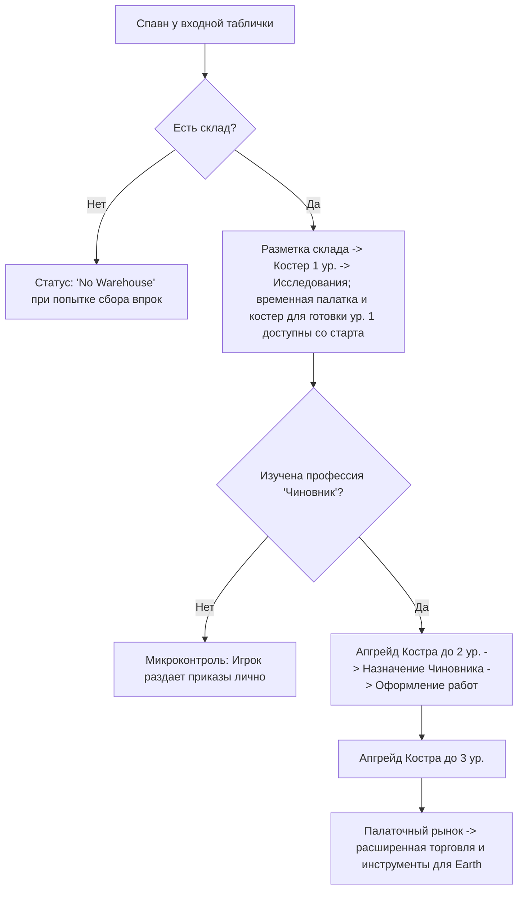

# Дизайн-документ: Выживание в Палаточной Эре (Tent Era Survival)

Связанные документы:

- [food_water_progression.md](food_water_progression.md) — прогрессия еды и воды от рюкзака до столовых;
- [storage_warehouses.md](storage_warehouses.md) — склады, рюкзак, кучи;
- [building_progression.md](building_progression.md) — цепочки зданий;
- [work_positions.md](work_positions.md) — рабочие позиции, FPP-роли, чиновник;
- [village_territory.md](village_territory.md) — область деревни, радиусы застройки, границы.

## 1. Введение и общая концепция

Настоящий документ описывает игровой процесс, стартовые условия и механику выживания на самом раннем этапе игры — в **Палаточной эре** (`Era.TENT`). Фокус этой фазы смещен с макро-планирования на интенсивный микроменеджмент, индивидуальные потребности поселенцев и непосредственное участие игрока в жизни лагеря.

Цель этапа — заложить основу поселения, пережить первые критические ночи, преодолеть погодные трудности и перейти от ручного распределения задач к базовой автоматизации управления.

---

## 2. Стартовые условия и снаряжение

### 2.1. Состав группы
Игра начинается с прибытия группы из 4 энтузиастов:
*   **Гендерный баланс:** 2 мужчины, 2 женщины.
*   **Случайные навыки:** Каждый поселенец генерируется со случайным набором небольших начальных навыков (например, повышенная скорость ходьбы, лучшее восстановление после сна, бонус к добыче дерева).
*   **Уникальный навык: «Мастер на все руки» (Jack of all Trades):**
    *   Случайно выпадает одному из поселенцев.
    *   Увеличивает скорость выполнения любых подручных работ (сбор мелких веток, травы) на 30%.
    *   Ускоряет освоение любых других профессий физического труда на 20%.

### 2.2. Стартовый общак (Ресурсы группы)
Группа прибывает с пустыми руками в плане сырья, но объединяет свои личные запасы:
*   **Провизия (Еда):** 16 единиц консервов/сухпайков. Этого запаса хватает ровно на **4 дня** автономного существования группы (потребление: 1 единица еды на человека в сутки). Данный лимит мотивирует игрока в течение 4 дней исследовать и построить *Палатку охотников и собирателей*.
*   **Вода:** несколько единиц воды — достаточно на 1-2 дня.
*   **Капитал (Деньги):** 500 монет в «общаке» общины. Деньги — виртуальный ресурс; они не занимают место в рюкзаке или на складе.
*   **Брезентовый тент:** 1 штука. Это физический предмет, который появляется в стартовом рюкзаке. С ним связана первая дилемма: сделать из него сборщик росы или укрыть им склад-кучу от дождя.

Если в стартовом сценарии нет готового склада, еда, вода и тент оказываются в **рюкзаке** — временной куче рядом с поселенцами. Их можно использовать как расходники сразу, но чтобы тент и стройматериалы стали «официальными» запасами, их нужно перенести в склад. Подробные правила — в [storage_warehouses.md](storage_warehouses.md).

### 2.3. Стартовое снаряжение и инструменты
*   **Бесконечное огниво (Flint & Steel):**
    *   Инструмент первой необходимости. Не имеет прочности/износа и не может быть потерян.
    *   Гарантирует невозможность софт-лока (ситуации, когда костер потух, а разжечь его нечем).
*   **Комплект строительных перчаток (Construction Gloves Set):**
    *   Перчатки — это общий ресурс поселения, а не личный инвентарь каждого жителя.
    *   Комплект имеет общий запас прочности (**Durability: 100%**).
    *   Прочность тратится при любой физической работе: рубка веток, сбор колючего кустарника, переноска камней, строительство. Палатки сборщиков материалов и строительные площадки тоже вносят свой процент износа.
    *   Когда прочность текущего активного комплекта падает до 0%, он считается изношенным, и автоматически начинает расходоваться следующий комплект из **рюкзака или склада**.
    *   Если не осталось целых комплектов перчаток ни в рюкзаке, ни на складе (все изношены):
        *   Все поселенцы, занятые физическим трудом, получают постоянный дебаф настроения «Ободранные руки» (Wellbeing падает на 1% в час во время работы).
        *   Скорость выполнения физических работ для всех снижается на 40%.
        *   Новые комплекты перчаток закупаются через входную табличку поселения.

---

## 3. Минимальная торговля через входную табличку

Входная табличка обозначает начало поселения и является единственным связующим звеном с внешним миром на старте. Минимальная аварийная торговля доступна сразу, но это не полноценный рынок и не экспортная экономика. Позже появится возможность написать на табличке выбранное игроком название поселения.

### 3.1. Механика заказа
1.  Игрок кликает на входную табличку для открытия интерфейса заказа.
2.  Начальный ассортимент: **Еда (сухпайки)**, **Вода**, **Комплекты строительных перчаток**, **Ведро**.
3.  **Ведро** сразу позволяет носить воду с водоёма, но стоит достаточно дорого,
    чтобы в самом начале покупать его было невыгодно. Оно видно в меню как
    стимул накапливать деньги через поденную работу.
4.  Игрок набирает товары в «корзину» и оплачивает заказ из стартового общака.
5.  Через табличку также можно отправить одного юнита на **поденную работу** во внешнее поселение на сутки — до исследования апгрейда доход случайный (4–12 монет).
6.  Изучив в меню исследований технологию **«Случайные заработки»**, доход от
    поденной работы становится постоянным и выше — фиксированные 16 монет (одноразовый апгрейд).

### 3.2. Экспедиция за покупками
*   После оплаты заказ не появляется мгновенно. Он переходит в статус «Ожидает доставки».
*   За покупками отправляется житель с дневным приказом **«Курьер»**, либо постоянный курьер, если такая профессия уже открыта. Игрок не может пойти сам, так как физически присутствует на карте и не может временно исчезать. Жителю выдается срочный приказ `&"trade_trip"`.
*   Срочный приказ не выдергивает жителя посреди текущего действия. Он резервируется как следующая работа и стартует, когда житель завершит текущий микро-шаг, если только игрок не отдаст прямой ручной приказ.
*   Юнит подходит к входной табличке и временно исчезает с карты (уходит во внешний мир).
*   **Время отсутствия:** 2 часа внутриигрового времени.
*   Через 2 часа юнит возвращается (спавнится у таблички) и относит товары на склад. Если доступного склада нет или все склады заполнены, он сбрасывает их на землю рядом с табличкой, образуя «открытую кучу ресурсов», которую необходимо разобрать. Подробнее о кучах и переполнении — в [storage_warehouses.md](storage_warehouses.md).

### 3.3. Логистика входной таблички
Входная табличка публикует особые логистические задачи, которые раньше закрывал
абстрактный резерв. В новой модели их выполняют только:

- **Курьер (дневной приказ)** — если игрок выдал дневной приказ конкретному жителю;
- **Курьер (постоянная профессия)** — если профессия уже открыта и оформлена через чиновника.

К этим задачам относятся:

- встреча новых жителей у таблички и сопровождение их в лагерь;
- поездка за покупками после оплаченного заказа;
- поденная работа/заработки во внешнем поселении;
- перенос доставленных товаров от таблички на склад или в открытую кучу.

Если нет активного дневного курьера и нет постоянного курьера, задача остается в
ожидании и UI должен явно показывать, что нужен дневной приказ «Курьер» или постоянный курьер.

---

## 4. Стартовая прогрессия и фазы управления

### 4.1. Фаза 1: Ручной микроконтроль (Игрок-ускоритель)
*   **Спавн:** Группа появляется на поляне у входной таблички.
*   **Блокировка сбора:** Пока не построен склад, поселенцы не могут накапливать ресурсы «впрок». Рюкзак не принимает добытую продукцию — это временное хранилище только для стартовых ресурсов и чит-добавлений. При попытке отправить юнита просто собирать ветки или траву без цели, он сбрасывает их и получает статус **«Нет склада»** (`status_no_warehouse`).
    *   *Исключение:* Перенос ресурсов с земли напрямую на чертеж строящегося здания разрешен без склада.
*   **Постройка склада:**
    1.  Игрок размещает чертеж склада (`Warehouse Level 1`). Чертёж можно
        поставить, даже если на складе ещё нет всех нужных материалов.
    2.  *Важная механика:* **Склад 1-го уровня — это просто открытая размеченная куча под открытым небом.** Он не имеет крыши и не защищает ресурсы от осадков, но выполняет роль первого логистического центра.
    3.  Все уже имеющиеся материалы **резервируются** под стройплощадку.
        Игрок может лично нести ресурсы руками, направить поселенцев вручную
        или (появившись позже) назначить курьеров. По мере доставки материалов
        строители работают над площадкой, даже если поставлены не все ресурсы.
    4.  Пока склад не построен, еда, вода и перчатки из рюкзака расходуются напрямую; стройматериалы и тент нужно перенести в склад, прежде чем они засчитаются в общие запасы.
    5.  Ранние поручения являются дневными приказами. Их можно выдать заранее,
        даже если сейчас нет подходящей работы: например, назначить строителя до
        размещения следующего чертежа. Если житель сегодня помогает стройке,
        собирает траву или работает «Курьером», поручение сбрасывается в конце
        рабочего дня. Вечером игрок может назначить новые поручения на следующий
        `workday_id`; утром жители начнут выполнять именно их.
*   **Баланс раннего сбора:** Первый цикл не должен превращаться в ожидание. Ориентир: полноценный стартовый набор (костер, палатка, костер для готовки, палатка собирателей, сборщик росы) должен собираться примерно за 2 игровых дня. Для этого:
    *   Новичок в палаточной эре переносит минимум 2 единицы веток/травы за ходку; навык влияет на скорость цикла, а не на порог «1 или 2».
    *   Герой в режиме от первого лица работает как ускоритель дефицита: за один сбор приносит несколько единиц и может закрывать нужный ресурс быстрее, чем авто-план.
    *   Стартовый запас может включать 6 веток, чтобы первый костер ставился сразу и показывал основную петлю без гринда.
*   **Разблокировка Костра 1-го уровня (Campfire Lvl 1):**
    *   Как только склад построен, поселенцы могут собирать ресурсы впрок. Игрок размещает чертёж Костра 1-го уровня и может строить его постепенно — стартовой огневой точки у входной таблички нет. Чертёж разрешается ставить без полных материалов; курьеры доставят их со склада, а строители работают по мере поступления.
    *   **Механика апгрейда костра:** В лагере может быть только **один** Главный костер. Он является ключевым ориентиром (landmark) — его **нельзя сносить или свободно строить в произвольных местах**. Вместо этого игрок выбирает существующий костер и нажимает кнопку **«Улучшить» (Upgrade)**, что запускает процесс улучшения с резервированием и доставкой ресурсов со склада. Костер, как и любой другой источник огня, может погаснуть во время дождя или от нехватки дров, после чего его нужно заново разжечь.
    *   **Эффекты Костра 1-го уровня:**
        *   Снимает дебаф «Страх темноты и холода» (отсутствие активного огня в лагере).
        *   Открывает доступ к **Системе Изучения (Research System)**.
        *   *Временная палатка* (Temporary Tent) и *Костер для готовки ур. 1*
            доступны со старта. Изучения требуют уже улучшенные уровни и
            специализированные постройки.
    *   **Постройка и снос зданий:** В отличие от костра, все палатки, склады и костры для готовки являются зданиями. Игрок волен размещать их чертежи, строить силами поселенцев или сносить при необходимости перепланировки лагеря.

#### 4.1.1. Хранение, порча и аварийные кучи
Палаточная эра использует несколько уровней хранения, чтобы игрок почувствовал переход от временного лагеря к организованному быту. Детальные правила складов, рюкзака и куч — в [storage_warehouses.md](storage_warehouses.md).

| Уровень | Образ | Вместимость | Правило |
| :--- | :--- | :---: | :--- |
| **Рюкзак** | Стартовая сумка/куча у поселенцев | — | Временное хранилище стартовых ресурсов и чит-добавлений; не работает как склад. |
| **Склад-куча под открытым небом** (`warehouse`) | Размеченная куча материалов | 24 | Бесплатен, разрешает накопление и логистику, но не защищает ресурсы. |
| **Склад с соломенным навесом** | Соломенный навес над кучей | 48 | Требует изучения соломенных построек; товары почти не портятся, но здание изнашивается. |
| **Склад с брезентовым навесом** | Брезентовый навес | 72 | Требует брезента и торговли; защищает содержимое. |
| **Брезентовая накидка над кучей** | Стартовый тент над складом | 24 | Защищает от дождя, но не увеличивает вместимость; расходует стартовый тент. |

Открытые кучи каждый день теряют часть органики даже без дождя: еда — до 10% в сутки, трава/ветки/бревна/доски — до 5% в сутки. Камень, глина и кирпич не распадаются. Дождь ускоряет этот процесс по правилам раздела 6.1.

Если суммарный запас поселения превышает защищенную вместимость складов, излишек остаётся в кучах и портится. При сносе или разрушении здания на месте появляется временная куча: в неё возвращается часть материалов здания, а при сносе склада — ещё и его содержимое. Такие кучи должны быстро разбираться курьерами, иначе органика в них продолжает пропадать.

### 4.2. Фаза 2: Автоматизация (Костер 2-го уровня и Чиновник)
*   Изначально в игре нет автоматического распределения труда. Игрок должен самостоятельно управлять жителями и отдавать приказы вручную.
*   Для перехода к автоматизации труда необходимо:
    1.  Накопить ресурсы, выбрать Костер 1-го уровня и нажать кнопку **«Улучшить»** для перехода на **Костер 2-го уровня** — **Лобное место**.
    2.  После апгрейда костра разблокировать в системе исследований технологию **«Чиновник» (Official)**.
    3.  Назначить юнита (это может быть сам игрок в режиме мэра или любой из компаньонов) на рабочее место Чиновника у Главного костра.
*   **Результат:** Чиновник берет на себя оформление труда: ведет учет жителей без постоянной работы и направляет их на свободные вакансии зданий (например, в палатку собирателей или двор материалов) согласно приоритетам на `OrderBoard`.
*   **Режимы авторитета:** Главный герой не получает роль чиновника на старте и является обычным жителем без постоянной работы. Игрок сам выбирает, кого назначить чиновником. До назначения чиновника автоматизированная система работников недоступна: пользователь лично раздает указания каждому жителю. После назначения чиновник ведет учет постоянных вакансий, но дневные команды игрока остаются доступны.

### 4.3. Автоматизация сбора через двор материалов
Ручной сбор должен иметь понятную точку выхода. `materials_yard` в палаточной эре дает постоянные рабочие места сборщикам материалов и автоматизирует добычу веток/травы.

До постройки двора игрок выдает жителям дневные приказы на сбор. После постройки двора и назначения работников через чиновника сбор становится штатной профессией: работники двора сами выбирают, что важнее для лагеря сейчас, и сдают ресурсы на склад. Это обучающая арка: сначала игрок гоняет людей вручную, затем строит двор и освобождает внимание для выживания, стройки и планирования.

### 4.4. Палаточный рынок и инструменты перехода
После изучения **Торговли** на соломенном уровне открывается строительство
**соломенного палаточного рынка** у входной таблички. Рынок превращает аварийную
закупку в расширенную торговлю:

*   появляются более дорогие товары, включая брезент и ремесленные товары;
*   торговые поездки продолжают выполняться через `trade_trip`, но становятся плановой работой курьеров; до постоянного курьера их можно закрывать дневным приказом «Курьер»;
*   экспортная торговля и широкий ассортимент остаются будущим развитием рынка, а не условием самого перехода эпохи.

Для перехода в Земляную эру нужен **брезентовый палаточный рынок** — именно там
продаются инструменты и чертежи следующей эры. Таким образом, чтобы купить
инструменты, игроку уже нужно развить торговлю и базовую экономику лагеря.

---

## 5. Механика Первой Ночи и Убежища

Выживание в первую ночь — ключевой челлендж палаточной эры. Игроку необходимо правильно рассчитать тайм-менеджмент первого дня.

### 5.1. Временная палатка (Temporary Tent)
*   **Вместимость:** Вмещает всю группу (4 человека).
*   **Стоимость постройки:** Требует небольшого количества веток и сухой травы. На сбор ресурсов и постройку уходит около 4-5 игровых часов совместной работы.
*   **Опциональность:** Временная палатка — один из способов дать группе ночлег в первый день. Она **не обязательна**; если группа остаётся без жилья, с **22:00** до **06:00** жители без крова получают дебаф «Ночлег под открытым небом».
*   **Срок службы:** Палатка не разрушается автоматически. При сносе или разрушении на землю выпадает часть ресурсов, потраченных на её постройку.
*   **Автоматическое заселение:** В отличие от обычных домов, палатка не требует ручного размещения юнитов. При завершении строительства все unhoused-жители автоматически заселяются в палатку (до её вместимости). Кнопка «Settle unhoused resident» в меню палатки скрыта.
*   **Заказ новых юнитов:** Кнопка «Order a resident» в меню палатки активна только если текущее число жильцов меньше вместимости (4). Заказ ограничен **1 юнитом в день** на палатку. Новый юнит прибывает через входную табличку, как и при заказе через обычный дом. Кнопка не блокируется наличием unhoused-жителей (в отличие от обычных домов).

### 5.2. Дебафы отсутствия жилья (Wellbeing Decay)
*   В **22:00** все жители, не имеющие спального места, получают статус **«Ночлег под открытым небом»**.
*   Данный статус запускает быстрое снижение удовлетворенности (Wellbeing) — по **3% в час**.
*   Дополнительно снижается качество восстановления во время сна на земле (на 50%).
*   При падении Wellbeing до 0% житель впадает в депрессию и при первой возможности навсегда уходит из поселения во внешний мир через входную табличку.

#### 5.2.1. Механика мягкого перезапуска (Lone Player Protection & Gradual Recovery)
*   **Правило:** Игра не допускает ситуации, когда на карте остается только сам игрок без рабочей силы, что привело бы к завершению игры (Game Over). Вместо этого запускается система мягкого восстановления лагеря.
*   **Первая стадия (Прибытие лидера спасения):** Если из-за низкого Wellbeing последний (четвертый) NPC-поселенец покидает карту:
    *   Запускается таймер ожидания (24 часа).
    *   Через входную табличку в лагерь приходит **один новый случайный NPC-беженец**.
    *   Его встречает житель с дневным приказом «Курьер» или постоянный курьер. Если такого исполнителя нет, новичок ждет у таблички, а UI показывает задачу встречи.
    *   Он приносит минимальный аварийный комплект припасов: 100 монет, 4 единицы еды, 1 комплект строительных перчаток.
*   **Вторая стадия (Постепенное восполнение группы):**
    *   Пока численность NPC-поселенцев в лагере меньше стартовых 4 человек, игра продолжает с периодичностью в 24–48 часов присылать по одному новому выжившему.
    *   Каждый новый поселенец прибывает через входную табличку.
    *   Процесс продолжается до тех пор, пока группа снова не достигнет **4 человек**.
    *   *Игровой смысл:* Это позволяет игроку сделать «работу над ошибками», не теряя прогресс постройки лагеря, и начать выживание заново с новыми силами.

### 5.3. Механика пропуска ночи (Skip Night)
*   Игрок может нажать кнопку «Пропустить ночь» после окончания выбранного рабочего дня (в том числе до 22:00). Это сознательно завершает оставшуюся вечернюю часть дня и перематывает время на 06:00. Кнопка недоступна, пока действует хотя бы один приказ «Работать ночью и следующий день».
*   **22:00 — не условие пропуска:** это время начала ночных дебафов для жителей без жилья и/или огня. При пропуске ночи эти дебафы и их последствия все равно рассчитываются для периода с 22:00 до 06:00.
*   Перемотка сохраняет мировые позиции жителей. Утром им выдаются новые рабочие задания, но они не телепортируются к входной табличке.

Длительность рабочего дня и ночные приказы из меню костра определены в
[labour_time_and_overtime.md](labour_time_and_overtime.md). Постоянного
переключателя ночных смен в дизайне нет.
*   **Ночные происшествия:** Пропуск ночи запускает генерацию случайного негативного события, которое выводится в лог сообщений утром:
    *   *«Барсуки-воришки пробрались в лагерь и утащили [3-5] единиц еды со склада/кучи.»*
    *   *«Бродячая дикая корова забрела на поляну и сжевала [10-15] единиц травы, приготовленной для строительства.»*
    *   *«Ночной порыв ветра раскидал незакрепленные ветки. Потеряно [5-8] единиц дерева.»*
    *   *«В лагерь забежали еноты и погрызли запасные строительные перчатки (снижение прочности случайных перчаток на складе на 20%).»*

---

### 5.4. Промысел и поденная работа
*   **Дом охотников и собирателей:** одно рабочее место на первом уровне, два на втором и три на третьем. Работники выбирают свободный источник пищи возле леса: дикое растение или животное на поляне.
*   **Источники пищи:** растение дает один сбор и появляется вновь спустя некоторое игровое время. Животные отображаются временными прямоугольниками, перемещаются по поляне и также появляются вновь после добычи.
*   **Логистика пищи:** работник возвращает добычу к своему дому и ожидает курьера; до появления курьера игрок может закрыть разовую перевозку дневным приказом «Курьер».
*   **Поденная работа:** через меню входной таблички можно отправить выбранного NPC в соседний населенный пункт. До почты и постоянных курьеров это делается дневным приказом «Курьер»; после появления почты поездку оформляет курьерская логистика. Исполнитель отсутствует одни сутки и до изучения апгрейда приносит случайный доход 4–12 монет. После изучения технологии **«Случайные заработки»** доход становится постоянным и равен 16 монет.

---

## 6. Влияние погоды и потребность в огне

### 6.1. Утренний прогноз погоды
Каждое утро в **06:00** в интерфейсе появляется уведомление с прогнозом на день:
1.  **Потепление (Warming):** Идеальная погода. Утомление от работы стандартное, дебафы минимальны.
2.  **Похолодание (Cooling):**
    *   Дебаф «Ночлег под открытым небом» удваивает скорость падения настроения (Wellbeing падает на **6% в час** вместо 3%).
    *   Расход калорий (голод) увеличивается на 25%.
3.  **Дождь (Rain):**
    *   **Тушение костров:** Дождь с вероятностью 100% тушит все открытые костры каждые несколько часов. Игрок должен подойти к костру и заново разжечь его с помощью огнива.
    *   **Порча сырья:** Так как Склад 1-го уровня является открытым, все лежащие на нем ресурсы (трава, еда, дерево) мокнут под дождем, начинают гнить и пропадать со скоростью **5% объема в час**.

### 6.2. Потребность в тепле (Fire Requirement)
*   В лагере круглосуточно должен гореть хотя бы один костер.
*   Если в поселении гаснет последний источник огня (из-за дождя или отсутствия дров):
    *   Все поселенцы мгновенно получают дебаф **«Страх темноты и холода»**.
    *   Wellbeing падает на **2% в час** (даже днем).
    *   При наступлении ночи (после 22:00) без костра дебаф холода суммируется с дебафом отсутствия жилья, приводя к критическому падению параметров выживших.

---

## 7. Идеи для углубления геймплея выживания (Вовлекающие механики)

Для того чтобы этап выживания не превращался в рутинное ожидание и "кликер", предлагаются следующие взаимосвязанные механики, завязанные на решениях игрока, рисках и планировании:

### 7.1. Посиделки у костра (Campfire Stories)
Каждый вечер после 20:00, когда поселенцы собираются у костра поужинать, игрок может выбрать одну из тем для обсуждения на ночь (задается через интерфейс костра):
*   **«Оптимистичные истории»:** Повышают скорость восстановления Wellbeing за ночь на 25%, но жители засыпают на час позже (хуже восстанавливаются утром).
*   **«Обучающие байки»:** Позволяют жителям поделиться опытом. Случайный житель получает +10% к прогрессу одного из физических навыков на следующий день.
*   **«План на завтра»:** Увеличивает скорость работы над выбранным типом задач (например, сбор дерева) на 15% на следующий день.

### 7.2. Панель жизненных решений (Frostpunk-style Decision Board)
Иногда утром (в 06:00 одновременно с прогнозом погоды и сообщением о надвигающемся дожде) на экране появляется интерактивная панель принятия решений, требующая от игрока сделать сложный выбор. Эти события создают риск-награду и влияют на баланс сил в общине.

Система событий реализована как data-driven архитектура (см. `design_docs/event_system.md`): определения событий, условий, выборов и последствий описаны в коде как данные, а не захардкожены в логике игры. События имеют:
- **Условия (conditions):** эра, погода, ресурсы, день, население, флаги цепочек.
- **Кулдауны (cooldowns):** каждое событие не повторяется в течение N дней.
- **Цепочки (chains):** одно событие может установить флаг, который делает другое событие доступным.
- **Отложенные последствия (delayed effects):** результат выбора может сработать через несколько дней.
- **Случайные исходы (random outcomes):** выбор может иметь шанс успеха/провала с разными последствиями.

#### Реализованные события (12 штук):

| # | ID | Название | Триггер | Кулдаун |
|---|---|---|---|---|
| 1 | `protect_firewood` | Угроза намокания дров | Дождь, есть ветки | 1 день |
| 2 | `forest_gifts` | Неопознанные лесные дары | День ≥ 2 | 3 дня |
| 3 | `traveler` | Заблудившийся турист | День ≥ 3, есть еда и вода | 4 дня |
| 4 | `lost_child` | Потерянный ребёнок | День ≥ 3, население ≥ 3 | 5 дней |
| 5 | `strange_illness` | Странная болезнь | День ≥ 4, население ≥ 3 | 6 дней |
| 6 | `forest_ranger` | Лесник | День ≥ 5 | 7 дней |
| 7 | `wild_boars` | Дикие кабаны | Флаг `boar_warning` (от лесника) | 5 дней |
| 8 | `refugees` | Беженцы | День ≥ 6 | 8 дней |
| 9 | `strange_light` | Странный свет | День ≥ 4 | 5 дней |
| 10 | `broken_tools` | Сломанные инструменты | День ≥ 5, есть ветки ≥ 2 | 6 дней |
| 11 | `tainted_water` | Заражение воды | День ≥ 4, есть вода ≥ 3 | 6 дней |
| 12 | `forest_cache` | Лесной тайник | День ≥ 7 | 10 дней |

#### Подробности событий:

**Событие 1: «Угроза намокания дров»** (`protect_firewood`)
*   *Контекст:* Утренний прогноз сообщает о сильном ливне. Склад 1-го уровня открыт, и все дрова для костра промокнут. Сырые дрова при горении дымят (накладывая дебаф **«Слезящиеся глаза»** в определенном радиусе от костра, что снижает скорость работы поселенцев на 30%).
*   *Выбор 1: Выделить человека на спасение дров.* Один NPC на 3 часа занят спасением дров. Дрова защищены от дождя.
*   *Выбор 2: Игнорировать угрозу.* На следующий день костер дымит, дебаф «Слезящиеся глаза» (отложенный эффект через флаг `smoky_firewood`).

**Событие 2: «Неопознанные лесные дары»** (`forest_gifts`)
*   *Выбор 1: Рискнуть и попробовать.* 50% шанс: Wellbeing +20. 50% шанс: один поселенец отравлен на 24 часа.
*   *Выбор 2: Выбросить дары.* Без последствий.

**Событие 3: «Заблудившийся турист»** (`traveler`)
*   *Выбор 1: Обменять.* -3 еда, -2 вода, +1 брезент.
*   *Выбор 2: Отказать.* Турист уходит.

**Событие 4: «Потерянный ребёнок»** (`lost_child`)
*   *Выбор 1: Принять.* Wellbeing +10, -2 еда.
*   *Выбор 2: Отказать.* Wellbeing -15.

**Событие 5: «Странная болезнь»** (`strange_illness`)
*   *Выбор 1: Карантин.* NPC на 48 часов, Wellbeing -5.
*   *Выбор 2: Игнорировать.* 50% шанс: один NPC болеет 48 часов. 50% шанс: лёгкая простуда, все здоровы.
*   *Выбор 3: Лечить медикаментами.* -1 goods, Wellbeing +5, быстрое выздоровление.

**Событие 6: «Лесник»** (`forest_ranger`) — начало цепочки
*   *Выбор 1: Обменять и слушать.* -1 еда, флаг `boar_warning`, сообщение о кабанах.
*   *Выбор 2: Просто слушать.* Флаг `boar_warning`.
*   *Выбор 3: Игнорировать.* Лесник уходит.

**Событие 7: «Дикие кабаны»** (`wild_boars`) — продолжение цепочки
*   *Триггер:* Флаг `boar_warning` установлен лесником.
*   *Выбор 1: Прогнать.* NPC на 6 часов. 70% успех. 30%: -2 еда.
*   *Выбор 2: Отдать еду.* -4 еда, никто не отвлекается.

**Событие 8: «Беженцы»** (`refugees`)
*   *Выбор 1: Принять.* -4 еда, Wellbeing +8.
*   *Выбор 2: Отказать.* Wellbeing -10.

**Событие 9: «Странный свет»** (`strange_light`)
*   *Выбор 1: Исследовать.* NPC на 12 часов. 60% шанс: +2 goods. 40% шанс: NPC потерялся на 24 часа.
*   *Выбор 2: Игнорировать.* Без последствий.

**Событие 10: «Сломанные инструменты»** (`broken_tools`)
*   *Выбор 1: Починить.* NPC на 4 часа, -2 ветки.
*   *Выбор 2: Работать без инструмента.* Wellbeing -5.

**Событие 11: «Заражение воды»** (`tainted_water`)
*   *Выбор 1: Вскипятить.* NPC на 3 часа, -1 ветки, вода безопасна.
*   *Выбор 2: Рискнуть.* 60% шанс: всё в порядке. 40% шанс: один NPC болеет 12 часов.

**Событие 12: «Лесной тайник»** (`forest_cache`)
*   *Выбор 1: Открыть.* 50% шанс: +3 goods или +4 еда. 50% шанс: NPC попал в ловушку на 24 часа.
*   *Выбор 2: Оставить.* Без последствий.

### 7.3. Случайные гости и бартер
Поскольку лагерь находится у дороги (входная табличка), раз в 3-4 дня мимо может проходить случайный путник, турист или местный лесник:
*   Они не вступают в поселение, но предлагают быстрый бартер у таблички.
*   Например, заблудившийся турист готов отдать качественный брезент (защищает кучу ресурсов от дождя) за порцию горячего супа и ночлег у костра.
*   Лесник может предупредить о грядущем нашествии диких кабанов (что позволяет игроку вовремя спрятать еду в склад) в обмен на пару пачек сигарет или батарейки из машины.
