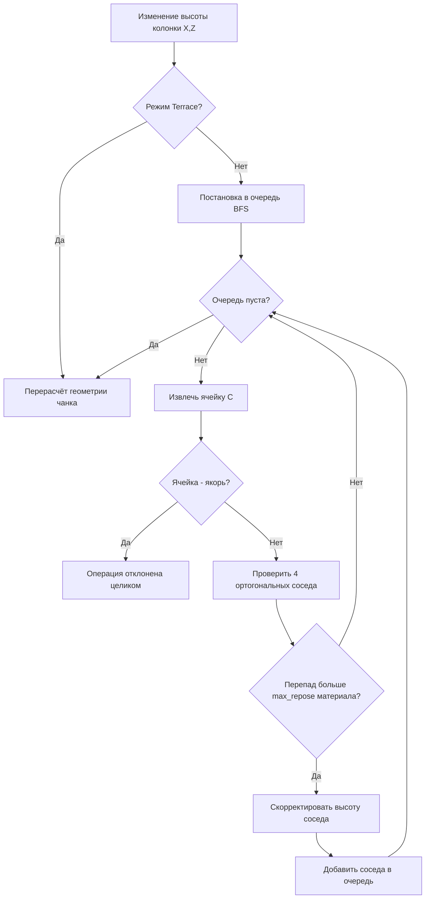

# Дизайн-документ: Дискретная Сеточно-Террасная Система Ландшафта (Grid Terrain System)

> **Проект:** Go To Happyness (Godot 4.7 / Forward+)
> **Статус:** Фазы 0–3, 4a и 4b реализованы (см. §15); 4c и 5 — спецификация
> **Целевая аудитория:** Подростки и взрослые (14+), ценящие креативность, точность и архитектурный контроль.
> **Дочерний документ:** [terrain_materials.md](terrain_materials.md) — каталог материалов,
> варианты, износ, снег, сезоны, блендинг и текстурный бюджет. Здесь — форма земли и вода.

---

## 1. Концепция и Главные Принципы

Система ландшафта представляет собой **дискретную сетку колонок земли (Grid Elevation
System)**, жёстко привязанную к строительной сетке редактора зданий ($1 \times 1$ метр).

### Ключевые столпы:
1. **Блок первичен, уклон вторичен.** Земля — это колонки блоков с целочисленной
   высотой. Уклон не является самостоятельной высотой: это оформление перехода между
   двумя колонками, выбираемое **только из фиксированного каталога** (§3). Произвольных
   углов в системе не существует ни на одном уровне — ни в данных, ни в инструментах.
2. **Архитектурный порядок:** Никаких висящих углов у зданий, размытой грязи или
   хаотичных неровностей.
3. **Пирамидальная устойчивость (Auto-Cascading):** При подъёме или опускании колонки
   окружающая земля перестраивается по правилам естественного осыпания (Angle of
   Repose), формируя аккуратные террасы или холмы. Каскад — режим инструмента, а не
   безусловный закон мира (§4).
4. **Единая экосистема с Редактором Зданий:** Землю можно редактировать глобально на
   карте мира и локально в чертежах зданий (замки на холме, подпорные стены).
5. **Тоннели как конструкции:** Земля не выкапывается в мягкие пещеры. Входы в
   подземелья создаются через **вырезы в сетке (Holes)**, в которые вставляются готовые
   блочные конструкции.

---

## 2. Модель данных (ключевое архитектурное решение)

### 2.1. Что хранится, а что вычисляется

Это главный инвариант системы. Нарушение его приводит к рассинхрону меша, навигации и
сохранений.

| | Сущность | Тип | Где живёт |
| :--- | :--- | :--- | :--- |
| **Хранится** | Высота колонки `height` | `int`, в шагах $\Delta h$ | `TerrainGrid` |
| **Хранится** | Материал верха `material_id` | `StringName` | `TerrainGrid` |
| **Хранится** | Дескриптор склона `slope` | ID из каталога §3 + направление | `TerrainGrid` |
| **Хранится** | Флаг выреза `is_hole` | `bool` | `TerrainGrid` |
| **Вычисляется** | Высоты 4 углов ячейки | `float` | мешер |
| **Вычисляется** | Класс уклона грани (0–7) | `int` | из перепада соседей |
| **Вычисляется** | Высота стояния гражданина | `float` | интерполяция по дескриптору |
| **Вычисляется** | Проходимость ребра | `bool` + вес | экспорт в `NavGrid` |

**Дробные высоты вершин существуют только в сгенерированном меше.** Их нельзя ни
сохранить, ни задать вручную, ни получить редактированием — только как результат
разворачивания дескриптора склона из каталога.

### 2.2. Единицы измерения
* **Горизонтальная ячейка:** $1.0 \times 1.0$ м (совпадает с `SettlementGame.CELL_SIZE`
  и `BuildingBlueprints.BLOCK_SIZE`).
* **Базовый шаг высоты ($\Delta h$):** $0.5$ м.
* **Диапазон высот:** $-64 \dots +191$ шага (умещается в `int8` со смещением; $-32$ м до
  $+95.5$ м). Выход за диапазон — операция отклоняется, а не клампится молча.
* **Размер карты поселения:** $96 \times 96$ ячеек (`SettlementGame.BOARD_CELLS`).
  Мировая карта поверх этого — отдельный слой, вне рамок этого документа.

### 2.3. Структура ячейки

```gdscript
# game/features/world/domain/terrain/terrain_cell.gd — чистые данные, без Node3D
height: int            # шагов Δh от нуля мира
material_id: StringName
variant: int           # 0..15, визуальный вариант текстуры (terrain_materials.md §4)
wear: int              # 0..2, износ поверхности от хождения (terrain_materials.md §6.1)
snow_depth: int        # 0..3, глубина снега (terrain_materials.md §6.2)
slope_id: StringName   # &"flat" | &"shallow" | &"gentle" | &"moderate" | ...
slope_dir: int         # 0..7, направление подъёма (N, NE, E, ...)
slope_index: int       # позиция ячейки внутри многоклеточного пандуса (0..run-1)
flags: int             # IS_HOLE | IS_ANCHOR | ...
```

`TerrainGrid` хранит их как параллельные `PackedByteArray` / `PackedInt32Array`, а не как
`Array[Object]` — это критично для памяти и скорости сохранения. `TerrainCell` — вид на
колонку для тех, кому удобнее передать её одним объектом, а не пятью аргументами; сетка
такими объектами не оперирует.

`variant`, `wear` и `snow_depth` физически лежат в **одном байте** на ячейку
(`terrain_materials.md` §5), а не в трёх массивах: три массива — это три промаха кэша на
клетку в мешере ради экономии, которой нет.

Склон и материал хранятся **числом**: `slope_class` — индекс в каталоге §3, `material` —
индекс в каталоге материалов. Строковые ID живут в заголовке сохранения (§12), в инструментах и
в тестах, но не в горячем пути: мешер и каскад спрашивают у сетки индексы
(`slope_class_at`, `material_index_at`) и обходятся без единого сравнения `StringName`.

---

## 3. Каталог уклонов

Уклон — это **переход между колонками**, а не высота. Он всегда занимает целое число
ячеек по горизонтали (`run`) и целое число шагов $\Delta h$ по вертикали (`rise`). Ничего
за пределами этой таблицы построить нельзя.

| Класс | ID | Угол | rise : run | Занимает клеток | Игровое назначение | Оформление |
| :--- | :--- | :--- | :--- | :--- | :--- | :--- |
| **0** | `flat` | 0° | $0 : 1$ | 1 | Площадки под здания, дороги, площади | Верхняя текстура покрытия |
| **1** | `shallow` | 5.625° | $1 : 8$ | **8** | Длинные пологие дороги, серпантины для тяжёлого груза и осадных башен | Едва заметный уклон дёрна |
| **2** | `gentle` | 11.25° | $1 : 4$ | **4** | Пологий холм, серпантины, съезды для телег | Плавный переход дёрна |
| **3** | `moderate` | 22.5° | $1 : 2$ | **2** | Естественные холмы, обычные съезды | Сглаженный меш с травой |
| **4** | `steep` | 45° | $1 : 1$ | 1 | Овраги, насыпи | Крутая насыпь / осыпь |
| **5** | `very_steep` | 63.4° | $2 : 1$ | 1 | Скалистая осыпь | Текстура осыпи |
| **6** | `pre_cliff` | 76.0° | $4 : 1$ | 1 | Укреплённый эскарп | Скалы / подпорные распорки |
| **7** | `cliff` | 90° | $n : 0$ | 0 | Отвесный обрыв любой высоты | **Авто-скала** или подпорная стенка |

Ряд rise:run — геометрическая прогрессия ($0, \tfrac18, \tfrac14, \tfrac12, 1, 2, 4,
\infty$), удваивающаяся на каждом классе; `shallow` продолжает её на шаг ниже `gentle`,
а не меняет принцип таблицы. Угол — номинальная метка для UI и балансировки скорости
(§10.2), не результат прямого `atan(rise/run)`; фактический угол вершин мешер всегда
считает из реальных `Δh` и `run`.

### 3.1. Как это работает на многоклеточных пандусах

Класс 2 (`gentle`) — это **один объект, растянутый на 4 ячейки**, а не 4 независимые
ячейки с дробной высотой. Все 4 ячейки несут один `slope_id = gentle`, одинаковый
`slope_dir` и разный `slope_index` (0, 1, 2, 3). Мешер разворачивает это в вершины с
шагом $\Delta h / 4 = 0.125$ м; данные при этом остаются целочисленными. Класс 1
(`shallow`) устроен так же, но на 8 клеток и с шагом меша $\Delta h / 8 = 0.0625$ м.

```
Профиль gentle (11.25°), подъём 1 шаг на 4 клетки:

  H+1                                    ┌────
      slope_index:  0     1     2     3  │
  H        ────┬─────┬─────┬─────┬───────┘
               └ 0.125 м на клетку (только в меше)
```

Инструмент «Пандус» ставит такой объект целиком, задавая класс и направление вручную:
система проверяет, что нужные клетки (4, 8 или 2, по `run` класса) свободны и что
перепад между конечными колонками равен `rise`. Если не сходится — пандус не ставится,
подсвечивается красным. Частичный пандус в данных невозможен. Этот инструмент — часть
Редактора Карт и Редактора Зданий (§5); в обычном игровом инструменте высоты (§3.2)
игрок классом не управляет напрямую, он вычисляется автоматически.

### 3.2. Авто-выбор класса на границе (Auto-Slope Selection)

Игровой инструмент высоты (не Редактор Карт) не даёт игроку выбирать `slope_id`. После
каждой операции (каскад §4 или ручное выравнивание) для каждой границы между колонками
разной высоты отдельный проход (`SlopeAssigner`) подбирает класс автоматически:

1. Взять перепад между колонками (в шагах $\Delta h$).
2. Посчитать **бюджет клеток** для этой границы: $\lceil \text{перепад} / \text{repose} \rceil$,
   где `repose` — шагов на клетку у материала нижней колонки (§4.2). Это ровно тот
   след, который каскад того же материала уже потратил бы на этот перепад. Бюджет
   дополнительно ограничен константой `MAX_CHAIN_CELLS` (16).
3. Перебрать каталог §3 от самого пологого класса (`shallow`) к самому крутому
   (`pre_cliff`), пропуская `flat`.
4. Взять первый класс, у которого `rise` делит перепад нацело, цепочка из
   $\text{перепад}/\text{rise}$ звеньев по `run` клеток укладывается в бюджет, **и** эти
   клетки свободны: в границах карты, без выреза, без якоря, не заняты другим пандусом
   и не забраны другой границей в этом же проходе.
5. Если ни один класс не подошёл — граница получает `cliff`. Это не ошибка и не
   блокирует операцию: голая отвесная грань — штатный итог, когда пологому пандусу
   физически негде поместиться.

**Про бюджет (п. 2).** Без него правило «самый пологий из возможных» на открытой
равнине разворачивает одно нажатие кисти `+1` в четыре восьмиклеточных `shallow`-пандуса:
`shallow` — самый пологий класс, а места на равнине всегда хватает. С бюджетом трава
оформляет свою границу одной клеткой 45°, песок — террасой в две клетки 22.5°, а скала
остаётся гранью: то есть ровно тем, во что каскад и без того сформировал колонки.
Пологие серпантины остаются работой Ramp Tool (§3.1) — инструмента, где игрок сознательно
тратит землю.

**Про цепочки (п. 4).** Перепад больше одного `rise` набирается **цепочкой пандусов
одного класса**, звенья ставятся от верхней колонки вниз: ближнее звено садится на
$H - \text{rise}$, следующее на $H - 2\,\text{rise}$ и так далее, последнее ложится точно
на исходную нижнюю землю. Клетки под ближними звеньями поднимаются — это и есть «насыпать
съезд». Пересчёт каскада после этого не запускается: авто-склон — завершающий шаг
операции, а не новая операция.

Это делает результат кисти предсказуемым (самый пологий из тех, что каскад мог бы себе
позволить) и снимает с игрока необходимость знать таблицу §3 наизусть, сохраняя её как
источник правды для Ramp Tool и для расчёта скорости и проходимости (§10).

### 3.3. Класс `cliff` — не пандус

`cliff` не занимает клеток вообще. Это просто отсутствие пандуса между двумя колонками
разной высоты: боковая грань колонки, которую мешер оформляет авто-скалой или подпорной
стенкой в зависимости от материала. В данных `cliff` не хранится: колонка остаётся
`flat`, а грань рисует мешер по разнице высот.

### 3.3.1. Целостность пандуса (инвариант записи)

Пандус — один объект, и в него входит **не только его `run`, но и колонка, к которой он
поднимается**. Пандус остаётся валидным, пока:

* все его клетки в границах карты, не вырезаны, стоят на одной высоте и несут один
  класс, одно направление и индексы $0 \dots run-1$;
* колонка за верхним концом ровно на `rise` выше базы.

Любая запись высоты или выреза обязана растворить пандусы, которые она ломает: и тот,
которому клетка принадлежит, и те, которые к ней поднимаются. Иначе получается склон,
ведущий в стену, — состояние, которое ни один инструмент не создавал и никто не чинит.

Колонка, к которой поднимается пандус, **сама может быть пандусом**: склон холма — это
цепочка пандусов, и высоты по общей грани сходятся, потому что клетка пандуса хранит
свою базу. Ручной Ramp Tool здесь строже (верх должен быть плоским) — но это правило
инструмента, а не данных.

### 3.4. Углы ячейки и диагонали

Прежнее «правило усреднения диагоналей» отменено. Высоты 4 углов ячейки вычисляются
детерминированно из её собственного дескриптора склона и высот 4 ортогональных соседей;
диагональные соседи делят с ячейкой ровно один угол, поэтому пирамидальные углы и срезы
получаются автоматически, без отдельного правила и без разрывов меша.

Конкретно:

1. Развернуть собственный дескриптор: углы вдоль направления подъёма поднимаются до
   верхней отметки, остальные остаются на нижней.
2. Пройти **8 соседей** — 4 ортогональных делят с ячейкой по паре углов, 4 диагональных
   ровно по одному — и поднять свой угол до соседского. Соседские углы берутся из их
   собственных дескрипторов, без рекурсии.
3. Дополнительно: односкатная ячейка (`run = 1`) поднимает грань к плоскому соседу,
   который стоит ровно на один `rise` выше — это внутренний угол у подножия колонны.

Кто может тянуть и насколько:

* **Тянет любой склон, плоская колонка — нет.** Склон — это земля, которую уже оформили,
  и поднятый им угол поднят для всех, кто стоит в этой точке; плоская колонка ничего не
  оформляла, поэтому терраса рядом с террасой остаётся отвесной (§4.1). Ограничивать
  источник одним классом (пробовали `steep`) нельзя: тогда песчаный склон из `moderate` и
  бока авторских пандусов обрастают треугольными плавниками — сосед-то поднялся, а
  плоская земля рядом нет.
* **Не выше чем на 2 шага над своей колонкой.** Ровно столько «стоит» диагональ склона в
  45°: по шагу в каждую сторону. Именно поэтому угол между четырьмя такими клетками
  требует двух шагов, и получается он `very_steep` — тоже класс из каталога §3. Выше —
  это уже настоящий обрыв, и он остаётся гранью.

Подъём принимается **целиком или не принимается вовсе**, его нельзя обрезать по своему
потолку: все колонки, делящие угол, проверяют одно и то же число, поэтому те, кто его
принял, оказываются ровно на одной высоте и поверхность смыкается. Обрезка заставила бы
каждую колонку остановиться на своей отметке и разорвала бы шов в другом месте.

Плоская колонка в проходе не участвует как источник: терраса рядом с террасой обязана
остаться отвесной (§4.1). Как получатель — участвует, иначе выпуклый угол холма так и
остался бы треугольной гранью.

Два следствия, которые легко пропустить и на которых система ломается:

* **«Плоская клетка» — это свойство углов, а не хранимой высоты.** После подъёма углов
  поверхность колонки может стоять на шаг выше её `height`. Мешер обязан и объединять
  плоские верхи, и класть их квад по фактической высоте углов; если он возьмёт хранимую
  высоту, квад окажется ниже собственных стен и в земле будет дыра насквозь.
* **Высота стояния читает ту же пару треугольников, что и меш** (разрез NW–SE), а не
  билинейный патч. Как только угол можно поднять отдельно, квад перестаёт быть плоским, и
  две трактовки расходятся до полушага в середине клетки — гражданин проваливается
  ступнями в землю, на которой стоит. Меш, коллизия и `height_at` — одна поверхность.

Результат проверяемый: у холма, вылепленного каскадом по траве, **нет ни одного
несогласованного угла** при любой высоте (тест `_test_grass_hillside_closes_every_corner`),
и над каждой колонкой чанка есть земля ровно на той высоте, которую отдаёт `height_at`
(тест `_test_hillside_has_ground_everywhere`).
Без пункта 2 такой холм покрыт вертикальными клиньями по всем диагоналям. Вогнутая форма
(яма) сложнее — там колонка бывает ниже трёх соседей сразу, и один-два шва остаются; там
же колонка может оказаться поднятой углами на шаг выше своей высоты, и это допустимо:
меш, коллизия и `height_at` читают одни и те же углы и потому согласованы между собой.

---

## 4. Каскад устойчивости (Cascade Slope Propagation)

### 4.1. Три режима инструмента

Каскад — не безусловный закон мира: игрок должен уметь строить и природный холм, и
отвесную террасу. Инструмент высоты работает в одном из трёх режимов.

| Режим | Каскад | Результат | Требование |
| :--- | :--- | :--- | :--- |
| **Sculpt** | Включён | Природный холм с осыпанием | — |
| **Terrace** | Выключен | Отвесная грань (`cliff`) | Грань требует подпорной стены или авто-скалы |
| **Level** | Включён | Площадка выравнивается в `flat` | — |

### 4.2. Угол осыпания зависит от материала

Максимальный уклон, который держится без подпорной стены, — свойство материала, а не
глобальная константа.

| Материал | Max angle of repose | Класс |
| :--- | :--- | :--- |
| `sand`, `mud`, `mars_regolith` | 22.5° | 3 |
| `grass`, `grass_tall`, `dirt`, `scorched`, `gravel`, `lunar_regolith` | 45° | 4 |
| `stone`, `lunar_rock`, `mars_rock` | 76.0° | 6 |
| `ice` (ледник), подпорная стена (конструкция) | 90° | 7 |

Источник правды по значениям — `terrain_materials.md` §2; здесь таблица приведена как
справка для чтения алгоритма каскада. **Снег в ней отсутствует намеренно:** снег —
состояние поверхности, а не материал, и угла осыпания не имеет (`terrain_materials.md`
§6.2). Иначе первый снегопад запускал бы каскад по всей карте и осыпал бы авторский
рельеф, а весенняя оттепель не вернула бы его обратно.

### 4.3. Алгоритм



### 4.4. Инварианты каскада

- **Якоря.** Ячейки под построенным зданием, дорогой или размещённым чертежом помечены
  `IS_ANCHOR`. Каскад **не двигает** их. Если волна каскада дошла до якоря — вся операция
  отклоняется целиком и откатывается, а не применяется частично. Молча просесть земле
  под домом нельзя.
- **Атомарность.** Операция вычисляется на копии региона (`TerrainWorkingRegion`) и
  применяется одним коммитом. Это же даёт бесплатный undo: хранится дельта — но не
  `cell -> old_height`, а **полное состояние колонки** `(height, slope_class, slope_dir,
  slope_index, material, variant, wear, flags)` до и после. Высоты мало: операция
  растворяет пандусы (§3.3.1), пишет склоны (§3.2), красит материал, меняет вариант и
  износ, режет вырезы. Всё, чего дельта не умеет выражать, undo молча потеряет.
- **Один вход на запись.** Любое редактирование идёт через `TerrainService` — кисть
  высоты, пандус, кисть материала, вырез. Инструмент, который пишет в сетку мимо него,
  создаёт изменение, невидимое для undo, а это хуже, чем отсутствие undo.
- **Завершаемость.** Каждая итерация строго уменьшает или увеличивает высоту в
  направлении цели, повторный заход в ячейку с той же высотой отсекается. Ограничитель —
  максимум $10^4$ обработанных ячеек на операцию; превышение = отклонение.
- **Детерминизм.** Обход очереди — по отсортированному ключу ячейки, не по порядку
  вставки в `Dictionary`. Один и тот же ввод даёт один и тот же рельеф на любой машине
  (важно для сохранений и тестов).

### 4.5. Авто-откосы при выравнивании (Auto-Skirt)

Голое плато с отвесными краями — самый частый неиграбельный результат выравнивания.
Режим **Level** решает это не отдельной кистью, а завершающим шагом операции:

1. Каскад (§4) выполняется как обычно и приводит целевую площадку к `flat`.
2. По периметру площадки, для каждой границы с более низкой соседней колонкой, авто-выбор
   класса (§3.2) пытается положить самый пологий пандус, который помещается в свободные
   клетки за пределами площадки.
3. Клетки, не свободные для пандуса (застройка, якорь, другая площадка, край карты) или
   не прошедшие валидацию §3.2, — получают `cliff`, как и предусмотрено §3.2. Это не
   откат операции: сама площадка выравнивается всегда, откос — лучший, что нашёлся.

Игрок таким образом получает пологий выезд с плато бесплатно там, где для него было
место, и честный обрыв там, где места не было — без отдельного шага «теперь обстрой края
пандусами вручную».

Отдельного механизма у Auto-Skirt нет: это тот же проход §3.2, запущенный по всем
границам, которые операция потревожила (сдвинутые колонки плюс кольцо вокруг них — откос
кладётся на нетронутую землю **за** площадкой). Режимы **Sculpt** и **Level** проход
выполняют, **Terrace** — нет: он затем и существует, чтобы получить отвесную грань.

---

## 5. Структура файлов и режимы редактирования

### 5.1. Разделение типов файлов: Карты vs Чертежи

```
┌────────────────────────────────────────────────────────────────────────┐
│                        ТИПЫ ДАННЫХ И ФАЙЛОВ                            │
├──────────────────────────────────────┬─────────────────────────────────┤
│ 1. Файл Карты Мира (.map)            │ 2. Чертёж Здания (.gdbuilding)  │
│ ──────────────────────────           │ ──────────────────────────      │
│ • Глобальная сетка высот карты       │ • Блоки здания (стенки, крыши)  │
│ • Карта биомов и материалов          │ • Слой "Подземные конструкции"  │
│ • Реки, озёра, уровень воды          │ • Слой "Ландшафтный фундамент"  │
│ • Спавн ресурсов и растительности    │   (Локальная земля/терраса)     │
└──────────────────────────────────────┴─────────────────────────────────┘
```

### 5.2. Земля в Редакторе Зданий
Добавляется 3-й слой просмотра/редактирования:
* `Надземный (Aboveground)` — конструктивные блоки здания.
* `Подземный (Underground)` — подвалы, бункеры, тоннели.
* `Местность/Фундамент (Terrain Base)` — локальная земля, привязанная к чертежу.

Высоты слоя `Terrain Base` хранятся **относительно якорной ячейки чертежа**, а не в
абсолютных координатах мира. Иначе чертёж нельзя переиспользовать на другой высоте.

### 5.3. Слияние чертежа с картой (Placement Merge)

Самое опасное место системы: размещение чертежа модифицирует уже существующую землю
игрока. Порядок строгий.

1. **Выбор якорной высоты.** Берётся медиана высот колонок под пятном застройки.
2. **Сухой прогон (dry run).** Merge считается на копии региона: применяются высоты
   чертежа, затем каскад в режиме Sculpt по границе пятна.
3. **Валидация.** Отклоняется, если: волна каскада задела чужой якорь; перепад по
   границе превышает 4 шага; пятно пересекает воду или вырез (`is_hole`); в survival — не
   хватает грунта (§8).
4. **Превью.** До подтверждения показывается призрак итогового рельефа: срез — синим,
   насыпь — жёлтым, конфликт — красным.
5. **Коммит.** Применяется одной транзакцией с записью дельты в undo.

Система вправе **отказать** в размещении. Это не ошибка, а нормальный ответ.

---

## 6. Вырезы Земли для Тоннелей и Входов (Terrain Hole Masking)

Тоннели не выкапываются вокселями, а строятся как жёсткие конструкции. Применяется
система масок выреза.

1. **Флаг ячейки `is_hole`:** ячейка помечается как вырезанная.
2. **Геометрия не генерируется.** В вырезанных ячейках мешер **не создаёт полигонов** —
   ни верха, ни граней. Вариант с `discard` в фрагментном шейдере **отвергнут**: он ломает
   depth-prepass и тени и, главное, не убирает коллизию — гражданин упрётся в невидимую
   землю в проёме тоннеля.
3. **Коллизия синхронна мешу.** `ConcavePolygonShape3D` чанка строится из того же набора
   полигонов, поэтому дырка в коллизии появляется автоматически.
4. **Стыковочный модуль.** Модуль входа (каменная арка, дверь бункера) перекрывает края
   выреза; его собственная коллизия обеспечивает стены проёма.

---

## 7. Материалы поверхности

Материал — не украшение: он задаёт угол осыпания (§4.2), вес прохода в `NavGrid`, выход
грунта при копке (§8) и материал авто-скалы на боковой грани. Полный каталог, правила
входа в него, визуальные варианты, износ, снег, сезоны, блендинг и текстурный бюджет
вынесены в **[terrain_materials.md](terrain_materials.md)** — там это одна связная тема, а
здесь она бы утопила форму земли.

Сетке от материалов нужно ровно четыре вещи.

### 7.1. Что хранит сетка

* **`material_index`** — байт на колонку, индекс в каталоге. Числом, не `StringName`:
  мешер и каскад проходят по всем клеткам чанка и не могут платить за поиск в словаре.
* **Детальный байт** — `variant` (4 бита) | `wear` (2) | `snow_depth` (2), одно поле на
  колонку (`terrain_materials.md` §5).

Ничего визуального — ни цветов, ни текстур, ни номеров слоёв — в домене терраина нет и
быть не может.

### 7.2. Что каскад спрашивает у каталога

Единственное: `repose_steps_per_cell_of_index(material_index)` — сколько шагов высоты на
клетку держит материал (§4.2). На этом же числе стоит бюджет клеток авто-склона (§3.2).

### 7.3. Что мешер спрашивает у каталога

Только `cliff_material` — чем оформить боковую грань класса 7 под этой колонкой
(`terrain_materials.md` §3). Это единственное место, где материал влияет на геометрию
отрисовки: грань уходит в отдельный surface чанка со своим triplanar-шейдером.

### 7.4. Что покраска материала НЕ делает

Она **не перестраивает меш**. Индекс материала попадает на GPU через глобальную
индекс-карту 96×96 (`terrain_materials.md` §7.3), а не через вершинный атрибут, поэтому
кисть материала пишет один тексель и не трогает ни `ArrayMesh`, ни коллизию. Единственное
её последствие для симуляции — изменившийся вес прохода.

Это отличается от первой редакции документа, где покраска была remesh-операцией и требовала
CPU-карты весов блендинга. Обе схемы отвергнуты: подробности и причины — в
`terrain_materials.md` §7.3.

---

## 8. Земляные работы и экономика грунта (survival)

В песочнице/редакторе высота меняется мгновенно и бесплатно. В режиме выживания земля —
ресурс.

1. **Объём.** Одна колонка на 1 шаг $\Delta h$ = **1 единица грунта** (`soil`). Материал
   определяет тип: земля даёт `soil`, камень — `stone` и требует кирки, песок — `sand`.
2. **Баланс.** Срез колонки кладёт грунт на склад/в отвал; насыпь его расходует. Насыпать
   холм из воздуха нельзя.
3. **Приказ «Подготовить площадку».** Игрок выделяет прямоугольник и целевую высоту.
   Создаётся заказ в существующей системе ордеров (`order_system.md`); рабочие с лопатами
   по одной ячейке приводят площадку к `flat`, по алгоритму §4, каждый шаг —
   отдельная задача с переносом грунта.
4. **Прогресс виден.** Ячейка меняет высоту на полный шаг за раз — промежуточных
   «полукопаных» состояний нет, это следствие §2.1.

---

## 9. Вода и Гидрология (Реки, Озёра, Моря, Лава)

### 9.1. Вода авторская, а не симулируемая

Отдельный дискретный слой высот с тем же шагом $\Delta h$. Уровень задаётся кистью и не
перетекает по кадрам; заливка низин считается один раз, при правке рельефа. Гидродинамика
в реальном времени не нужна ни одному игровому решению и стоила бы больше, чем весь
терраин.

### 9.2. Тип водоёма задаёт водоём, а не дно

Первая редакция выводила тип воды из материала дна (`seabed` / `riverbed` / `lakebed`).
Схема отвергнута — она ломается на четырёх обычных сценариях:

1. **Одна река идёт по гальке, песчаной отмели и илистой излучине.** Чтобы вода не меняла
   цвет и волну посреди русла, автор обязан закрасить всё в `riverbed` — и дно перестаёт
   быть дном, становясь замаскированным тегом типа воды.
2. **Осушенное русло** (перекрыли плотиной) остаётся «рекой»: тип есть, воды нет.
3. **Рыбе нужен владелец запаса.** Рыба — популяция с объёмом и восстановлением, а не
   свойство тайла: ячейка дна не может кончиться и не может восстановиться.
4. **Течению нужна связность.** Направление потока — свойство русла целиком; заданное по
   ячейкам, оно разрешает физически невозможные конфигурации.

Владельцем типа становится **`WaterBody`** — авторский объект, а ячейка хранит только
ссылку на него.

```gdscript
# game/features/world/domain/water/water_body.gd
id: int                     # 1..255, 0 = нет воды
type: int                   # SEA | RIVER | LAKE | POND | LAVA
surface_height: int         # авторский уровень в шагах Δh
wave_amplitude: float       # базовая амплитуда, домножается на ветер (§9.5)
colour, foam_strength       # визуал; дефолт берётся от type
salinity: int               # FRESH | SALT — таблица рыбы и годность для питья
freezes: bool               # море замерзает только в полярном регионе
flow: Dictionary            # cell -> (dir 0..7, strength 0..3), только для RIVER
fish_stock: Dictionary      # species -> amount
fish_regen_per_day: Dictionary
```

Реестр водоёмов живёт в сохранении карты рядом с сеткой. Рыболовство получает нормальную
экономику — квота озера, перелов, восстановление — и ложится на уже существующий паттерн
ресурсных состояний (`world_resource_state.gd`, `tree_resource_state.gd`), а не требует
новой машинерии.

| Тип | Волны | Течение | Солёность | Замерзает | Урон |
| :--- | :--- | :--- | :--- | :--- | :--- |
| `SEA` | большие | приливные (опц.) | SALT | только в полярном регионе | нет |
| `RIVER` | средние | **направление + сила** | FRESH | при `strength` ≤ 1 | нет |
| `LAKE` | малые | нет | FRESH | да | нет |
| `POND` | рябь | нет | FRESH | да | нет |
| `LAVA` | бурлящие | нет | — | никогда | **да** |

### 9.3. Что хранит слой воды

Три плоских массива на карту, параллельно `TerrainGrid` — не разреженные структуры:
Dictionary на 9216 клеток стоит хеша в каждом шейдерном апдейте ради экономии 27 КБ.

| Массив | Формат | Содержимое |
| :--- | :--- | :--- |
| `water_height` | `int8` со смещением | уровень поверхности в шагах $\Delta h$ |
| `body_id` | `uint8` | ссылка на `WaterBody`, 0 = сухо |
| `water_flags` | `uint8` | `FROZEN` \| `ice_thickness` (2 бита) \| резерв |

**Течение — не per-cell массив.** Оно хранится разреженно у водоёма: реки занимают
проценты карты, и 9216 векторов ради них — чистая потеря.

Материал дна при этом остаётся честным материалом суши (`mud`, `gravel`, `sand`, `stone`)
и отвечает ровно за то же, за что на суше: по чему шлёпают ноги в броду, что выкопается,
как блендится берег, насколько мутно у дна.

### 9.4. Лава — тип жидкости, а не дно

Урон, непроходимость и эмиссия — свойства расплава, поэтому `LAVA` это `type` водоёма.
Остывшая лава — вариант материала `stone` (`terrain_materials.md` §2.5): то, что остаётся,
когда лава ушла. В первой редакции `lava_cooled` был одновременно и сушей, и «дном под
лавой», то есть остывшая лава лежала под расплавленной.

### 9.5. Волны и ветер

Амплитуда волны = `body.wave_amplitude × WeatherState.wind_strength_at(minute)`,
направление — от `wind_direction_at`. Море штормит в грозу **бесплатно**, без единого
нового состояния: глобальный ветер уже существует и уже документирован как источник для
волн и флагов. Прибрежная пена — тот же множитель: `foam_strength` водоёма на силу ветра.

### 9.6. Лёд как состояние воды

Сезонный лёд — флаг водной ячейки, а не покраска терраина материалом `ice` (материал `ice`
остаётся только для авторских ледников). Смена состояния переключает шейдер водного
плана: **геометрия не меняется вообще**.

* **Проходимость.** Замёрзшая клетка становится проходимой на уровне поверхности воды
  вместо «глубоко, непроходимо».
* **Несущая способность.** `ice_thickness` 0–3 против третьего скаляра в
  `TravelerProfile` (§10.1): пешеход проходит с 1, тележка с 2, стройка — никогда.
  Тонкий лёд под тяжёлым грузом ломается, и гражданин оказывается в воде.
* **Река с течением `strength` ≥ 2 не замерзает.** Авторское правило, дающее естественные
  незамерзающие переправы: одну реку зимой перейти можно, другую нет.
* **Скольжение** — механика контроллера движения, переиспользует снос течением (§9.7), а
  не вес поиска (`terrain_materials.md` §6.5).
* Замерзание и таяние — **единственное из сезонных изменений, которое меняет
  проходимость**, поэтому идёт через `TerrainService` как обычная транзакция с
  инкрементальной републикацией (§10.5). Одна операция на водоём за сезон.

### 9.7. Навигация в воде

Глубина = уровень воды минус высота колонки.

* $\le 1$ шаг ($0.5$ м) — брод, проходим с весом $\times 3$.
* $> 1$ шаг — непроходим пешком, нужен мост или лодка.
* Лава — непроходима всегда, независимо от глубины.
* Течение в брод: боковой снос пропорционален `strength`; при `strength` $\ge 3$ брод
  непроходим.
* Замёрзшая клетка — см. §9.6, проходимость по толщине льда.

### 9.8. Размещение построек

`Placement Merge` (§5.3) отклоняет пятно, пересекающее воду, — **включая замёрзшую**.
Лёд не является грунтом ни при какой толщине: здание, построенное зимой, весной оказалось
бы на дне.

---

## 10. Взаимодействие с Citizen AI (`routing` и `needs`)

### 10.1. Проходимость — свойство ребра, а не ячейки

Двух свободных ячеек мало: перепад между ними может быть непроходим. Терраса рядом с
террасой — это отвесная грань, и выразить её можно только на ребре.

Форму земли навигация получает как `NavTerrainField` — плоскую проекцию `TerrainGrid`,
которую собирает `TerrainNavigationPublisher` (единственное место, где встречаются
словари террейна и маршрутов). Поле хранит на ячейку: есть ли грунт, класс уклона
поверхности и класс уклона перехода к каждому из восьми соседей. Классы там — обычные
числа со смыслом `SlopeCatalog`; `routing` не зависит от фичи `world`.

Публикатор владеет и геометрическим контрактом двух сеток: `configure` задаёт размер
`NavGrid` по `TerrainGrid`, а не доверяет двум вызывающим передать совпадающие числа.
Расхождение в полклетки не может обнаружить ни одна из сторон — оно просто молча
индексирует не ту колонку.

**Класс поверхности выводится из геометрии, а не из хранимого дескриптора.** Клетка
рядом с пандусом наклонена подъёмом углов (§3.4), но хранит `flat`; по дескриптору
гражданин взбежал бы по ней на полной скорости. Чтение углов при этом воспроизводит
каталог там, где уклон авторский: `gentle` в четыре клетки даёт четверть шага на клетку,
то есть снова `gentle`.

- Ребро считается разрывом (класс 7, непроходимо для всех), если общие углы двух
  колонок расходятся хотя бы на пол-шага; иначе класс берётся по фактическому набору
  высоты на клетку.
- Связность (`_ensure_walkable_components`), A\* и `segment_cost` спрашивают
  `is_step_passable`: одной проходимости ячеек мало ни для поиска, ни для сглаживания —
  иначе сглаживание вернёт маршрут сквозь ту самую грань, которую поиск обошёл.
- Диагональные переходы дополнительно требуют, чтобы обе ортогональные ячейки-«плечи»
  были и проходимы, и достижимы — иначе гражданин срежет угол сквозь скалу.
- `TravelerProfile.max_slope_class`: пешеход — 5, тележка — 3, тяжёлый груз — 2.
  Ячейка круче предела не является местом, где можно стоять, и дорога поверх неё этого
  не меняет.
- `TravelerProfile.has_suit`: если `false`, непроходимы рёбра в ячейки с битом `airless`.
  Бит публикуется в `NavTerrainField` **из региона карты, а не из материала**
  (`terrain_materials.md` §8): «нет атмосферы» — свойство места, иначе марсианский и
  земной базальт обязаны быть разными материалами. В survival по умолчанию `false`, в
  песочнице — `true`.
- `TravelerProfile.min_ice_thickness`: пешеход — 1, тележка — 2, стройка — недостижимо.
  Замёрзшая водная ячейка тоньше предела непроходима, тонкий лёд под грузом ломается
  (§9.6).

Поле навигации несёт, помимо формы земли, три производных бита на ячейку — `airless`,
`frozen` и `is_water` — и множитель веса от снега и износа. Всё это **веса и
проходимость, а не топология**: снег и износ обязаны бампать `weights_revision`, а не
`topology_revision`, иначе каждая метель инвалидирует все маршруты в мире
(`terrain_materials.md` §7.5).

### 10.2. Скорость по уклону

| Класс | Угол | Пешеход | Тележка / курьер с грузом |
| :--- | :--- | :--- | :--- |
| 0–3 | 0° – 22.5° | 100% | 100% (класс 3 — 70%) |
| 4 | 45° | 50% | непроходимо |
| 5 | 63.4° | 25% | непроходимо |
| 6–7 | 76° – 90° | непроходимо | непроходимо |

Классы 6–7 требуют лестниц, серпантинов или подъёмников.

Уклон — множитель поверх веса покрытия, а не отдельный слой: дорога, проложенная по
косогору, остаётся косогором. Множитель всегда ≥ 1, поэтому он не может опустить клетку
ниже `minimum_cell_weight()` и сделать эвристику A\* недопустимой.

### 10.3. Многоуровневость

Тоннели (§6), мосты и этажи зданий делают ключ `Vector2i` недостаточным: над одной
клеткой карты может быть и пол тоннеля, и поверхность земли. Это **отдельная задача,
намеренно вынесенная за рамки Фазы 1–4**.

Подготовка сделана заранее, чтобы потом не переписывать: топология `NavGrid`
(`_blocked`, дорожные клетки, компоненты связности) ключуется через `NavCell`, а не через
голый `Vector2i`. Сам ключ — `Vector3i` (x, z, level): значимый тип, поэтому в внутреннем
цикле A\* он не стоит ни одной аллокации. Когда появится `IndoorGraph`
(см. `navigation_and_roads.md` §319), уровень перестанет быть всегда нулевым без правки
вызывающих.

Веса перехода остались на координате карты сознательно: вес — свойство поверхности, а
слои, которые его пишут (тропы, дороги), до `IndoorGraph` существуют только на земле.

### 10.4. Высота стояния

`NavGrid.height_at(position) -> float` интерполирует по тем же двум треугольникам
(разрез NW–SE), которые выдаёт мешер: как только угол можно поднять отдельно, квад
перестаёт быть плоским, и билинейное чтение разошлось бы с мешем на полшага в середине
клетки. Меш, коллизия и высота, на которую ставят гражданина, обязаны быть одной
поверхностью; `test_domain_terrain_navigation` это и проверяет, сверяя ответ с
`TerrainGrid.height_at`.

`cell_center` возвращает точку на этой поверхности, поэтому маршрут по косогору идёт
вдоль него, а не сквозь. `_terrain_height_at` в бутстрапе спрашивает сетку, а не
физический луч: тот же ответ приходит headless, до меширования чанка и без кадра
задержки после правки. `CharacterBody3D` продолжает работать по коллизии.

### 10.5. Перепубликация под кистью

Правка не пересобирает поле целиком. `TerrainNavigationPublisher` подписан на
`TerrainService.edit_committed` и переиздаёт ровно те колонки, которых коснулась
транзакция, — включая undo и redo, которые идут тем же сигналом.

Радиусы разные, и это не запас: правка колонки двигает углы восьми её соседей, а ребро
принадлежит обеим клеткам, которые оно соединяет. Значит поверхности пересчитываются на
кольцо вокруг правки, рёбра — на кольцо дальше. Два прохода раздельны: ребро читает углы
обеих своих клеток, и вперемешку результат зависел бы от порядка обхода.

Правка поля на месте не видна `NavGrid`, поэтому публикатор зовёт
`notify_terrain_changed()`: иначе кэш компонентов связности и все маршруты, привязанные к
`topology_revision`, переживут исчезновение земли под собой.

Замеры на доске $96\times96$ (`tests/repro/diag_terrain_nav_publish_cost.gd`):

| Операция | Время |
| :--- | :--- |
| Полная публикация, 9216 колонок | ~610 мс |
| Штрих кисти 3×3 | ~2.7 мс |
| Штрих кисти 9×9 | ~10 мс |
| Кисть 33×33 | ~100 мс |

Кисть до 9×9 укладывается в кадр; крупная — на отпускание. **Рёбра читаются из уже
записанного поля, а не пересчитываются по `TerrainGrid`:** каждое ребро общее для двух
клеток, а у клетки их восемь, так что обращение к `corner_heights_into` (проход по девяти
колонкам) повторялось бы около двадцати раз на клетку. Первый честный замер этой наивной
версии дал 8.7 с на полную публикацию — в четырнадцать раз медленнее.

### 10.6. Как автор карты это видит

Проходимость невидима в отрисованном меше: две террасы и склон с изометрической камеры
выглядят одинаково, а разница между ними — стена, на которую никто не заберётся.

Поэтому `NavTerrainOverlay` рисует ответ: заливка клетки по классу уклона (шкала
зелёный → красный, а не восемь произвольных оттенков — вопрос автора звучит «насколько
это плохо»), тёмно-красная заливка там, где стоять нельзя, и **вертикальная стенка на
каждом ребре, которое выбранный путник не пересечёт**. Именно стенка, а не линия: линия в
пиксель шириной не видна с той дистанции, с которой реально работают.

Лаборатория (`tools/terrain_lab`) держит настоящий `NavGrid` над настоящим полем:
клавиша `M` включает оверлей, `T` переключает профиль путника. Пресеты захвата
`nav_pedestrian`, `nav_cart` и `nav_ramps_closeup` — воспроизводимый визуальный случай;
разница между первыми двумя и есть смысл `max_slope_class`: полосы вдоль пандусов,
наклонённые подъёмом углов до класса 5, проходимы пешеходу и закрыты для тележки.

---

## 11. Производительность, чанки и коллизия

| Параметр | Значение | Обоснование |
| :--- | :--- | :--- |
| Размер чанка | $16 \times 16$ ячеек | 36 чанков на карту $96 \times 96$ |
| Меш чанка | один индексированный `ArrayMesh`, **два surface** | квад — 4 вершины, не 6; верх и грани класса 5–7 разделены по шейдерам, но surface на материал запрещён — это сотни draw call'ов (`terrain_materials.md` §7.2) |
| Коллизия чанка | `ConcavePolygonShape3D` из тех же полигонов | синхронна вырезам |
| Бюджет перестройки | **не более 2 чанков за кадр** | правка кистью грязнит соседние чанки |
| Слияние граней | greedy meshing по плоским областям — и для верхов, и для стен | плоская площадка $16\times16$ = 2 треугольника, не 512; обрыв в 16 клеток = 1 квад, не 16 |
| LOD | чанки дальше 64 м — только верхняя поверхность, без боковых граней | камера изометрическая, граней всё равно не видно |

Грязные чанки собираются в очередь и перестраиваются по бюджету; во время
перетаскивания кисти показывается лёгкое превью, полная перестройка — на отпускание.

**Что именно считается один раз.** Мешер кэширует высоты углов, материал и «есть ли
земля» для чанка **вместе с кольцом в одну клетку** вокруг него. Без этого каждая клетка
считала бы углы своих четырёх соседей заново — пятикратная работа на ровном месте, — а
`SlopeCatalog` пришлось бы опрашивать по `StringName`. По той же причине сетка хранит
класс склона и материал числами и отдаёт их наружу и числом (`slope_class_at`,
`material_index_at`), и числом же ими оперируют мешер и каскад; `StringName` остаётся
языком инструментов и тестов.

**Грязные чанки.** Правка помечает соседние чанки только тогда, когда клетка стоит на
границе чанка: каскад трогает тысячи клеток, и почти ни одна из них на границе не стоит.

**LOD и коллизия.** Дальний чанк теряет боковые грани вместе с их коллизией — это
безопасно: верхняя поверхность, на которой все стоят, остаётся. Переключение с
гистерезисом (0.9 от порога), иначе камера, замершая на границе, перестраивала бы один и
тот же чанк каждый кадр.

**Что вообще не доходит до мешера.** Покраска материала, смена варианта, износ и снег
меняют только текселя двух карт поверхности (`terrain_materials.md` §7.3) и не грязнят ни
одного чанка. Из всех правок remesh требуют ровно три: высота, пандус, вырез.

**Риск и план Б.** Если меширование на GDScript не укладывается в бюджет, следующий шаг —
дельта-обновление чанка вместо полной перестройки. Greedy meshing и кэш углов уже сделаны.
Перенос в C#/GDExtension — сознательно вне плана: проект целиком на GDScript.

---

## 12. Сохранение и формат

- Сетка сохраняется по чанкам в существующую feature `save_load`.
- Формат чанка: `height` — `PackedByteArray` со смещением (1 байт); `material_index` —
  байтовый индекс в каталог (1 байт); детальный байт `variant` (4 бита) + `wear` (2) +
  `snow_depth` (2); `slope_id`/`slope_dir`/`slope_index`/`flags` — упакованы в один байт.
  Итого 4 байта на ячейку, $\approx 37$ КБ на карту $96 \times 96$ — сжатие не требуется.
- **Снег не увеличил формат.** Он занял два spare-бита детального байта, которые уже были
  зарезервированы, — поэтому сезоны не потребовали ни роста файла, ни новой версии формата
  по размеру записи (`terrain_materials.md` §5).
- Слой воды — три массива на карту: `water_height` (1 байт со смещением), `body_id`
  (1 байт), `water_flags` (1 байт). $\approx 27$ КБ. Реестр `WaterBody` пишется отдельной
  секцией: типы, течения и рыбные запасы — данные карты, а не ячейки (§9.2).
- В заголовке — `format_version`. Каталоги материалов и уклонов сохраняются как список
  строковых ID, а не как индексы, чтобы добавление материала не ломало старые сохранения.
  Сами индексы после релиза **не перенумеровываются никогда**
  (`terrain_materials.md` §2.6).
- Чанк, полностью совпадающий с дефолтом (плоский, один материал, сухой), пишется одним
  флагом.

---

## 13. Наследие Terrain3D

Аддон `addons/terrain_3d` **выпилен**: непрерывный heightmap-скульптинг несовместим с
дискретными террасами — отвесных граней, чистых углов и per-cell материала он не даёт, а
высоту потребляет `routing`, поэтому двух владельцев высоты быть не может. Единственный
владелец высоты и коллизии — `GridTerrainWorld` над `TerrainGrid`, создаваемый в
`WorldSetup._build_terrain()`.

Остаточный долг: плоскость $1000 \times 1000$ под землёй в `territory_base.tscn` осталась
**только как фон горизонта и без коллайдера** — на запросы высоты она не отвечает и
отвечать не должна. Когда рельеф в игре перестанет быть плоским, её надо убрать.

---

## 14. Размещение в архитектуре проекта

Слоистость проекта (`AGENTS.md`) обязательна: алгоритмы каскада и меширования нельзя
смешивать.

```text
game/features/world/
  domain/terrain/
    terrain_cell.gd             # запись одной колонки (вид, не хранилище)
    terrain_grid.gd             # сетка, чанки, get/set — без Node3D
    slope_catalog.gd            # §3, единственный источник правды по уклонам
    terrain_material_catalog.gd # материалы: repose, nav вес, грунт, cliff_material
    terrain_edit_operation.gd   # §4.1, что просит инструмент
    terrain_working_region.gd   # §4.4, копия региона под операцию
    cascade_solver.gd           # §4, чистая функция: (grid, op) -> delta | null
    slope_assigner.gd           # §3.2 и §4.5, авто-выбор класса и откосы
    terrain_delta.gd            # §4.4, полное состояние колонок до/после
  domain/water/
    water_grid.gd          # §9.3, три массива: уровень, body_id, флаги
    water_body.gd          # §9.2, тип, волна, солёность, течение, рыба
    water_body_registry.gd # §9.2, водоёмы карты, сохраняется отдельной секцией
  application/
    terrain_service.gd     # транзакции, undo-стек, экспорт в NavGrid
    earthworks_service.gd  # §8, заказы на земляные работы
    water_service.gd       # §9, кисть воды, замерзание и таяние как транзакции
  presentation/
    terrain/
      grid_terrain_world.gd  # чанки, ArrayMesh, коллизия, LOD
      terrain_chunk_mesher.gd
      terrain_brush_tool.gd
    water/
      water_surface.gd       # §9.5, план водоёма, параметры из реестра и ветра
```

Файлы материалов, износа, снега и сезонов перечислены в `terrain_materials.md` §9 — они
относятся к тому же `world`, но живут своей темой и своим планом.

Пока игровых кистей нет, их роль исполняет `tools/terrain_lab/terrain_lab.gd` —
лаборатория с теми же доменными классами и тем же `TerrainService`, без поселения вокруг.
`terrain_brush_tool.gd` появится, когда кисти переедут в игру.

`TerrainGrid` хранит данные плоскими массивами, а не по чанкам. Чанковая решётка остаётся
первоклассной в API (`chunk_of`, `take_dirty_chunks`), а по-чанковое хранение — это вопрос
формата сохранения (§12), и его можно ввести, не трогая вызывающих.

### Тесты (обязательны для Фазы 2)

Домен — `tests/domain/test_domain_terrain.gd`, меширование и коллизия —
`tests/features/world/test_terrain_meshing.gd`. Алгоритмы чистые и детерминированные,
поэтому покрываются напрямую, без сцены. Проверять надо не «нормальный» случай, а те
состояния, в которые игрок попадает, таская кисть: край карты, якорь, вырез, чужой пандус.

Каталоги и сетка:
- быстрые таблицы по классу (`RISE_BY_CLASS`, `RUN_BY_CLASS`) сходятся с таблицей §3, а
  крутизна монотонно растёт с номером класса — на этом стоит перебор §3.2;
- углы осыпания §4.2 совпадают с углами классов каталога;
- выход за диапазон высот и за границы карты отклоняется, а не клампится;
- пандус ставится только при перепаде, равном `rise` класса, и наличии ровно `run`
  свободных клеток вдоль направления (оба класса — `shallow` на 8 клеток и `gentle`);
- пандус растворяется, когда двигают его клетку, **и когда двигают или вырезают колонку,
  к которой он поднимается** (§3.3.1); соседняя клетка сбоку его не трогает.

Каскад:
- каскад на плоскости даёт симметричную пирамиду, копка — воронку;
- угол осыпания соблюдается для каждого материала §4.2;
- волна, дошедшая до якоря, отклоняет операцию целиком, сетка не изменена;
- волна упирается в край карты и в вырез, но не отклоняет операцию из-за них;
- одна и та же правка, описанная в другом порядке клеток, даёт побайтно тот же рельеф.

Авто-склон (§3.2, §4.5):
- трава получает `steep` в одну клетку, песок — `moderate` в две, и ни один из них не
  двигает землю: бюджет равен следу, который каскад уже потратил;
- скала на перепаде 3 остаётся `cliff` (ни один `rise` его не делит в один бюджетный
  шаг), на перепаде 4 — `pre_cliff`;
- выровненное плато получает откос из цепочки пандусов, а её дальнее звено ложится точно
  на исходную землю;
- занятая земля (чужой пандус, якорь) оставляет границу обрывом и ничего не растворяет;
- режим Terrace не назначает склонов вообще.

Транзакции:
- применение дельты и её откат возвращают исходную сетку побайтно;
- дельта несёт материал и флаги, а не только высоту, — иначе undo их теряет;
- кисть материала и вырез откатываются, и вырез уносит пандусы в той же транзакции.

Материалы, износ и снег — в `terrain_materials.md` §10. Здесь остаётся только то, что
касается формы земли: каждому материалу каталога соответствует валидный класс repose из
§4.2, и каскад читает его числом, а не по `StringName`.

Вода:
- тип водоёма читается из `WaterBody`, а не из материала дна: смена дна под водой не
  меняет ни волну, ни солёность, ни рыбу;
- брод глубиной 1 шаг проходим с весом ×3, глубже — непроходим, лава — всегда;
- замерзание меняет проходимость и потому идёт транзакцией: `topology_revision` растёт,
  инкрементальная републикация покрывает ровно клетки водоёма;
- клетка с `ice_thickness = 1` проходима пешеходу и непроходима тележке;
- река с `strength ≥ 2` не замерзает;
- `Placement Merge` отклоняет пятно на воде, включая замёрзшую;
- осушение водоёма не меняет материал дна — дно остаётся тем, чем его нарисовали.

Меширование:
- 256 плоских колонок дают 2 треугольника, а разрыв по материалу или высоте делит квад;
- обрыв длиной в чанк — один квад, и его вершины лежат ровно на двух разделяемых
  высотах: ни щели, ни перехлёста;
- вырез убирает полигоны И коллизию над клеткой, а его соседи получают юбку;
- на границе пандуса и колонки, к которой он поднимается, стены нет;
- коллизия — это тот же индексированный меш, развёрнутый в треугольники;
- дальний LOD теряет вертикальные грани, но не землю под ногами.

---

## 15. План интеграции в проект

```
[Фаза 0: Снос Terrain3D] — СДЕЛАНО
   ├── Удаление аддона и .res-регионов
   └── Заглушка плоского GridTerrain, чтобы игра запускалась

[Фаза 1: Модель данных и мешер] — СДЕЛАНО
   ├── TerrainGrid + TerrainCell + SlopeCatalog (§2, §3)
   ├── Чанковый мешер: flat, cliff, steep (45°) + коллизия
   └── Пандусы gentle/moderate как многоклеточные объекты

[Фаза 2: Каскад и кисти редактора] — СДЕЛАНО, кисти пока в лаборатории
   ├── CascadeSolver с тремя режимами и якорями (§4) + юнит-тесты
   ├── SlopeAssigner: авто-выбор класса и авто-откосы (§3.2, §4.5)
   ├── Height Brush / Material Brush / Ramp Tool, undo-стек — в tools/terrain_lab
   └── Бюджет перестройки чанков, greedy meshing, LOD (§11)

[Фаза 3: Интеграция с навигацией] — СДЕЛАНО
   ├── Проходимость по рёбрам, max_slope_class в TravelerProfile (§10)
   ├── NavCell вместо голого Vector2i — задел под многоуровневость
   ├── height_at() для граждан и героя, вместо рейкаста по коллизии
   ├── TerrainNavigationPublisher: TerrainGrid → NavTerrainField → NavGrid,
   │   инкрементально по edit_committed (§10.5)
   └── NavTerrainOverlay в лаборатории — проходимость видна автору (§10.6)

[Фаза 4a: Материалы и шейдеры] — СДЕЛАНО в лаборатории, terrain_materials.md §11
   ├── Каталог 13 материалов, cliff_material, разовая перенумерация индексов
   ├── Детальный байт variant | wear | snow в сетке (сейв — когда он появится)
   ├── Texture2DArray + индекс-карта + два шейдера, height-based блендинг
   ├── Cutout Hole Mask без discard (§6)
   └── Износ поверхности; объединение со счётчиком троп — при интеграции в игру

[Фаза 4b: Вода] — СДЕЛАНО, кроме рыболовства и сноса течением
   ├── WaterGrid: уровень, body_id, флаги (§9.3) — СДЕЛАНО, слой пишется в water.bin
   ├── WaterBody и реестр: тип, волна, солёность, течение (§9.2) — СДЕЛАНО, реестр в map.json
   ├── WaterService: транзакция, залив низины, лёд, undo — СДЕЛАНО
   ├── Брод ×3, непроходимая глубина, лава, публикация в NavTerrainField (§9.7) — СДЕЛАНО
   ├── Лёд как состояние воды, min_ice_thickness в TravelerProfile (§9.6) — СДЕЛАНО
   ├── Волны и пена от глобального ветра, шейдер водной поверхности (§9.5) — СДЕЛАНО
   ├── Режим «Вода» в редакторе карт (map_editor.md §5.3) — СДЕЛАНО
   ├── Рыбный запас: поля есть в WaterBody, экономика рыболовства — не начата
   └── Снос течением в броду и скольжение по льду — механика контроллера движения,
       данные (flow, strength) уже публикуются, сама механика не начата

[Фаза 4c: Сезоны] — terrain_materials.md §11
   ├── SeasonState: климатическая кривая поверх WeatherState
   ├── Снег: накопление, таяние, weights_revision отдельно от topology_revision
   └── Регионы (airless, климат), скафандр, зарастание после пожара

[Фаза 5: Чертежи и земляные работы]
   ├── Слой Terrain Base в .gdbuilding, относительные высоты (§5.2)
   ├── Placement Merge с dry run, превью и правом отказа (§5.3)
   └── Экономика грунта и заказы «Подготовить площадку» (§8)
```

---

## 16. Библиотеки и средства

Сторонние библиотеки **не нужны** — всё покрывается штатным Godot.

| Задача | Средство |
| :--- | :--- |
| Меш террейна | `ArrayMesh` + `SurfaceTool`, по чанкам |
| Коллизия | `ConcavePolygonShape3D` на чанк |
| Текстуры материалов | один `Texture2DArray`, слой = материал × вариант (≈ 20 МБ VRAM) |
| Блендинг материалов | свой шейдер, индекс-карта `R8` 96×96 + карта деталей `RGBA8` |
| Декор и растительность | `MultiMeshInstance3D`, плотность от материала и износа |
| Вода | план на водоём + свой шейдер, параметры массивом uniform'ов |
| Навигация | собственный `NavGrid` + A* |

Сознательно **не используем**:
- `Terrain3D` — см. §13.
- `godot_voxel` (Zylann) — другая модель данных (воксели / marching cubes), даёт
  сглаженные пещеры, которые дизайн явно отвергает (§1.5), и тянет GDExtension.
- `NavigationServer3D` / `NavigationMesh` — сетка маршрутов в проекте уже своя,
  детерминированная и завязанная на веса дорог и троп; navmesh её не заменит.
- `HeightMapShape3D` — не поддерживает отвесные грани и вырезы.

---

> [!TIP]
> **Главный выигрыш архитектуры:** чёткость контрольных сеток (RCT / Timberborn) при
> визуальной эстетике современных симуляторов — за счёт авто-скал 90° и height-based
> блендинга. Ключ к тому, чтобы это не развалилось: **хранятся только целые блоки и ID
> уклонов из каталога; всё дробное — производное и живёт только в меше.**
