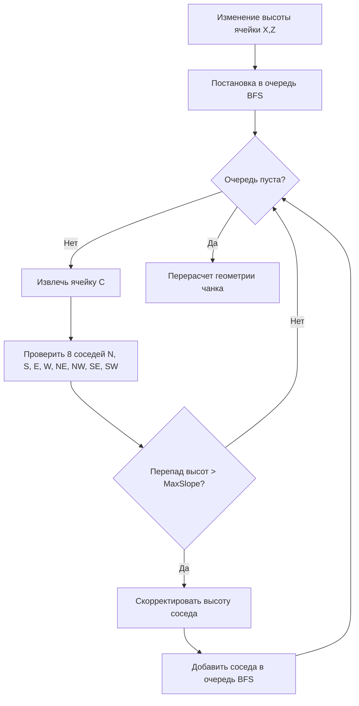

# Дизайн-документ: Дискретная Сеточно-Террасная Система Ландшафта (Grid Terrain System)

> **Проект:** Go To Happyness (Godot 4.7 / Forward+)  
> **Статус:** Концепт и Техническая Спецификация  
> **Целевая аудитория:** Подростки и взрослые (14+), ценящие креативность, точность и архитектурный контроль.

---

## 1. Концепция и Главные Принципы

Система ландшафта представляет собой **дискретную сетку высот (Grid Elevation System)**, жестко привязанную к строительной сетке редактора зданий ($1 \times 1$ метр). 

### Ключевые столпы:
1. **Архитектурный порядок:** Никаких висящих углов у зданий, размытой грязи или хаотичных неровностей. Каждая ячейка имеет точную высоту и стандартизированный уклон.
2. **Пирамидальная устойчивость (Auto-Cascading):** При подьеме или опускании блока окружающая земля автоматически перестраивается по правилам естественного осыпания (Angle of Repose), формируя аккуратные террасы или холмы.
3. **Единая экосистема с Редактором Зданий:** Землю можно редактировать как глобально на карте мира, так и локально в чертежах зданий (например, для создания замков на холме или подпорных стен).
4. **Тоннели как конструкции:** Земля не выкапывается в мягкие пещеры. Входы в подземелья и тоннели создаются через **вырезы в сетке (Holes)**, в которые вставляются готовые блочные конструкции тоннелей.

---

## 2. Стандартизация Высот и Уклонов

### 2.1. Единицы измерения
* **Горизонтальная ячейка:** $1.0 \times 1.0$ метра.
* **Базовый шаг высоты ($\Delta h$):** $0.5$ метра.

### 2.2. Стандартная линейка уклонов
Каждый уклон между ячейками жестко фиксирован и привязан к соотношению горизонтального шага к вертикальному:

| Уровень уклона | Угол наклона | Соотношение (H:V) | Описание и Игровое назначение | Визуальное оформление |
| :--- | :--- | :--- | :--- | :--- |
| **0 (Flat)** | **0°** | $1 : 0$ | Плоская площадка. Идеально для зданий, дорог, площадей. | Верхняя текстура покрытия (Трава, Земля и т.д.) |
| **1 (Gentle)** | **11.25°** | $4 : 1$ | Очень пологий холм (1 шаг высоты на 4 клетки). Серпантины. | Плавный переход дерна/травы |
| **2 (Moderate)**| **22.5°** | $2 : 1$ | Средний уклон. Естественные холмы, съезды. | Сглаженный меш с травой/землей |
| **3 (Steep)** | **45°** | $1 : 1$ | Крутой спуск (1 шаг высоты на 1 клетку). Овраги, насыпи. | Крутая насыпь / осыпающийся грунт |
| **4 (Very Steep)**| **63.4°** | $1 : 2$ | Очень крутой спуск (2 шага высоты на 1 клетку). Скалистая осыпь. | Текстура осыпи / крутой камень |
| **5 (Pre-Cliff)** | **76.0°** | $1 : 4$ | Почти отвесный склон (4 шага высоты на 1 клетку). Укрепленный эскарп. | Каменные скалы / подпорные распорки |
| **6 (Cliff)** | **90°** | $0 : 1$ | Вертикальный обрыв (отвесная стена любой высоты). | **Авто-скала** или **Каменная подпорная стенка** |

```
Визуальный профиль уклонов (сбоку):

  90° (Cliff)    76° (Pre-Cliff)    63.4° (V.Steep)    45° (Steep)    22.5° (Moderate)    11.25° (Gentle)
    [#]               [#]               [#]               [#]             [#]                 [#]
    [#]               [|]             [/]               [/]               [ ] [/]             [ ] [ ] [ ] [/]
    [#]             [/]             [/]               [/]               [/]                   [/]
```

> [!NOTE]
> Добавление уклонов 63.4° и 76.0° позволяет создавать невероятно эффектные горные массивы и отвесные укрепления (эскарпы) без необходимости делать грань абсолютно вертикальной (90°).

---

## 3. Алгоритм Пирамидальной Устойчивости (Cascade Slope Propagation)

Когда игрок (в редакторе) или строительная техника (в игре) меняет высоту ячейки $(X, Z)$ на высоту $H_{new}$, соседние ячейки не могут оставаться на прежнем уровне, если перепад превышает допустимый уклон (например, максимум 45° без подпорных стенок).



### Правило Крестовины и Диагоналей (8-Way Neighbor Propagation):
1. **Прямые соседи ($N, S, E, W$):** Гарантируют соблюдение максимального перепада (например, не более 1 шага высоты $\Delta h$ на 1 клетку).
2. **Диагональные соседи ($NE, NW, SE, SW$):** Рассчитываются как средняя геометрия между прямыми соседями, образуя аккуратные пирамидальные углы и срезы без острых разрывов меша.

---

## 4. Структура Файлов и Режимы Редактирования

### 4.1. Разделение типов файлов: Карты vs Чертежи

```
┌────────────────────────────────────────────────────────────────────────┐
│                        ТИПЫ ДАННЫХ И ФАЙЛОВ                            │
├──────────────────────────────────────┬─────────────────────────────────┤
│ 1. Файл Карты Мира (.map)            │ 2. Чертеж Здания (.building)     │
│ ──────────────────────────           │ ──────────────────────────      │
│ • Глобальная сетка высот карты       │ • Блоки здания (стенки, крыши)  │
│ • Карта биомов и материалов          │ • Слой "Подземные конструкции"  │
│ • Реки, озера, уровень воды          │ • Слой "Ландшафтный фундамент"  │
│ • Спавн ресурсов и растительности    │   (Локальная земля/терраса)     │
└──────────────────────────────────────┴─────────────────────────────────┘
```

### 4.2. Как работает Земля в Редакторе Зданий?
В Редакторе Зданий добавляется 3-й слой просмотра/редактирования:
* `Надземный (Aboveground)` — конструктивные блоки здания.
* `Подземный (Underground)` — подвалы, бункеры, тоннели.
* `Местность/Фундамент (Terrain Base)` — локальная земля, привязанная к чертежу.

#### Слияние чертежа с картой (Placement Merge):
Когда игрок размещает в игре чертеж с сохраненной "Местностью", система сглаживает границы между локальной землей чертежа и глобальной землей карты, с вызовом алгоритма пирамидальной устойчивости!

---

## 5. Вырезы Земли для Тоннелей и Входов (Terrain Hole Masking)

Так как туннели не выкапываются в сыпучем грунте вокселями, а строятся как жесткие конструкции, применяется система **масок выреза (Cutout Holes)**:

1. **Флаг ячейки `is_hole`:** В ячейках, где строится вход в шахту или подземный тоннель, ячейка сетки помечается как вырезанная.
2. **Шейдер отсечения (Discard Shader):** В районе выреза полигоны земли не генерируются (или отбрасываются в Fragment Shader), формируя чистый дверной/портальный проем.
3. **Стыковочный модуль:** Модуль входа в тоннель (каменная арка, железная дверь бункера) идеальным образом перекрывает края выреза земли.

---

## 6. Материалы, Раскрашивание и Бесшовный Блендинг

### 6.1. Палитра материалов
Игрок может красить землю кистью материалов:
* **Трава / Дерн** (Основа поселения)
* **Земля / Грязь** (Дороги, тропинки, огороды)
* **Камень / Скала** (Горные массивы, обрывы)
* **Песок / Гравий** (Пляжи, берега рек)
* **Снег** (Высокогорье, зимний период)

### 6.2. Алгоритм смешивания (Triplanar + Height-Based Blending)
Чтобы границы между материалами (например, камень и трава) не выглядели как мутная размытая текстура:
* Используется **Height-Based Splatmap Blend**: шейдер учитывает карту высот самой текстуры.
* *Результат:* Трава визуально прорастает сквозь щели камней на границе кисти, создавая невероятно естественные органичные переходы.

---

## 7. Вода и Гидрология (Реки, Озера, Моря, Лава)

1. **Сетка Воды (Water Height Grid):** Вода представляет собой отдельный дискретный слой высот.
2. **Типы водоемов:**
   * *Реки и Озера:* Заполняют низины рельефа (где уровень земли ниже уровня воды).
   * *Прибрежная пена:* На стыке воды и уклонов земли (45° или 22.5°) шейдер автоматически рендерит прибойную пену.
   * *Лава:* Использует тот же слой жидкости, но с горячим шейдером, свечением (Emission) и нанесением урона/поджога проходящим гражданам.

---

## 8. Взаимодействие с Citizen AI (`routing` и `needs`)

Сеточный ландшафт идеально интегрируется в существующий модуль навигации `routing`:

1. **Проходимость (Walkability):**
   * **0° – 22.5°:** 100% скорость передвижения граждан.
   * **45°:** Скорость замедляется на 50% (тяжелый подъем, тележки замедляются сильно).
   * **63.4°:** Очень крутой подъем (скорость замедляется на 75%, недоступно для тележек/курьеров с тяжелым грузом).
   * **76.0° и 90° (Cliff):** Абсолютно непроходимо пешком. Требуется постройка вертикальных лестниц, серпантинов или подъемных лифтов.
2. **Автоматическое выравнивание под постройку:**
   * В режиме выживания/строительства игрок отдает приказ «Подготовить площадку».
   * Рабочие с лопатами/техникой поочередно меняют высоты ячеек по алгоритму Пирамиды, пока площадка не станет плоской (0°).

---

## 9. План Интеграции в Проект

```
[Фаза 1: Прототип GridTerrain (GDScript + ArrayMesh)]
   ├── Создание структуры GridData (2D Массив высот + материалов)
   └── Написание генератора меша со склонами (0°, 11.25°, 22.5°, 45°, 90°)

[Фаза 2: Алгоритм Каскадной Пирамиды & Кисти Редактора]
   ├── Реализация BFS-алгоритма выравнивания осыпания (Angle of Repose)
   └── Режим редактирования ландшафта в Godot (Height Brush, Material Brush)

[Фаза 3: Вырезы (Holes), Вода и Блендинг Шейдеров]
   ├── Triplanar Height-Based Blending для материалов
   ├── Cutout Hole Mask для входов в тоннели
   └── Дискретный слой воды с береговой пеной

[Фаза 4: Интеграция с Редактором Зданий & Citizen Routing]
   ├── Добавление слоя Terrain Base в чертежи зданий
   └── Авто-экспорт сетки высот в модуль навигации routing
```

---

> [!TIP]
> **Главный выигрыш архитектуры:** Данный дизайн сочетает в себе простоту и четкость контрольных сеток (как в RCT/Timberborn) с визуальной эстетикой современных симуляторов (благодаря авто-скалам 90° и height-based блендингу).
