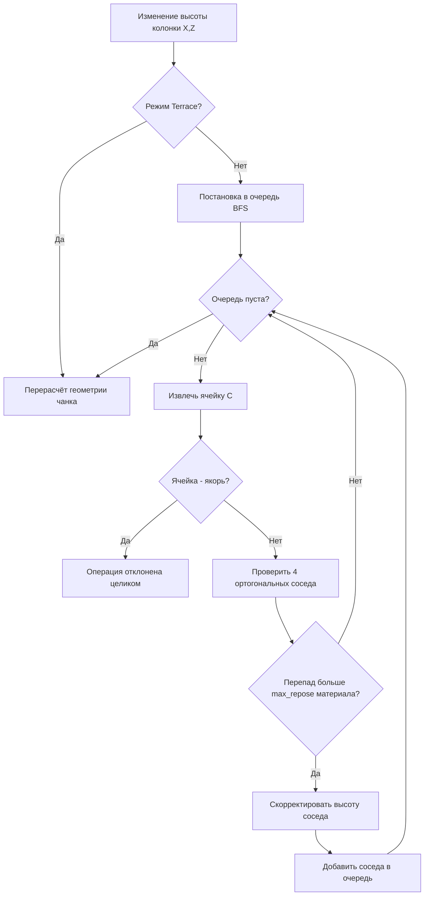

# Дизайн-документ: Дискретная Сеточно-Террасная Система Ландшафта (Grid Terrain System)

> **Проект:** Go To Happyness (Godot 4.7 / Forward+)
> **Статус:** Техническая спецификация, готова к Фазе 1
> **Целевая аудитория:** Подростки и взрослые (14+), ценящие креативность, точность и архитектурный контроль.

---

## 1. Концепция и Главные Принципы

Система ландшафта представляет собой **дискретную сетку колонок земли (Grid Elevation
System)**, жёстко привязанную к строительной сетке редактора зданий ($1 \times 1$ метр).

### Ключевые столпы:
1. **Блок первичен, уклон вторичен.** Земля — это колонки блоков с целочисленной
   высотой. Уклон не является самостоятельной высотой: это оформление перехода между
   двумя колонками, выбираемое **только из фиксированного каталога** (§3). Произвольных
   углов в системе не существует ни на одном уровне — ни в данных, ни в инструментах.
2. **Архитектурный порядок:** Никаких висящих углов у зданий, размытой грязи или
   хаотичных неровностей.
3. **Пирамидальная устойчивость (Auto-Cascading):** При подъёме или опускании колонки
   окружающая земля перестраивается по правилам естественного осыпания (Angle of
   Repose), формируя аккуратные террасы или холмы. Каскад — режим инструмента, а не
   безусловный закон мира (§4).
4. **Единая экосистема с Редактором Зданий:** Землю можно редактировать глобально на
   карте мира и локально в чертежах зданий (замки на холме, подпорные стены).
5. **Тоннели как конструкции:** Земля не выкапывается в мягкие пещеры. Входы в
   подземелья создаются через **вырезы в сетке (Holes)**, в которые вставляются готовые
   блочные конструкции.

---

## 2. Модель данных (ключевое архитектурное решение)

### 2.1. Что хранится, а что вычисляется

Это главный инвариант системы. Нарушение его приводит к рассинхрону меша, навигации и
сохранений.

| | Сущность | Тип | Где живёт |
| :--- | :--- | :--- | :--- |
| **Хранится** | Высота колонки `height` | `int`, в шагах $\Delta h$ | `TerrainGrid` |
| **Хранится** | Материал верха `material_id` | `StringName` | `TerrainGrid` |
| **Хранится** | Дескриптор склона `slope` | ID из каталога §3 + направление | `TerrainGrid` |
| **Хранится** | Флаг выреза `is_hole` | `bool` | `TerrainGrid` |
| **Вычисляется** | Высоты 4 углов ячейки | `float` | мешер |
| **Вычисляется** | Класс уклона грани (0–7) | `int` | из перепада соседей |
| **Вычисляется** | Высота стояния гражданина | `float` | интерполяция по дескриптору |
| **Вычисляется** | Проходимость ребра | `bool` + вес | экспорт в `NavGrid` |

**Дробные высоты вершин существуют только в сгенерированном меше.** Их нельзя ни
сохранить, ни задать вручную, ни получить редактированием — только как результат
разворачивания дескриптора склона из каталога.

### 2.2. Единицы измерения
* **Горизонтальная ячейка:** $1.0 \times 1.0$ м (совпадает с `SettlementGame.CELL_SIZE`
  и `BuildingBlueprints.BLOCK_SIZE`).
* **Базовый шаг высоты ($\Delta h$):** $0.5$ м.
* **Диапазон высот:** $-64 \dots +191$ шага (умещается в `int8` со смещением; $-32$ м до
  $+95.5$ м). Выход за диапазон — операция отклоняется, а не клампится молча.
* **Размер карты поселения:** $96 \times 96$ ячеек (`SettlementGame.BOARD_CELLS`).
  Мировая карта поверх этого — отдельный слой, вне рамок этого документа.

### 2.3. Структура ячейки

```gdscript
# game/features/world/domain/terrain_cell.gd — чистые данные, без Node3D
height: int            # шагов Δh от нуля мира
material_id: StringName
slope_id: StringName   # &"flat" | &"gentle" | &"moderate" | &"steep" | ...
slope_dir: int         # 0..7, направление подъёма (N, NE, E, ...)
slope_index: int       # позиция ячейки внутри многоклеточного пандуса (0..run-1)
flags: int             # IS_HOLE | IS_ANCHOR | ...
```

`TerrainGrid` хранит их как параллельные `PackedByteArray` / `PackedInt32Array` по
чанкам, а не как `Array[Object]` — это критично для памяти и скорости сохранения.

---

## 3. Каталог уклонов

Уклон — это **переход между колонками**, а не высота. Он всегда занимает целое число
ячеек по горизонтали (`run`) и целое число шагов $\Delta h$ по вертикали (`rise`). Ничего
за пределами этой таблицы построить нельзя.

| Класс | ID | Угол | rise : run | Занимает клеток | Игровое назначение | Оформление |
| :--- | :--- | :--- | :--- | :--- | :--- | :--- |
| **0** | `flat` | 0° | $0 : 1$ | 1 | Площадки под здания, дороги, площади | Верхняя текстура покрытия |
| **1** | `shallow` | 5.625° | $1 : 8$ | **8** | Длинные пологие дороги, серпантины для тяжёлого груза и осадных башен | Едва заметный уклон дёрна |
| **2** | `gentle` | 11.25° | $1 : 4$ | **4** | Пологий холм, серпантины, съезды для телег | Плавный переход дёрна |
| **3** | `moderate` | 22.5° | $1 : 2$ | **2** | Естественные холмы, обычные съезды | Сглаженный меш с травой |
| **4** | `steep` | 45° | $1 : 1$ | 1 | Овраги, насыпи | Крутая насыпь / осыпь |
| **5** | `very_steep` | 63.4° | $2 : 1$ | 1 | Скалистая осыпь | Текстура осыпи |
| **6** | `pre_cliff` | 76.0° | $4 : 1$ | 1 | Укреплённый эскарп | Скалы / подпорные распорки |
| **7** | `cliff` | 90° | $n : 0$ | 0 | Отвесный обрыв любой высоты | **Авто-скала** или подпорная стенка |

Ряд rise:run — геометрическая прогрессия ($0, \tfrac18, \tfrac14, \tfrac12, 1, 2, 4,
\infty$), удваивающаяся на каждом классе; `shallow` продолжает её на шаг ниже `gentle`,
а не меняет принцип таблицы. Угол — номинальная метка для UI и балансировки скорости
(§10.2), не результат прямого `atan(rise/run)`; фактический угол вершин мешер всегда
считает из реальных `Δh` и `run`.

### 3.1. Как это работает на многоклеточных пандусах

Класс 2 (`gentle`) — это **один объект, растянутый на 4 ячейки**, а не 4 независимые
ячейки с дробной высотой. Все 4 ячейки несут один `slope_id = gentle`, одинаковый
`slope_dir` и разный `slope_index` (0, 1, 2, 3). Мешер разворачивает это в вершины с
шагом $\Delta h / 4 = 0.125$ м; данные при этом остаются целочисленными. Класс 1
(`shallow`) устроен так же, но на 8 клеток и с шагом меша $\Delta h / 8 = 0.0625$ м.

```
Профиль gentle (11.25°), подъём 1 шаг на 4 клетки:

  H+1                                    ┌────
      slope_index:  0     1     2     3  │
  H        ────┬─────┬─────┬─────┬───────┘
               └ 0.125 м на клетку (только в меше)
```

Инструмент «Пандус» ставит такой объект целиком, задавая класс и направление вручную:
система проверяет, что нужные клетки (4, 8 или 2, по `run` класса) свободны и что
перепад между конечными колонками равен `rise`. Если не сходится — пандус не ставится,
подсвечивается красным. Частичный пандус в данных невозможен. Этот инструмент — часть
Редактора Карт и Редактора Зданий (§5); в обычном игровом инструменте высоты (§3.2)
игрок классом не управляет напрямую, он вычисляется автоматически.

### 3.2. Авто-выбор класса на границе (Auto-Slope Selection)

Игровой инструмент высоты (не Редактор Карт) не даёт игроку выбирать `slope_id`. После
каждой операции (каскад §4 или ручное выравнивание) для каждой границы между колонками
разной высоты отдельный проход подбирает класс автоматически:

1. Взять перепад между колонками (в шагах $\Delta h$).
2. Перебрать каталог §3 от самого пологого класса (`shallow`) к самому крутому
   (`pre_cliff`), пропуская `flat`.
3. Взять первый класс, у которого `rise` делит перепад нацело **и** вдоль направления
   подъёма есть `run` свободных, не занятых якорем и не размеченных под другой пандус
   клеток.
4. Если ни один класс не подошёл (клеток не хватает или перепад не делится ни на один
   `rise`) — граница получает `cliff`. Это не ошибка и не блокирует операцию: голая
   отвесная грань — штатный итог, когда пологому пандусу физически негде поместиться.

Это делает результат кисти предсказуемым (самый пологий из возможных склонов) и снимает
с игрока необходимость знать таблицу §3 наизусть, сохраняя её как источник правды для
Ramp Tool и для расчёта скорости и проходимости (§10).

### 3.3. Класс `cliff` — не пандус

`cliff` не занимает клеток вообще. Это просто отсутствие пандуса между двумя колонками
разной высоты: боковая грань колонки, которую мешер оформляет авто-скалой или подпорной
стенкой в зависимости от материала.

### 3.4. Углы ячейки и диагонали

Прежнее «правило усреднения диагоналей» отменено. Высоты 4 углов ячейки вычисляются
детерминированно из её собственного дескриптора склона и высот 4 ортогональных соседей;
диагональные соседи делят с ячейкой ровно один угол, поэтому пирамидальные углы и срезы
получаются автоматически, без отдельного правила и без разрывов меша.

---

## 4. Каскад устойчивости (Cascade Slope Propagation)

### 4.1. Три режима инструмента

Каскад — не безусловный закон мира: игрок должен уметь строить и природный холм, и
отвесную террасу. Инструмент высоты работает в одном из трёх режимов.

| Режим | Каскад | Результат | Требование |
| :--- | :--- | :--- | :--- |
| **Sculpt** | Включён | Природный холм с осыпанием | — |
| **Terrace** | Выключен | Отвесная грань (`cliff`) | Грань требует подпорной стены или авто-скалы |
| **Level** | Включён | Площадка выравнивается в `flat` | — |

### 4.2. Угол осыпания зависит от материала

Максимальный уклон, который держится без подпорной стены, — свойство материала, а не
глобальная константа.

| Материал | Max angle of repose | Класс |
| :--- | :--- | :--- |
| Песок / гравий | 22.5° | 3 |
| Земля / грязь | 45° | 4 |
| Трава / дёрн | 45° | 4 |
| Камень / скала | 76.0° | 6 |
| Подпорная стена (конструкция) | 90° | 7 |

### 4.3. Алгоритм



### 4.4. Инварианты каскада

- **Якоря.** Ячейки под построенным зданием, дорогой или размещённым чертежом помечены
  `IS_ANCHOR`. Каскад **не двигает** их. Если волна каскада дошла до якоря — вся операция
  отклоняется целиком и откатывается, а не применяется частично. Молча просесть земле
  под домом нельзя.
- **Атомарность.** Операция вычисляется на копии региона и применяется одним коммитом.
  Это же даёт бесплатный undo: хранится дельта (список `cell -> old_height`).
- **Завершаемость.** Каждая итерация строго уменьшает или увеличивает высоту в
  направлении цели, повторный заход в ячейку с той же высотой отсекается. Ограничитель —
  максимум $10^4$ обработанных ячеек на операцию; превышение = отклонение.
- **Детерминизм.** Обход очереди — по отсортированному ключу ячейки, не по порядку
  вставки в `Dictionary`. Один и тот же ввод даёт один и тот же рельеф на любой машине
  (важно для сохранений и тестов).

### 4.5. Авто-откосы при выравнивании (Auto-Skirt)

Голое плато с отвесными краями — самый частый неиграбельный результат выравнивания.
Режим **Level** решает это не отдельной кистью, а завершающим шагом операции:

1. Каскад (§4) выполняется как обычно и приводит целевую площадку к `flat`.
2. По периметру площадки, для каждой границы с более низкой соседней колонкой, авто-выбор
   класса (§3.2) пытается положить самый пологий пандус, который помещается в свободные
   клетки за пределами площадки.
3. Клетки, не свободные для пандуса (застройка, якорь, другая площадка, край карты) или
   не прошедшие валидацию §3.2, — получают `cliff`, как и предусмотрено §3.2. Это не
   откат операции: сама площадка выравнивается всегда, откос — лучший, что нашёлся.

Игрок таким образом получает пологий выезд с плато бесплатно там, где для него было
место, и честный обрыв там, где места не было — без отдельного шага «теперь обстрой края
пандусами вручную».

---

## 5. Структура файлов и режимы редактирования

### 5.1. Разделение типов файлов: Карты vs Чертежи

```
┌────────────────────────────────────────────────────────────────────────┐
│                        ТИПЫ ДАННЫХ И ФАЙЛОВ                            │
├──────────────────────────────────────┬─────────────────────────────────┤
│ 1. Файл Карты Мира (.map)            │ 2. Чертёж Здания (.gdbuilding)  │
│ ──────────────────────────           │ ──────────────────────────      │
│ • Глобальная сетка высот карты       │ • Блоки здания (стенки, крыши)  │
│ • Карта биомов и материалов          │ • Слой "Подземные конструкции"  │
│ • Реки, озёра, уровень воды          │ • Слой "Ландшафтный фундамент"  │
│ • Спавн ресурсов и растительности    │   (Локальная земля/терраса)     │
└──────────────────────────────────────┴─────────────────────────────────┘
```

### 5.2. Земля в Редакторе Зданий
Добавляется 3-й слой просмотра/редактирования:
* `Надземный (Aboveground)` — конструктивные блоки здания.
* `Подземный (Underground)` — подвалы, бункеры, тоннели.
* `Местность/Фундамент (Terrain Base)` — локальная земля, привязанная к чертежу.

Высоты слоя `Terrain Base` хранятся **относительно якорной ячейки чертежа**, а не в
абсолютных координатах мира. Иначе чертёж нельзя переиспользовать на другой высоте.

### 5.3. Слияние чертежа с картой (Placement Merge)

Самое опасное место системы: размещение чертежа модифицирует уже существующую землю
игрока. Порядок строгий.

1. **Выбор якорной высоты.** Берётся медиана высот колонок под пятном застройки.
2. **Сухой прогон (dry run).** Merge считается на копии региона: применяются высоты
   чертежа, затем каскад в режиме Sculpt по границе пятна.
3. **Валидация.** Отклоняется, если: волна каскада задела чужой якорь; перепад по
   границе превышает 4 шага; пятно пересекает воду или вырез (`is_hole`); в survival — не
   хватает грунта (§8).
4. **Превью.** До подтверждения показывается призрак итогового рельефа: срез — синим,
   насыпь — жёлтым, конфликт — красным.
5. **Коммит.** Применяется одной транзакцией с записью дельты в undo.

Система вправе **отказать** в размещении. Это не ошибка, а нормальный ответ.

---

## 6. Вырезы Земли для Тоннелей и Входов (Terrain Hole Masking)

Тоннели не выкапываются вокселями, а строятся как жёсткие конструкции. Применяется
система масок выреза.

1. **Флаг ячейки `is_hole`:** ячейка помечается как вырезанная.
2. **Геометрия не генерируется.** В вырезанных ячейках мешер **не создаёт полигонов** —
   ни верха, ни граней. Вариант с `discard` в фрагментном шейдере **отвергнут**: он ломает
   depth-prepass и тени и, главное, не убирает коллизию — гражданин упрётся в невидимую
   землю в проёме тоннеля.
3. **Коллизия синхронна мешу.** `ConcavePolygonShape3D` чанка строится из того же набора
   полигонов, поэтому дырка в коллизии появляется автоматически.
4. **Стыковочный модуль.** Модуль входа (каменная арка, дверь бункера) перекрывает края
   выреза; его собственная коллизия обеспечивает стены проёма.

---

## 7. Материалы, Раскрашивание и Бесшовный Блендинг

### 7.1. Палитра материалов
* **Трава / Дёрн** (основа поселения)
* **Земля / Грязь** (дороги, тропинки, огороды)
* **Камень / Скала** (горные массивы, обрывы)
* **Песок / Гравий** (пляжи, берега рек)
* **Снег** (высокогорье, зимний период)

Материал — не только визуал: он задаёт угол осыпания (§4.2), вес прохода в `NavGrid` и
выход грунта при копке (§8).

### 7.2. Алгоритм смешивания (Triplanar + Height-Based Blending)
* **Height-Based Splatmap Blend**: шейдер учитывает карту высот самой текстуры, поэтому
  трава прорастает сквозь щели камней на границе кисти вместо мутного размытия.
* **Splatmap** — `ImageTexture` формата `RGBA8` с разрешением 1 тексель на ячейку (для
  карты $96 \times 96$ это $96 \times 96$ пикселей, копейки). 4 канала = 4 веса материалов
  на ячейку, 5-й материал (снег) накладывается процедурно по высоте и уклону.
* **Triplanar** включается только на гранях класса 5–7, где UV по верхней плоскости
  растягивались бы. На плоскости и пологих склонах — обычные UV, это дешевле.
* **Авто-скала.** Боковые грани класса 7 получают отдельный surface с каменным
  материалом, независимо от материала верха колонки.

---

## 8. Земляные работы и экономика грунта (survival)

В песочнице/редакторе высота меняется мгновенно и бесплатно. В режиме выживания земля —
ресурс.

1. **Объём.** Одна колонка на 1 шаг $\Delta h$ = **1 единица грунта** (`soil`). Материал
   определяет тип: земля даёт `soil`, камень — `stone` и требует кирки, песок — `sand`.
2. **Баланс.** Срез колонки кладёт грунт на склад/в отвал; насыпь его расходует. Насыпать
   холм из воздуха нельзя.
3. **Приказ «Подготовить площадку».** Игрок выделяет прямоугольник и целевую высоту.
   Создаётся заказ в существующей системе ордеров (`order_system.md`); рабочие с лопатами
   по одной ячейке приводят площадку к `flat`, по алгоритму §4, каждый шаг —
   отдельная задача с переносом грунта.
4. **Прогресс виден.** Ячейка меняет высоту на полный шаг за раз — промежуточных
   «полукопаных» состояний нет, это следствие §2.1.

---

## 9. Вода и Гидрология (Реки, Озёра, Моря, Лава)

1. **Сетка воды (Water Height Grid):** отдельный дискретный слой высот с тем же шагом
   $\Delta h$. Вода **авторская, а не симулируемая** — уровень задаётся кистью и не
   перетекает по кадрам. Заливка низин считается один раз, при правке рельефа.
2. **Типы водоёмов:**
   * *Реки и озёра:* заполняют низины (уровень земли ниже уровня воды).
   * *Прибрежная пена:* на стыке воды и склонов шейдер рендерит прибой.
   * *Лава:* тот же слой, горячий шейдер, Emission, урон/поджог проходящим гражданам
     через feature `needs`.
3. **Навигация.** Глубина = уровень воды минус высота колонки.
   * $\le 1$ шаг ($0.5$ м) — брод, проходим с весом $\times 3$.
   * $> 1$ шаг — непроходим пешком, нужен мост или лодка.
   * Лава — непроходима всегда, независимо от глубины.

---

## 10. Взаимодействие с Citizen AI (`routing` и `needs`)

### 10.1. Проходимость — свойство ребра, а не ячейки

**Это меняет API `NavGrid`.** Сейчас `NavGrid` оперирует `Vector2i` и хранит
`_blocked` / `_cell_weights` по ячейкам. Со склонами двух свободных ячеек мало: перепад
между ними может быть непроходим. Проверку надо перенести на ребро.

- `CONNECTED_DIRECTIONS` фильтруется по перепаду: сосед считается связанным только если
  класс уклона грани между ними допустим для профиля путника.
- Диагональные переходы дополнительно требуют, чтобы обе ортогональные ячейки-«плечи»
  тоже были проходимы — иначе гражданин срежет угол сквозь скалу.
- `TravelerProfile` получает поле `max_slope_class`: пешеход — 5, тележка — 3, тяжёлый
  груз — 2.

### 10.2. Скорость по уклону

| Класс | Угол | Пешеход | Тележка / курьер с грузом |
| :--- | :--- | :--- | :--- |
| 0–3 | 0° – 22.5° | 100% | 100% (класс 3 — 70%) |
| 4 | 45° | 50% | непроходимо |
| 5 | 63.4° | 25% | непроходимо |
| 6–7 | 76° – 90° | непроходимо | непроходимо |

Классы 6–7 требуют лестниц, серпантинов или подъёмников.

### 10.3. Многоуровневость

Тоннели (§6), мосты и этажи зданий делают ключ `Vector2i` недостаточным: над одной
клеткой карты может быть и пол тоннеля, и поверхность земли. Это **отдельная задача,
намеренно вынесенная за рамки Фазы 1–4**.

Подготовка, которую надо сделать сразу, чтобы потом не переписывать: ключ ячейки в
`NavGrid` инкапсулировать (`NavCell`), а не использовать `Vector2i` напрямую по всему
коду. Когда появится `IndoorGraph` (см. `navigation_and_roads.md` §319), ключ расширится
до `(cell, level)` без правки всех вызывающих.

### 10.4. Высота стояния

`NavGrid` отдаёт `height_at(position) -> float` — интерполяцию по дескриптору склона.
Граждане и герой ставятся на неё; `CharacterBody3D` продолжает работать по коллизии, но
маршрутные точки и превью строятся по этому запросу, чтобы путь не парил над склоном.

---

## 11. Производительность, чанки и коллизия

| Параметр | Значение | Обоснование |
| :--- | :--- | :--- |
| Размер чанка | $16 \times 16$ ячеек | 36 чанков на карту $96 \times 96$ |
| Меш чанка | один `ArrayMesh`, до 3 surface | верх / грани / авто-скала |
| Коллизия чанка | `ConcavePolygonShape3D` из тех же полигонов | синхронна вырезам |
| Бюджет перестройки | **не более 2 чанков за кадр** | правка кистью грязнит до 9 чанков |
| Слияние граней | greedy meshing по плоским областям | плоская площадка $16\times16$ = 2 треугольника, не 512 |
| LOD | чанки дальше 64 м — только верхняя поверхность, без боковых граней | камера изометрическая, граней всё равно не видно |

Грязные чанки собираются в очередь и перестраиваются по бюджету; во время
перетаскивания кисти показывается лёгкое превью, полная перестройка — на отпускание.

**Риск и план Б.** Если меширование на GDScript не укладывается в бюджет, порядок
действий: сначала greedy meshing и дельта-обновление, затем перенос мешера в C#/GDExtension.
Переносить заранее, до замеров, не нужно.

---

## 12. Сохранение и формат

- Сетка сохраняется по чанкам в существующую feature `save_load`.
- Формат чанка: `height` — `PackedByteArray` со смещением; `material_id` — байтовый
  индекс в каталог; `slope_id`/`slope_dir`/`slope_index`/`flags` — упакованы в один байт.
  Итого 3 байта на ячейку, $\approx 28$ КБ на карту $96 \times 96$ — сжатие не требуется.
- В заголовке — `format_version`. Каталоги материалов и уклонов сохраняются как список
  строковых ID, а не как индексы, чтобы добавление материала не ломало старые сохранения.
- Чанк, полностью совпадающий с дефолтом (плоский, один материал), пишется одним флагом.

---

## 13. Миграция с Terrain3D

Аддон `addons/terrain_3d` **выпиливается**. Он реализует непрерывный heightmap-скульптинг
со своей коллизией, LOD и splatmap'ом — модель, несовместимую с дискретными террасами:
отвесных граней и чистых углов он не даёт, per-cell материал — тоже. Держать обе системы
нельзя: высота стала бы двойным источником правды, а её потребляет `routing`.

Порядок:
1. `game/features/world/presentation/terrain_3d_world.{gd,tscn}` заменяется на
   `grid_terrain_world.{gd,tscn}`.
2. `game/features/world/data/terrain3d/*.res` удаляются (стартовый рельеф заново
   генерируется процедурно либо задаётся плоской картой).
3. Проверить потребителей: `world_setup.gd`, `territory_base.gd`, `camera_controller.gd` —
   всё, что запрашивало высоту у Terrain3D, переводится на `TerrainGrid.height_at()`.
4. Каталог `addons/terrain_3d` удаляется, зависимость снимается с `project.godot`.

---

## 14. Размещение в архитектуре проекта

Слоистость проекта (`AGENTS.md`) обязательна: алгоритмы каскада и меширования нельзя
смешивать.

```text
game/features/world/
  domain/terrain/
    terrain_cell.gd        # данные ячейки
    terrain_grid.gd        # сетка, чанки, get/set — без Node3D
    slope_catalog.gd       # §3, единственный источник правды по уклонам
    cascade_solver.gd      # §4, чистая функция: (grid, op) -> delta | null
  application/
    terrain_service.gd     # транзакции, undo-стек, экспорт в NavGrid
    earthworks_service.gd  # §8, заказы на земляные работы
  presentation/
    grid_terrain_world.gd  # чанки, ArrayMesh, коллизия
    terrain_chunk_mesher.gd
    terrain_brush_tool.gd
```

### Тесты (обязательны для Фазы 2)

`cascade_solver.gd` — чистый детерминированный алгоритм без движковых типов, покрывается
юнит-тестами напрямую:
- каскад на плоскости даёт симметричную пирамиду;
- угол осыпания соблюдается для каждого материала §4.2;
- волна, дошедшая до якоря, отклоняет операцию целиком, сетка не изменена;
- применение дельты и её откат возвращают исходную сетку побайтно;
- многоклеточный пандус ставится только при перепаде, равном `rise` класса, и наличии
  ровно `run` свободных клеток вдоль направления (§3, оба класса — `shallow` и `gentle`);
- авто-выбор класса (§3.2) на границе с недостающим местом или неделящимся перепадом
  всегда даёт `cliff`, никогда не самый близкий по углу класс, который не проходит
  валидацию.

---

## 15. План интеграции в проект

```
[Фаза 0: Снос Terrain3D]
   ├── Удаление аддона и .res-регионов
   └── Заглушка плоского GridTerrain, чтобы игра запускалась

[Фаза 1: Модель данных и мешер]
   ├── TerrainGrid + TerrainCell + SlopeCatalog (§2, §3)
   ├── Чанковый мешер: flat, cliff, steep (45°) + коллизия
   └── Пандусы gentle/moderate как многоклеточные объекты

[Фаза 2: Каскад и кисти редактора]
   ├── CascadeSolver с тремя режимами и якорями (§4) + юнит-тесты
   ├── Height Brush / Material Brush / Ramp Tool, undo-стек
   └── Бюджет перестройки чанков (§11)

[Фаза 3: Интеграция с навигацией]
   ├── Проходимость по рёбрам, max_slope_class в TravelerProfile (§10)
   ├── NavCell вместо голого Vector2i — задел под многоуровневость
   └── height_at() для граждан и героя

[Фаза 4: Вырезы, вода и шейдеры]
   ├── Triplanar + Height-Based Blending, авто-скала (§7)
   ├── Cutout Hole Mask без discard (§6)
   └── Дискретный слой воды, брод, береговая пена (§9)

[Фаза 5: Чертежи и земляные работы]
   ├── Слой Terrain Base в .gdbuilding, относительные высоты (§5.2)
   ├── Placement Merge с dry run, превью и правом отказа (§5.3)
   └── Экономика грунта и заказы «Подготовить площадку» (§8)
```

---

## 16. Библиотеки и средства

Сторонние библиотеки **не нужны** — всё покрывается штатным Godot.

| Задача | Средство |
| :--- | :--- |
| Меш террейна | `ArrayMesh` + `SurfaceTool`, по чанкам |
| Коллизия | `ConcavePolygonShape3D` на чанк |
| Блендинг материалов | свой шейдер, splatmap через `ImageTexture` |
| Декор и растительность | `MultiMeshInstance3D` |
| Вода | плоский меш + свой шейдер |
| Навигация | собственный `NavGrid` + A* |

Сознательно **не используем**:
- `Terrain3D` — см. §13.
- `godot_voxel` (Zylann) — другая модель данных (воксели / marching cubes), даёт
  сглаженные пещеры, которые дизайн явно отвергает (§1.5), и тянет GDExtension.
- `NavigationServer3D` / `NavigationMesh` — сетка маршрутов в проекте уже своя,
  детерминированная и завязанная на веса дорог и троп; navmesh её не заменит.
- `HeightMapShape3D` — не поддерживает отвесные грани и вырезы.

---

> [!TIP]
> **Главный выигрыш архитектуры:** чёткость контрольных сеток (RCT / Timberborn) при
> визуальной эстетике современных симуляторов — за счёт авто-скал 90° и height-based
> блендинга. Ключ к тому, чтобы это не развалилось: **хранятся только целые блоки и ID
> уклонов из каталога; всё дробное — производное и живёт только в меше.**
