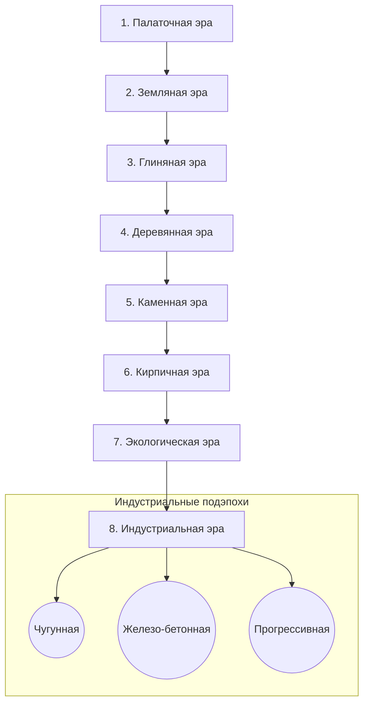

# Дизайн-документ: Эпохи развития (Epochs)

## 1. Введение и общая концепция

Настоящий документ описывает структуру эпох (эр) развития поселения, прогрессию транспорта и торговли, а также механику удовлетворенности жителей (Wellbeing). Система уровней, специализаций и улучшений построек вынесена в [building_upgrades.md](building_upgrades.md).

Основная идея игры — это плавный переход от микро-симуляции выживания в диких условиях к макро-симуляции масштабного индустриального города. 

### Смена масштаба и фокуса геймплея:
*   **Доиндустриальные эпохи**: Фокус игрока сосредоточен на выживании небольшого племени/поселения. Каждая единица ресурса имеет значение, жители обладают выраженной индивидуальностью, игрок детально контролирует их потребности, логистику и личное благоустройство.
*   **Индустриальная эпоха**: Происходит переход на масштаб макро-менеджмента. Игрок больше не следит за тем, как отдельный житель идет кушать или спать — вместо этого он оперирует рабочими сменами заводов, балансом энергосетей, транспортными потоками (поезда, грузовики) и зонированием жилых и промышленных кварталов.

### Иммерсивность первого лица (First-Person Perspective - FPP):
Игра позволяет игроку в любой момент переключиться в режим от первого лица и прогуляться по улицам своего поселения. Это решает важнейшие эмоциональные задачи:
1.  **Чувство гордости**: Игрок видит, как его поселение «живет своей жизнью» — жители ездят на велосипедах или мопедах, общаются, спешат на работу или идут за покупками.
2.  **Интерактивный быт (Связь с реальностью)**: Игрок может наравне с жителями зайти в местную лавку, на рынок или в супермаркет, чтобы купить продукты или товары личного пользования. Это стирает грань между стратегическим планированием и живым миром.

---

## 2. Хронология развития: Общая таблица эпох

Развитие разделено на 8 глобальных эпох (6 доиндустриальных, 1 переходная экологическая и 1 индустриальная, состоящая из 3 подэпох).

| Эпоха / Код | Цель эры | Тип управления | Базовые материалы | Главный транспорт | Дорожная сеть |
| :--- | :--- | :--- | :--- | :--- | :--- |
| **1. Палаточная** (`TENT`) | Выжить | Выживание племени | Ветки, Трава | Отсутствует | Тропинка (*Dirt Path*) |
| **2. Земляная** (`EARTH`) | Процветать | Небольшая община | Почва, Ветки, Кожа | Велосипеды | Грунтовая дорога (*Dirt Road*) |
| **3. Глиняная** (`CLAY`) | Торговать | Поселение ремесленников | Глина, Простой металл | Велосипеды с тележкой | Глинобитная дорога (*Clay Road*) |
| **4. Деревянная** (`WOOD`) | Продвинутая экономика | Деревянный городок | Доски, Бревна | Мопеды | Деревянная мостовая (*Wooden Road*) |
| **5. Каменная** (`STONE`) | Базовая политика | Каменный город | Камень, Черепица | Мопеды с коляской | Каменная дорога (*Stone Road*) |
| **6. Кирпичная** (`BRICK`) | Производства и плотное взаимодействие с соседними поселениями | Ранний индустриальный узел | Кирпич, Стекло | Легковые / Грузовые авто | Асфальтовая дорога (*Asphalt Road*) |
| **7. Экологическая** (`ECO`) | Эко-технологии | Эко-устойчивое поселение | Эко-материалы, Композиты | Электровелосипеды / Электрокары | Выделенные эко-полосы / Эко-плитка |
| **8. Индустриальная** (`INDUSTRIAL`)* | Макро-индустрия | Глобальный макро-менеджмент | Чугун, Железобетон, Сплавы | Поезда, Тяжелые грузовики | Асфальто-бетонная / Железная дорога |

*\* Примечание: Индустриальная эпоха делится на 3 подэпохи: Чугунная, Железо-бетонная и Прогрессивная. Управление в ней меняется на масштаб заводов и макро-логистики. Детальная проработка индустриального этапа в рамках данного документа не приводится.*

---

## 3. Детальное описание доиндустриальных эпох

### 3.1. Палаточная эра (Era.TENT)
*   **Суть**: Начало цивилизации. Жители живут в простейших палатках из веток и травы.
*   **Ограничения**:
    *   Дороги: Исключительно вытаптываемые тропинки (Dirt Path), которые протаптываются сами жителями при частом хождении.
    *   Транспорт: Отсутствует. Все ходят только пешком. Скорость перемещения минимальна.
    *   Образование: Отсутствует. Все навыки приобретаются только в процессе тяжелого труда.
*   **Торговля**: Полноценной торговли и экспорта еще нет. Сразу доступна только аварийная закупка через входную табличку поселения: сухпайки и строительные перчатки. Расширенная торговля появляется после постройки палаточного рынка, открываемого Костром 3-го уровня.

### 3.2. Земляная эра (Era.EARTH)
*   **Суть**: Община зарывается в землю. Появляются первые землянки (Dugouts), защищающие от холода.
*   **Ограничения**:
    *   Дороги: Игрок может прокладывать грунтовые дороги (Dirt Road).
    *   Транспорт: Появляются первые **Велосипеды** (Bicycles) с деревянной рамой.
*   **Образование (Примитивная школа)**:
    *   Позволяет построить первую **Примитивную лесную школу**. В ней дети обучаются базовой грамотности, что дает постоянный пассивный буст к скорости обучения профессиям на 15%.
*   **Транспорт и инфраструктура**:
    *   *Транспорт*: Велосипед. Увеличивает скорость юнита на грунтовых дорогах на 50%.
    *   *Обслуживание*: **Веломастерская (уровень 1)**. Требует дерево и кожу для обслуживания рам и кожаных шин/седел. Без обслуживания велосипеды изнашиваются и ломаются (юнит снова идет пешком).
*   **Торговля**:
    *   Появляется **Торговая лавка** (Stall). Продавец раскладывает на столе излишки ягод, вяленого мяса и воды. Жители тратят заработанную на общих работах монету, покупая еду, что повышает удовлетворенность.

### 3.3. Глиняная эра (Era.CLAY)
*   **Суть**: Открытие обжига глины. Строятся глиняные дома, появляется первая посуда и более гигиеничные условия жизни.
*   **Ограничения**:
    *   Дороги: Глинобитные дороги (Clay Road).
    *   Транспорт: **Велосипеды с тележкой** (Cargo Bicycles).
*   **Образование**:
    *   Примитивная школа улучшается до **Глиняной общинной школы**. В ней появляется преподавание ремесел, что открывает доступ к более сложным профессиям без необходимости долгой практики.
*   **Транспорт и инфраструктура**:
    *   *Транспорт*: Велосипед с деревянной тележкой. Позволяет курьерам перевозить до 4 единиц сырья одновременно (вместо 1 единицы в руках), сохраняя скорость велосипеда на глинобитной дороге.
    *   *Обслуживание*: **Мастерская колесного транспорта (уровень 2)**. Занимается ремонтом осей тележек и велосипедов.
*   **Торговля**:
    *   Появляется **Киоск** (Kiosk). Крытая деревянно-глиняная постройка. Продавец предлагает не только еду, но и базовые бытовые товары (глиняные горшки, теплая одежда из шкур, простые инструменты).

### 3.4. Деревянная эра (Era.WOOD)
*   **Суть**: Развитие деревообработки, лесопилок. Строятся полноценные деревянные дома из досок, ратуша.
*   **Ограничения**:
    *   Дороги: Деревянные мостовые (Wooden Road).
    *   Транспорт: Появление первых **Мопедов** (Mopeds) на дровах или угле (паровые/газогенераторные прототипы).
*   **Образование**:
    *   Строится **Земская деревянная школа**. Появляется деление на классы, подготовка писарей и счетоводов, улучшающих работу ратуши и складов.
*   **Транспорт и инфраструктура**:
    *   *Транспорт*: Мопед. Скорость перемещения на 100% выше пешехода. Позволяет быстро перемещаться на дальние дистанции (например, от жилого сектора к удаленной шахте).
    *   *Обслуживание*: **Гараж легкого моторного транспорта**. Обслуживает мопеды. Требует постоянного снабжения углем или сухими дровами (топливо) и смазочным дегтем.
*   **Торговля**:
    *   Появляется **Рынок** (Market). Полноценная площадь с прилавками. Продает широкий ассортимент товаров: доски для мебели, разнообразные продукты питания, льняную одежду. Жители активно посещают рынок в свободное время.

### 3.5. Каменная эра (Era.STONE)
*   **Суть**: Архитектура из тесаного камня. Дома становятся прочными, долговечными, снижается риск пожаров (который будет внедрен позже).
*   **Ограничения**:
    *   Дороги: Каменные дороги (Stone Road).
    *   Транспорт: Мопеды с грузовой коляской, прототипы первых паровых автомобилей.
*   **Образование**:
    *   Земская школа эволюционирует в **Каменную городскую гимназию**. Дает глубокие знания математики и механики.
*   **Транспорт и инфраструктура**:
    *   *Транспорт*: Грузовой мопед (мотороллер) и легкие паровые тягачи. Перевозят до 6-8 единиц груза.
    *   *Обслуживание*: **Механический цех обслуживания**. Ремонт поршней, осей, замена прокладок.
*   **Торговля**:
    *   Появляется **Магазин** (Shop). Каменное крытое здание со стеллажами и витринами. Игрок в FPP может войти внутрь, подойти к прилавку и купить товары первой необходимости.

### 3.6. Кирпичная эра (Era.BRICK)
*   **Суть**: Вершина доиндустриального развития. Кирпичные заводы, мануфактуры, высокая плотность застройки.
*   **Ограничения**:
    *   Дороги: Асфальтовые дороги (Asphalt Road).
    *   Транспорт: **Автомобили** (легковые для велбеинга богатых жителей, грузовые для нужд мануфактур).
*   **Образование (Техникумы / Ремесленные училища)**:
    *   Появляется **Среднеспециальное техническое училище**. Готовит специализированные кадры: мастеров плавки, инженеров паровых котлов, профессиональных ткачей. Позволяет значительно ускорить работу мануфактур за счет комплектования смен дипломированными рабочими.
*   **Транспорт и инфраструктура**:
    *   *Транспорт*: Легковые автомобили (для быстрого передвижения управленцев) и грузовики (перевозят до 15 единиц груза за раз).
    *   *Обслуживание*: **Станция технического обслуживания (СТО)** и **Бензоколонка**. Требуют переработки нефти/угля для получения бензина и дизеля.
*   **Торговля**:
    *   Появляется **Универмаг / Торговый центр** (Department Store). Огромное кирпичное здание со множеством отделов (одежда, еда, хозтовары, игрушки).

---

## 4. Обзор постиндустриальных и индустриальных эпох (Для информации)

### 4.1. Экологическая эпоха (Era.ECO)
Переходная эра, в которой человечество отказывается от загрязнения окружающей среды в пользу «зеленых» технологий.
*   **Материалы**: Переработанное дерево, биокомпозиты, закаленное эко-стекло, солнечная черепица.
*   **Геймплей**: Фокус на переработке отходов (Recycling), очистке воды и почвы, выработке чистой энергии (ветряки, гидроэлектростанции).
*   **Транспорт**: Электровелосипеды, бесшумные электрокары.
*   **Цель игрока**: Максимизировать экологический баланс поселения без потери уровня удовлетворенности жителей.

### 4.2. Индустриальная эпоха (Era.INDUSTRIAL)
Эпоха глобализации и гигантских заводов. Геймплей кардинально меняется. Вместо заботы об отдельных жителях игрок планирует мега-инфраструктуру.
Делится на три подэпохи:
1.  **Чугунная подэпоха (Cast Iron Era)**:
    *   *Технологии*: Паровые поршневые двигатели, ткацкие станки, выплавка чугуна, угольные шахты.
    *   *Логистика*: Первые железные дороги на паровой тяге.
    *   *Атмосфера*: Закопченные кирпичные трубы, густой черный дым, грохот паровых молотов.
2.  **Железо-бетонная подэпоха (Reinforced Concrete Era)**:
    *   *Технологии*: Электрические сети, двигатели внутреннего сгорания, конвейеры Форда, добыча нефти, железобетонные конструкции.
    *   *Логистика*: Сеть асфальтобетонных шоссе, грузовые автомобили, тепловозы.
    *   *Атмосфера*: Небоскребы, электрический свет, огромные заводские цеха с конвейерными линиями.
3.  **Прогрессивная подэпоха (Progressive Era)**:
    *   *Технологии*: Автоматизация, робототехника, атомная энергетика, легкие композитные сплавы, компьютерные терминалы.
    *   *Логистика*: Маглев-поезда, автоматические дроны-доставщики.
    *   *Атмосфера*: Футуристичный дизайн, сверкающие фасады, автоматизированные заводы-гиганты без участия человека.

---

## 5. Торговля и удовлетворенность жителей (Wellbeing & Trade)

Система торговли — это ключевой мостик между экономикой поселения и счастьем его жителей.

### 5.1. Потребность в товарах (Goods Consumption)
У жителей, помимо базового голода и сна, есть шкала **Потребительского спроса (Consumer Demand)**. 
*   Жители получают зарплату за свою работу в виде монет.
*   В нерабочее время (вечером или по выходным) они идут в ближайшее торговое заведение (лавку, киоск, рынок, магазин), чтобы потратить монеты.
*   Покупка товаров (одежда, обувь, мебель, посуда, деликатесы) сбрасывает шкалу спроса и дает мощный буст к **Wellbeing**.

### 5.2. Развитие торговых точек и вид от первого лица
Развитие торговли напрямую отражает рост поселения и меняет игровой опыт в режиме FPP:

1.  **Лавка / Лоток (Stall)**:
    *   *Вид сверху*: Маленький деревянный навес с ящиками.
    *   *Вид от первого лица*: Игрок видит грубый прилавок, продавец предлагает только базовую еду. Игрок может купить сушеное мясо, восстанавливающее здоровье.
2.  **Киоск (Kiosk)**:
    *   *Вид сверху*: Небольшая закрытая будка.
    *   *Вид от первого лица*: Появляется витрина с первыми промышленными товарами (свечи, простые ткани). Жители толпятся у окошка.
3.  **Рынок (Market)**:
    *   *Вид сверху*: Зона с несколькими торговыми рядами и палатками.
    *   *Вид от первого лица*: Шумное место. Жители переходят от прилавка к прилавку, выбирая товары. Игрок может подойти к разным торговцам (мяснику, зеленщику, ремесленнику).
4.  **Магазин (Shop)**:
    *   *Вид сверху*: Красивое каменное здание с большими окнами.
    *   *Вид от первого лица*: Игрок физически открывает дверь, заходит в теплое помещение магазина. Внутри стоят стеллажи, разложены товары, играет фоновая музыка (граммофон или радио в зависимости от эры). Жители берут корзинки и ходят вдоль полок. Игрок может сам взять товар с полки и расплатиться на кассе.
5.  **Универмаг / Торговый центр (Shopping Mall)**:
    *   *Вид сверху*: Величественное многоэтажное кирпично-стеклянное здание.
    *   *Вид от первого лица*: Просторные залы, стеклянные витрины, манекены с модной одеждой, кафетерий на втором этаже, где жители могут перекусить. Огромный выбор товаров.

---

## 6. Ограничения и особенности эпох (Progression Gates)

Чтобы переход между эпохами не происходил автоматически, каждая эра выдвигает строгие требования (Progression Gates), которые игрок обязан выполнить.

### 6.1. Ресурсные и инфраструктурные требования
Для повышения уровня эпохи в Ратуше (или Центральном костре) необходимо накопить определенный набор условий:
*   **Переход Tent -> Earth**:
    *   Разблокированы инструменты: Топор (Axe), Ручная пила (Hand Saw), Лопата (Shovel), Ведро (Bucket).
    *   Эти инструменты покупаются через расширенную торговлю палаточного рынка; поэтому апгрейд костра и базовая экономика остаются фактической предпосылкой, но не дублируются отдельными условиями перехода.
*   **Переход Earth -> Clay**:
    *   Построены: Earth Assembly, Smithy (Кузница), Earth Market.
    *   Популяция обеспечена жильем (землянками) на 100%.
    *   Инструменты: Разблокирована мотыга (Hoe).
    *   Wellbeing поселения: не ниже 75 единиц.
*   **Переход Clay -> Wood**:
    *   Построены: Clay Lodge, Clay Market, Глиняный туалет ур. 3.
    *   Сырье на складе: минимум 10 бревен (logs), 5 глины.
    *   Казна поселения: минимум 10 золотых монет.
*   **Переход Wood -> Stone**:
    *   Построены: Wooden Town Hall, Wood Market, Деревянный туалет ур. 3.
    *   Жилые дома: все дома улучшены минимум до Деревянного дома ур. 3.
    *   Инструменты: Разблокирована кирка (Pickaxe).
*   **Переход Stone -> Brick**:
    *   Построены: Stone Prefecture, Stone Market, Masonry Workshop (Мастерская каменщика), Каменный туалет ур. 3.
    *   Сырье на складе: минимум 20 единиц камня.

### 6.2. Технологические лимиты эпох
Каждая эпоха жестко ограничивает максимальный уровень развития infrastructure, чтобы игрок не мог построить кирпичный ресторан, живя в землянках:
*   В **Земляную эру** невозможно использовать каменные или деревянные материалы для строительства (они заблокированы в каталоге).
*   Максимальный уровень дорог ограничен текущей эрой (например, в Глиняную эру лучшая доступная дорога — глинобитная, деревянная или каменная недоступны).
*   Использование транспорта жестко завязано на тип дорожного покрытия: если в поселении нет грунтовых дорог, жители на велосипедах будут постоянно спешиваться на тропинках, теряя скорость, что делает покупку велосипедов невыгодной до постройки дорожной сети.

---

## 7. Заключение

Данная система эпох делает игровой процесс глубоким и поэтапным. Игрок постоянно видит плоды своего труда: от примитивных костров и тропинок поселение эволюционирует до мощеных улиц с мопедами, магазинами и специализированными училищами.

Возможность в любой момент переключиться в режим первого лица, зайти в магазин за хлебом наряду со своими жителями и увидеть, как они едут мимо на велосипедах, создает уникальную атмосферу живого, развивающегося мира и вызывает у игрока чувство искренней гордости за построенный им город.
