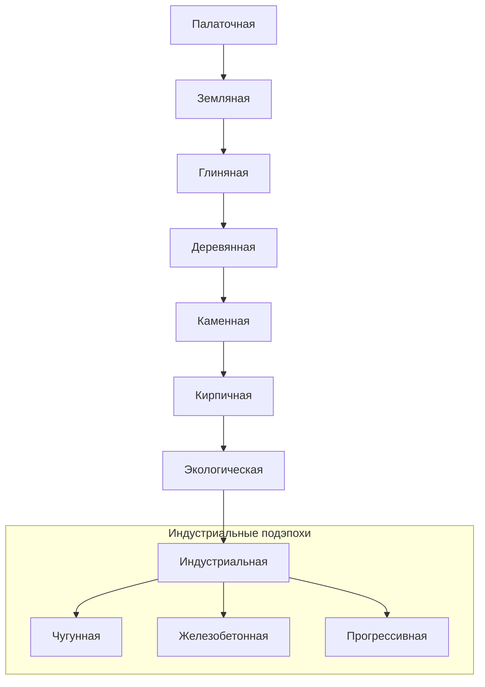

# Дизайн-документ: Эры развития

Этот документ описывает дизайн-роль каждой эры: fantasy, масштаб управления,
материалы, транспорт, дороги, торговлю и изменение фокуса игрока.

Точные условия переходов вынесены в [era_progression_gates.md](era_progression_gates.md).
Поперечные цепочки зданий и апгрейдов вынесены в
[building_progression.md](building_progression.md). Детальный стартовый сценарий
Палаточной эры описан в [tent_era_survival.md](tent_era_survival.md).

## 1. Общая концепция

Основная идея игры -- плавный переход от микро-симуляции выживания в диких
условиях к макро-симуляции крупного индустриального города.

### Смена масштаба

* **Доиндустриальные эры**: игрок управляет небольшим поселением, где важны
  отдельные жители, ручная логистика, еда, жилье, тепло, профессии и локальное
  благоустройство.
* **Индустриальная эра**: фокус сдвигается на макро-менеджмент: рабочие смены
  заводов, энергосети, транспортные потоки, кварталы и большие цепочки
  производства.

### Вид от первого лица

Игрок может в любой момент переключиться в режим от первого лица и пройтись по
поселению. Это должно работать как эмоциональная проверка прогресса: костры
становятся улицами, палатки -- домами, лавки -- магазинами, тропинки -- дорогами
с транспортом.

В FPP игрок видит не абстрактные бонусы, а бытовую жизнь: жители идут за едой,
работают у зданий, покупают товары, ездят на велосипедах, мопедах и автомобилях.

## 2. Таблица эр

| Эра / Код | Цель эры | Тип управления | Базовые материалы | Главный транспорт | Дорожная сеть |
| :--- | :--- | :--- | :--- | :--- | :--- |
| **1. Палаточная** (`TENT`) | Выжить | Выживание группы | Ветки, трава | Нет | Вытаптываемая тропинка |
| **2. Земляная** (`EARTH`) | Стабилизировать быт | Небольшая община | Почва, ветки, кожа | Велосипеды | Грунтовая дорога |
| **3. Глиняная** (`CLAY`) | Запустить ремесло и торговлю | Поселение ремесленников | Глина, простой металл | Велосипеды с тележкой | Глинобитная дорога |
| **4. Деревянная** (`WOOD`) | Построить развитую экономику | Деревянный городок | Бревна, доски | Мопеды | Деревянная мостовая |
| **5. Каменная** (`STONE`) | Сформировать городское управление | Каменный город | Камень, черепица | Мопеды с коляской | Каменная дорога |
| **6. Кирпичная** (`BRICK`) | Выйти к мануфактурам и плотной застройке | Ранний индустриальный узел | Кирпич, стекло | Авто и грузовики | Асфальтовая дорога |
| **7. Экологическая** (`ECO`) | Перейти к устойчивым технологиям | Эко-поселение | Эко-материалы, композиты | Электротранспорт | Эко-плитка и выделенные полосы |
| **8. Индустриальная** (`INDUSTRIAL`) | Управлять макро-индустрией | Макро-менеджмент | Чугун, железобетон, сплавы | Поезда, тяжелые грузовики | Асфальтобетон и железная дорога |

`ECO` и `INDUSTRIAL` пока являются дизайн-направлением. В текущей реализации
доменные правила переходов заканчиваются на `BRICK`.

## 3. Карта развития

## 4. Доиндустриальные эры

### 4.1. Палаточная эра (`Era.TENT`)

**Суть:** начало цивилизации. Жители живут в простейших палатках из веток и
травы, боятся холода, темноты, дождя и нехватки еды.

**Фокус игрока:**

* построить первый склад и костер;
* пережить первые ночи;
* перейти от ручных дневных приказов к первичной автоматизации;
* открыть палаточный рынок и купить инструменты для Земляной эры.

**Ограничения:**

* дороги существуют только как протоптанные тропинки;
* транспорта нет, все ходят пешком;
* образование отсутствует;
* до чиновника нет постоянных профессий и исследований; дневные приказы,
  земляные работы и управление рабочими местами доступны с самого начала;
* чиновник является исследователем — отдельная роль исследователя появится
  в земляной эре;
* торговля начинается как аварийные закупки через входную табличку.

Механика рабочих позиций, назначение чиновника и переход от микроменеджмента
к стратегическому управлению описаны в [work_positions.md](work_positions.md).
Подробные правила этой эры находятся в [tent_era_survival.md](tent_era_survival.md).

### 4.2. Земляная эра (`Era.EARTH`)

**Суть:** поселение уходит от временного лагеря к защищенному быту. Появляются
землянки, первые дороги, базовые ремесла и стабильная логистика.

**Фокус игрока:**

* заменить уязвимые палаточные решения земляными постройками;
* открыть почту и постоянных курьеров;
* перейти от ручной переноски к организованной доставке;
* подготовить экономику к глине и ремеслу.

**Ключевые изменения:**

* дороги: грунтовые дороги;
* транспорт: первые велосипеды;
* торговля: земляной рынок или лавка;
* образование: примитивная лесная школа как первый источник пассивного обучения;
* инфраструктура: почта открывает профессию курьера.

### 4.3. Глиняная эра (`Era.CLAY`)

**Суть:** открытие обжига глины, посуды, улучшенной гигиены и раннего
ремесленного производства.

**Фокус игрока:**

* наладить добычу и использование глины;
* улучшить жилье, туалеты и торговлю;
* расширить ассортимент товаров;
* подготовить деревообработку и переход к деревянному городу.

**Ключевые изменения:**

* дороги: глинобитные дороги;
* транспорт: велосипеды с тележкой;
* торговля: киоск или глиняный рынок;
* образование: общинная школа с ремесленным уклоном.

### 4.4. Деревянная эра (`Era.WOOD`)

**Суть:** поселение становится деревянным городком. Появляются пилорамы,
доски, полноценные дома, ратуша и более широкая экономика.

**Фокус игрока:**

* выстроить деревообработку;
* улучшить дома до высокого уровня;
* развить рынок и общественные здания;
* подготовиться к камню и более формальному управлению.

**Ключевые изменения:**

* дороги: деревянные мостовые;
* транспорт: мопеды или ранние моторные средства;
* торговля: полноценный рынок;
* образование: деревянная школа с подготовкой писарей и счетоводов.

### 4.5. Каменная эра (`Era.STONE`)

**Суть:** поселение превращается в устойчивый каменный город. Архитектура
становится долговечной, появляются более сложные мастерские и базовая политика.

**Фокус игрока:**

* построить префектуру и каменный рынок;
* развить каменную обработку;
* открыть гильдию строителей и постоянную профессию строителя;
* подготовить кирпичную плотную застройку.

**Ключевые изменения:**

* дороги: каменные дороги;
* транспорт: грузовые мопеды, мотороллеры, ранние паровые тягачи;
* торговля: магазин;
* образование: каменная гимназия с математикой и механикой;
* инфраструктура: гильдия строителей автоматизирует строительство.

### 4.6. Кирпичная эра (`Era.BRICK`)

**Суть:** вершина доиндустриального развития. Появляются кирпичные заводы,
мануфактуры, плотная застройка, автомобили и более сложное взаимодействие с
соседними поселениями.

**Фокус игрока:**

* развить кирпичное строительство;
* открыть мануфактуры и плотные городские сервисы;
* перейти от локальной логистики к большим потокам ресурсов;
* подготовить экологический или индустриальный этап.

**Ключевые изменения:**

* дороги: асфальтовые дороги;
* транспорт: легковые автомобили и грузовики;
* торговля: универмаг или торговый центр;
* образование: техническое училище и подготовка специалистов.

## 5. Постиндустриальные направления

### 5.1. Экологическая эра (`Era.ECO`)

Переходная эра, в которой поселение перестраивает производство, транспорт и
энергетику вокруг устойчивых технологий.

Ключевые темы:

* переработка отходов;
* очистка воды и почвы;
* чистая энергия;
* электротранспорт;
* баланс экологии и Wellbeing.

### 5.2. Индустриальная эра (`Era.INDUSTRIAL`)

Эра глобализации и заводов, где игра меняет масштаб. Вместо заботы об отдельном
жителе игрок управляет крупной инфраструктурой.

Подэпохи:

1. **Чугунная:** паровые двигатели, уголь, чугун, первые железные дороги.
2. **Железобетонная:** электричество, двигатели внутреннего сгорания, нефть,
   конвейеры, железобетон.
3. **Прогрессивная:** автоматизация, робототехника, атомная энергетика,
   композиты, дроны и маглев.

## 6. Торговля и Wellbeing

Торговля является мостом между экономикой поселения и удовлетворенностью
жителей. По мере развития эр торговые точки меняют не только числа, но и
поведение жителей в мире.

### 6.1. Потребительский спрос

У жителей, кроме базовых нужд, есть потребительский спрос. Житель зарабатывает
монеты, а затем тратит их в торговых зданиях на еду, одежду, мебель, посуду,
инструменты или деликатесы.

Покупка товаров снижает потребительский спрос и повышает Wellbeing.

### 6.2. Вид торговых точек в FPP

| Этап торговли | Вид сверху | Вид от первого лица |
| :--- | :--- | :--- |
| Лавка / лоток | Малый навес и ящики | Грубый прилавок, базовая еда |
| Киоск | Закрытая будка | Окно выдачи, первые бытовые товары |
| Рынок | Площадь с рядами | Несколько торговцев, толпы жителей |
| Магазин | Каменное здание с окнами | Полки, касса, корзинки, внутренняя навигация |
| Универмаг | Большое кирпично-стеклянное здание | Отделы, витрины, кафетерий, большой выбор |

## 7. Принцип технологического потолка

Эра задает максимальный уровень материалов, дорог, транспорта и зданий.
Прогрессия не должна позволять игроку строить кирпичный ресторан внутри
земляного поселения или запускать автомобили без подходящих дорог.

Технологический потолок применяется к:

* строительным материалам;
* доступным зданиям;
* апгрейдам зданий;
* дорогам;
* транспорту;
* профессиям и инфраструктуре, которая их обслуживает.
