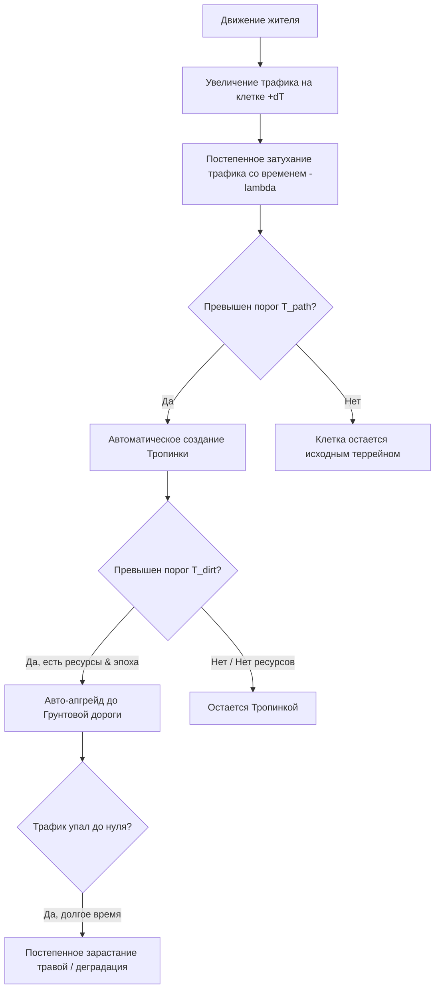

# Дизайн-документ: Система навигации и дорог (Navigation & Roads)

## 1. Введение и назначение системы

Настоящий документ описывает архитектуру и дизайн системы навигации (поиска пути) и дорожной сети для симулятора поселения. 

Дороги и движение жителей — это ключевая часть визуального и игрового опыта. Данная система решает три основные задачи:
1. **Реалистичное поведение**: Жители выбирают наиболее быстрые и логичные пути, отдавая приоритет дорогам, но срезая углы там, где это действительно выгодно.
2. **Динамический мир (Desire Lines)**: Ландшафт меняется под влиянием жителей. В часто используемых местах автоматически протаптываются тропинки, которые со временем эволюционируют в полноценные дороги.
3. **Экономическая и технологическая прогрессия**: Дорожная сеть развивается вместе с эпохами (эрами) поселения, требуя исследований, ресурсов и стратегического планирования со стороны игрока.

---

## 2. Анализ существующей системы навигации (без дорог)

На текущий момент навигация в игре устроена следующим образом:
- **`NavGrid`**: Хранит сетку клеток (`cell_size := 1.0`). Препятствия (здания, особенности террейна) помечаются как заблокированные клетки (`_blocked: Dictionary`).
- **`GridRouteService`**:
  - Использует поиск в ширину (BFS) в 4 направлениях (`LEFT`, `RIGHT`, `UP`, `DOWN`) для нахождения базового пути по клеткам.
  - Поиск является **неприоритетным** (у клеток нет стоимости прохода, они либо абсолютно проходимы, либо абсолютно заблокированы).
  - Путь сглаживается методом «натяжения струны» (`_smooth`) с помощью алгоритма трассировки луча Amanatides & Woo (`is_segment_clear`). Если между точками A и B по прямой нет препятствий, промежуточные точки удаляются, и юнит идет напрямую.

### Недостатки текущей системы для дорожной сети:
1. **Отсутствие весов клеток (BFS)**: Поиск в ширину не может отдать приоритет дороге перед травой, если путь по траве физически короче (меньше клеток).
2. **Наивное сглаживание**: Сглаживание пути (`_smooth`) полностью игнорирует покрытие. Если юнит идет вдоль изгиба дороги, алгоритм сглаживания построит прямую линию по диагонали (через грязь/траву), так как на пути нет твердых препятствий (зданий). Это визуально ломает идею использования дорог.
3. **Фиксированная скорость**: Нет штрафов за ходьбу по сложному ландшафту (болото, лес, песок) и бонусов за движение по мощеным дорогам.
4. **Нет поддержки транспорта**: Отсутствуют ограничения на движение техники/велосипедов (например, велосипед не должен ехать по лесной тропинке с такой же скоростью, как по асфальту, или вообще не должен иметь возможности там проехать).

---

## 3. Проектирование навигации без дорог (Целевое состояние)

Для качественного симулирования движения необходимо перевести навигацию на взвешенный поиск пути.

### 3.1. Переход на алгоритм A* (или Dijkstra)
Вместо BFS в `GridRouteService` внедряется взвешенный алгоритм A* на 8 направлений (с учетом диагоналей, где стоимость движения по диагонали умножается на $\approx 1.414$).

Каждая клетка $C(x,y)$ получает вес стоимости прохода $Weight(C) \ge 1.0$:
- **Заблокированная клетка**: Проход запрещен ($Weight = \infty$).
- **Ландшафт по умолчанию (Трава, обычная земля)**: Базовый вес $Weight_{grass} = 2.0$.
- **Тяжелый ландшафт (Песок, мелкий кустарник)**: Вес $Weight_{rough} = 3.0 - 4.0$.
- **Непроходимый ландшафт (Густой лес, болото)**: Вес $Weight_{swamp} = 8.0$ (или блокировка для определенных типов юнитов/транспорта).
- **Дорожное покрытие**: Вес $Weight_{road} = 1.0$ (базовый эталон).

Формула стоимости перехода из клетки $A$ в соседнюю клетку $B$:
$$Cost(A \to B) = \text{Distance}(A, B) \times Weight(B)$$

### 3.2. Скорость движения без дорог
Если юнит движется по бездорожью, его скорость штрафуется в зависимости от веса клетки. Базовая скорость юнита $Speed_{base}$ умножается на модификатор скорости покрытия $Modifier_{speed} = \frac{1.0}{Weight(C)}$ (или на специфический коэффициент):
- Движение по траве: Скорость составляет **50%** от нормальной ($Modifier = 0.5$).
- Движение по песку/грязи: Скорость составляет **30-40%** от нормальной.

### 3.3. Модификация сглаживания пути (Weighted String Pulling)
Сглаживание пути не должно уводить юнита с хорошего покрытия на плохое ради незначительного сокращения расстояния. 
**Решение**: Алгоритм `_smooth` разрешает соединить точки напрямую только в том случае, если средневзвешенная стоимость прямого пути не превышает стоимость пути по дорожной сетке (с учетом некоторого коэффициента допуска), либо если все клетки на пути луча имеют вес не хуже, чем у текущего пути. 
*Альтернатива*: Использование алгоритма **Theta*** с весами, который интегрирует проверку видимости непосредственно в процесс раскрытия вершин A*, сравнивая итоговую стоимость пути.

---

## 4. Взаимодействие навигации с дорожной сетью

Дороги являются модификатором сетки `NavGrid`. Укладка дороги на клетку $C(x,y)$ снижает ее вес $Weight(C)$ до $1.0$ (или ниже для продвинутых дорог) и меняет тип покрытия.

```text
Без дорог (A* выберет прямую линию, но со штрафом скорости):
[Старт] --- (Трава: вес 2.0) ---> [Цель]  (Итоговая стоимость пути высока)

С дорогой (A* предпочтет обходной путь по дороге, так как ее суммарный вес меньше):
[Старт] === (Дорога: вес 1.0) ===> [Поворот] === (Дорога: вес 1.0) ===> [Цель]
   \                                                                      /
    \--------------------- (Трава: вес 2.0) -----------------------------/
```

За счет разницы в весах ($Weight_{grass} = 2.0$ против $Weight_{road} = 1.0$) алгоритм A* автоматически выберет маршрут в обход по дорожной сети, даже если он физически длиннее (вплоть до двукратной разницы в расстоянии). Жители будут вести себя естественно: выходить на ближайшую дорогу, идти по ней до перекрестка и сворачивать к цели.

---

## 5. Типы дорог и их характеристики

В игре проектируется 5 типов дорожных покрытий. Каждый тип имеет свои требования к эпохе, ресурсам и накладывает ограничения на используемый транспорт.

| Тип покрытия | Скорость пешехода | Скорость транспорта | Допустимый транспорт | Стоимость (ресурсы и деньги) | Эра разблокировки |
| :--- | :---: | :---: | :--- | :--- | :--- |
| **Тропинка** *(Dirt Path)* | $100\%$ (База) | $0\%$ (Запрещено) | Только пешеходы | Бесплатно (автовытаптывание) | `Era.TENT` |
| **Грунтовая дорога** *(Dirt Road)* | $100\%$ | $100\%$ (Умеренная) | Пешеходы, Велосипеды, Ручные тележки | Труд строителей (время) | `Era.EARTH` |
| **Каменная дорога** *(Stone Road)* | $120\%$ | $130\%$ | Пешеходы, Велосипеды, Конные повозки | Камень, Золото + Труд | `Era.CLAY` |
| **Асфальтовая дорога** *(Asphalt Road)* | $140\%$ | $180\%$ | Все виды, включая легкий моторный транспорт | Гравий/Щебень, Битум (Нефть), Золото | `Era.STONE` |
| **Асфальто-бетонная** *(Asphalt-Concrete)* | $150\%$ | $220\%$ | Все виды, включая тяжелые грузовики | Бетон, Сталь (арматура), Золото | `Era.BRICK` |

### Логика ограничений транспорта:
- **Тропинка**: Представляет собой узкую неровную дорожку. Проезд на велосипедах или повозках невозможен (юниты на велосипедах будут спешиваться и катить их рядом со скоростью пешехода, либо поиск пути для транспорта заблокирует эту клетку).
- **Грунтовая дорога**: Становится доступен базовый транспорт (велосипеды, тележки курьеров). Моторная техника (машины) ехать здесь может, но со штрафом скорости (например, $50\%$ от своей базовой скорости) и риском застрять в дождь.
- **Асфальтовая и Асфальто-бетонная дороги**: Снимают любые ограничения скорости для автомобилей и грузовиков. Асфальто-бетонные дороги необходимы для тяжелой промышленной техники (например, крупных грузовиков лесопилки или карьера), которая наносит урон асфальту более низкого качества.

---

## 6. Создание дорог игроком (Ручной режим)

Игрок может вручную планировать дорожную сеть через интерфейс строительства.

1. **Инструмент разметки**: Игрок выбирает тип дороги и «рисует» линию на карте.
2. **Размещение чертежей (Blueprints)**:
   - Клетки будущей дороги размечаются как «строящиеся».
   - Они не изменяют проходимость мгновенно. Во время строительства они сохраняют свойства исходного террейна.
3. **Доставка ресурсов строителями**:
   - Система `SettlementDirector` генерирует заказы на доставку материалов (камень, битум, бетон) к строящимся сегментам дорог.
   - Логистическая служба доставляет ресурсы на место строительства.
4. **Строительные работы**:
   - Строители приходят на объект и тратят рабочие тики на укладку дороги.
   - По завершении клетка меняет свой тип в `NavGrid`, обновляется визуальный меш (или текстура террейна), и обновляется навигационная карта поселения.
5. **Ручной Upgrade**:
   - Игрок может выбрать существующую дорогу более низкого уровня и дать приказ улучшить ее. Процесс аналогичен строительству новой дороги, но учитывает уже имеющиеся ресурсы (например, улучшение грунтовой дороги до каменной стоит меньше камня, чем строительство каменной с нуля).

---

## 7. Динамическое автосоздание дорог (Желаемые тропы / Desire Lines)

Если игрок не строит дороги вручную, поселение адаптируется самостоятельно на основе реального поведения жителей.



### 7.1. Тепловая карта трафика (Traffic Heatmap)
Игра ведет скрытый учет интенсивности движения по каждой координате сетки.
- Каждая проходимая клетка $C(x,y)$ имеет вещественную переменную $TrafficIntensity \ge 0.0$.
- **Накопление**: Каждый раз, когда любой юнит наступает на клетку, значение увеличивается:
  $$TrafficIntensity(x,y) \leftarrow TrafficIntensity(x,y) + \Delta T$$
  где $\Delta T$ зависит от типа юнита (пешеход = $1.0$, курьер с тележкой = $1.5$, тяжелый транспорт = $3.0$).
- **Рассеивание (Decay)**: Раз в игровые сутки (или каждые несколько часов) интенсивность трафика снижается (затухает), симулируя зарастание травой и выветривание:
  $$TrafficIntensity(x,y) \leftarrow TrafficIntensity(x,y) \times (1 - \lambda)$$
  где $\lambda \in (0, 1)$ — коэффициент затухания (например, $\lambda = 0.15$ в сутки).

### 7.2. Эволюция покрытий
На основе уровня $TrafficIntensity$ происходят автоматические изменения:

1. **Появление Тропинки ($TrafficIntensity \ge Threshold_{path}$)**:
   - Как только интенсивность трафика на клетке бездорожья превышает $Threshold_{path}$ (например, $50$ единиц), клетка автоматически превращается в **Тропинку**.
   - Визуально на террейне прорисовывается протоптанная земля (через смешивание текстур / splatmap или замену вокселей).
   - Вес клетки в `NavGrid` снижается с $2.0$ (трава) до $1.0$ (тропинка).
   - Жители начинают активнее выбирать этот путь, так как стоимость прохода снизилась. Трафик на этой клетке начинает расти еще быстрее (положительная обратная связь).
   - **Экономика**: Переход в Тропинку абсолютно бесплатен для поселения. Это естественное следствие ходьбы.

2. **Модернизация в Грунтовую дорогу ($TrafficIntensity \ge Threshold_{dirt\_road}$)**:
   - Если трафик на тропинке продолжает расти и превышает порог $Threshold_{dirt\_road}$ (например, $200$ единиц), система инициирует автоматический апгрейд до **Грунтовой дороги**.
   - Апгрейд требует ресурсов поселения и работы строителей (см. раздел 8).
   - После завершения апгрейда на клетке разрешается движение простого транспорта (велосипеды, тележки), что повышает эффективность логистики.

### 7.3. Малозагруженные маршруты и приоритеты
- **Приоритет авто-апгрейда**: В первую очередь система модернизирует клетки с наивысшим избыточным трафиком. 
- Если маршрут малозагружен (трафик колеблется чуть выше порога), приоритет назначения строителей на этот участок будет минимальным. Он будет модернизирован только тогда, когда в поселении нет более важных строительных задач.

### 7.4. Обратный процесс: Зарастание (Degradation)
Если игрок перестроил город, и жители перестали ходить по старой автодороге или тропинке, значение $TrafficIntensity$ на ней начнет падать за счет Decay.
- Если трафик падает ниже $Threshold_{path\_degrade}$ и удерживается там в течение $N$ дней, дорога постепенно деградирует:
  - Грунтовая дорога $\to$ Тропинка $\to$ Заросший террейн (трава).
  - Мощеные дороги (каменные, асфальтовые) **не деградируют автоматически**, так как они укреплены искусственно. Их может демонтировать только игрок вручную (возвращая часть ресурсов).

---

## 8. Прогрессия: Эры, Исследования и Экономика

Автоматическое развитие дорог не должно происходить бесконтрольно, ломая экономический баланс поселения.

### 8.1. Зависимость от Эпохи (Era Limits)
Текущая эра поселения жестко ограничивает максимальный уровень автоматической модернизации дорог:
- `Era.TENT` (Палаточный лагерь): Максимальный авто-уровень — **Тропинка**. Грунтовые дороги заблокированы.
- `Era.EARTH` (Земляная эра): Максимальный авто-уровень — **Грунтовая дорога**.
- `Era.CLAY` / `Era.WOOD` / `Era.STONE`: Максимальный авто-уровень — **Каменная дорога**.
- `Era.BRICK` (Кирпичная эра): Допускается автоматический апгрейд до **Асфальтовой дороги** (при условии развитой индустрии).
- **Асфальто-бетонные дороги** никогда не строятся автоматически. Это стратегические магистрали высшего уровня, требующие исключительно ручной разметки игроком.

### 8.2. Система исследований (Technology Tree)
Уровни дорог должны быть изучены игроком в дереве технологий, прежде чем они станут доступны для строительства (как ручного, так и автоматического).

Пример структуры технологий в `BuildingCatalog.RESEARCH_TECHS`:
```gdscript
const RESEARCH_TECHS := {
	# ... существующие технологии
	"dirt_road_construction": {
		"name": "Грунтовые дороги и транспорт",
		"base_duration": 30.0,
		"required_skill": "construction",
		"target_building": "dirt_road", # Открывает грунтовые дороги
		"prerequisites": [],
		"cost": {"boards": 5, "money": 10}
	},
	"stone_road_paving": {
		"name": "Мощение камнем",
		"base_duration": 60.0,
		"required_skill": "construction",
		"target_building": "stone_road",
		"prerequisites": ["dirt_road_construction"],
		"cost": {"stone": 15, "money": 30}
	},
	"asphalt_laying": {
		"name": "Асфальтирование",
		"base_duration": 120.0,
		"required_skill": "engineer",
		"target_building": "asphalt_road",
		"prerequisites": ["stone_road_paving"],
		"cost": {"bricks": 30, "boards": 20, "money": 100}
	}
}
```

### 8.3. Экономика автоматического строительства
Когда клетка превышает порог трафика для перехода на следующий уровень (например, Тропинка $\to$ Грунтовая дорога), система запрашивает ресурсы.

**Механика выполнения авто-апгрейда**:
1. **Запрос бюджета**: Система автодорог запрашивает у поселения стоимость апгрейда клетки (например, $1$ дерево/глина и $2$ монеты за клетку грунтовой дороги).
2. **Проверка доступности**: Если ресурсы и деньги есть на складах, и лимит бюджета автодорог (настраиваемый игроком ползунок в интерфейсе) не превышен, ресурсы резервируются.
3. **Размещение авто-чертежа**: На клетку автоматически устанавливается невидимый чертеж дороги (авто-апгрейд).
4. **Интеграция с `SettlementDirector`**: 
   - Создается приказ на доставку материалов строителями со склада к этой клетке.
   - Строители приходят и строят дорогу.
5. **Финансовый лимит**: Игрок может в любой момент выключить автоматический апгрейд дорог в настройках поселения или ограничить процент ежедневно расходуемых на дороги денег/ресурсов (например, «тратить на дороги не более 10% от притока золота»).

---

## 9. Архитектурные интерфейсы и структура данных (Godot)

Для интеграции системы в существующую архитектуру Godot-проекта предлагается создать новый сервис `RoadNetworkService` под юрисдикцией фичи `world` или выделить отдельную фичу `routing` (как рекомендуется в `docs/architecture.md`).

### 9.1. Класс `RoadNetworkService`
Хранит состояние дорожной сети и тепловую карту трафика.

```gdscript
class_name RoadNetworkService
extends RefCounted

# Сетка интенсивностей трафика: Dictionary[Vector2i, float]
var traffic_heatmap: Dictionary = {}

# Сетка типов дорог: Dictionary[Vector2i, int (RoadType Enum)]
var road_grid: Dictionary = {}

# Ссылка на NavGrid для обновления весов проходимости
var nav_grid: NavGrid

enum RoadType { NONE, PATH, DIRT, STONE, ASPHALT, ASPHALT_CONCRETE }

func register_step(cell: Vector2i, unit_weight: float) -> void:
	# Вызывается при каждом шаге жителя на клетку
	var current_t = traffic_heatmap.get(cell, 0.0)
	traffic_heatmap[cell] = current_t + unit_weight
	_check_evolution(cell)

func process_daily_decay(decay_rate: float) -> void:
	# Вызывается раз в сутки для уменьшения трафика на всей карте
	for cell in traffic_heatmap.keys():
		var next_val = traffic_heatmap[cell] * (1.0 - decay_rate)
		if next_val < 0.1:
			traffic_heatmap.erase(cell)
			_check_degradation(cell)
		else:
			traffic_heatmap[cell] = next_val

func _check_evolution(cell: Vector2i) -> void:
	# Логика эволюции покрытия на основе порогов, эры и доступности исследований
	pass
```

### 9.2. Обновление `GridRouteService`
Метод поиска пути A* обращается к `RoadNetworkService` для получения веса ребра:

```gdscript
func get_cell_weight(cell: Vector2i) -> float:
	if not grid.is_walkable(cell):
		return INF
	
	var road_type = road_service.get_road_type(cell)
	match road_type:
		RoadType.NONE:
			return 2.0 # Трава (высокая стоимость прохода)
		RoadType.PATH:
			return 1.0 # Базовая стоимость
		RoadType.DIRT:
			return 1.0 # Базовая стоимость (преимущество для транспорта)
		RoadType.STONE:
			return 0.8 # Бонус скорости (быстрее, чем без дорог)
		RoadType.ASPHALT:
			return 0.7 # Высокий приоритет
		RoadType.ASPHALT_CONCRETE:
			return 0.6 # Максимальный приоритет
```

---

## 10. Рекомендация по разделению документа

Отвечая на вопрос о разделении: **настоятельно рекомендуется оставить эти темы в одном документе**. 

### Аргументы в пользу единого документа:
1. **Замкнутый цикл (Feedback Loop)**: Алгоритм навигации считывает типы дорог $\to$ жители выбирают пути на основе весов $\to$ движение жителей увеличивает трафик на клетках $\to$ тепловая карта трафика рождает новые дороги $\to$ новые дороги меняют веса для алгоритма навигации. Разделение этих частей на два документа разорвет понимание этого цикла разработчиком.
2. **Единая зона ответственности**: В соответствии с `docs/architecture.md`, вся логика маршрутизации и дорог относится к новой выделенной подсистеме (`routing` или `world`). Описание этой подсистемы в рамках одного документа упрощает поддержку кода.

Однако для удобства чтения документ структурирован на независимые модули:
- **Разделы 2 и 3**: Алгоритмическая часть (поиск пути A*, сглаживание и веса клеток). Интересно в первую очередь программисту навигации.
- **Разделы 4 и 5**: Геймдизайнерские настройки (типы дорог, модификаторы скоростей, виды транспорта). Справочник для балансировки.
- **Разделы 6, 7 и 8**: Экономика и логика эволюции (авто-апгрейды, эры, Desire Lines). Интересно дизайнеру систем и разработчику симуляции.
