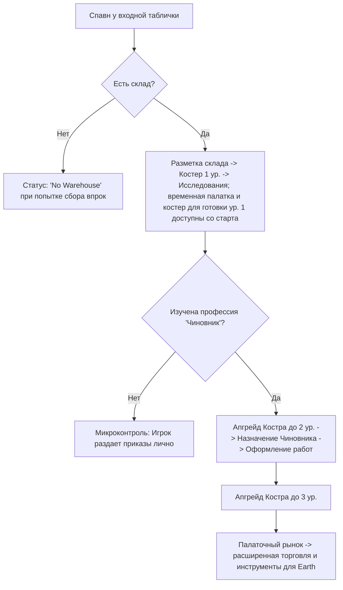

# Дизайн-документ: Выживание в Палаточной Эре (Tent Era Survival)

Связанные документы:

- [food_water_progression.md](food_water_progression.md) — прогрессия еды и воды от рюкзака до столовых;
- [storage_warehouses.md](storage_warehouses.md) — склады, рюкзак, кучи;
- [building_progression.md](building_progression.md) — цепочки зданий;
- [work_positions.md](../citizens/work_positions.md) — рабочие позиции, FPP-роли, чиновник;
- [village_territory.md](village_territory.md) — область деревни, радиусы застройки, границы;
- [weather.md](../engine/weather.md) — как устроены прогноз, облачность, ветер и небо.

## 1. Введение и общая концепция

Настоящий документ описывает игровой процесс, стартовые условия и механику выживания на самом раннем этапе игры — в **Палаточной эре** (`Era.TENT`). Фокус этой фазы смещен с макро-планирования на интенсивный микроменеджмент, индивидуальные потребности поселенцев и непосредственное участие игрока в жизни лагеря.

Цель этапа — заложить основу поселения, пережить первые критические ночи, преодолеть погодные трудности и перейти от ручного распределения задач к базовой автоматизации управления.

---

## 2. Стартовые условия и снаряжение

### 2.1. Состав группы
Игра начинается с прибытия группы из 4 энтузиастов:
*   **Гендерный баланс:** 2 мужчины, 2 женщины.
*   **Случайные навыки:** Каждый поселенец генерируется со случайным набором небольших начальных навыков (например, повышенная скорость ходьбы, лучшее восстановление после сна, бонус к добыче дерева).
*   **Уникальный навык: «Мастер на все руки» (Jack of all Trades):**
    *   Случайно выпадает одному из поселенцев.
    *   Увеличивает скорость выполнения любых подручных работ (сбор мелких веток, травы) на 30%.
    *   Ускоряет освоение любых других профессий физического труда на 20%.

### 2.2. Стартовый общак (Ресурсы группы)
Группа прибывает с пустыми руками в плане сырья, но объединяет свои личные запасы:
*   **Провизия (Еда):** 16 единиц консервов/сухпайков. Этого запаса хватает ровно на **4 дня** автономного существования группы (потребление: 1 единица еды на человека в сутки). Данный лимит мотивирует игрока в течение 4 дней исследовать и построить *Палатку охотников и собирателей*.
*   **Вода:** несколько единиц воды — достаточно на 1-2 дня.
*   **Капитал (Деньги):** 500 монет в «общаке» общины. Деньги — виртуальный ресурс; они не занимают место в рюкзаке или на складе.
*   **Брезентовый тент:** 1 штука. Это физический предмет, который появляется в стартовом рюкзаке. С ним связана первая дилемма: сделать из него сборщик росы или укрыть им склад-кучу от дождя.

Если в стартовом сценарии нет готового склада, еда, вода и тент оказываются в **рюкзаке** — временной куче рядом с поселенцами. Их можно использовать как расходники сразу, но чтобы тент и стройматериалы стали «официальными» запасами, их нужно перенести в склад. Подробные правила — в [storage_warehouses.md](storage_warehouses.md).

---

## 3. Минимальная торговля через входную табличку

Входная табличка обозначает начало поселения и является единственным связующим звеном с внешним миром на старте. Минимальная аварийная торговля доступна сразу, но это не полноценный рынок и не экспортная экономика. Позже появится возможность написать на табличке выбранное игроком название поселения.

### 3.1. Механика заказа
1.  Игрок кликает на входную табличку для открытия интерфейса заказа.
2.  Начальный ассортимент: **Еда (сухпайки)**, **Вода**, **Ведро**.
3.  **Ведро** сразу позволяет носить воду с водоёма, но стоит достаточно дорого,
    чтобы в самом начале покупать его было невыгодно. Оно видно в меню как
    стимул накапливать деньги через поденную работу.
4.  Игрок набирает товары в «корзину» и оплачивает заказ из стартового общака.
5.  Через табличку также можно отправить одного юнита на **поденную работу** во внешнее поселение на сутки — до исследования апгрейда доход случайный (4–12 монет).
6.  Изучив в меню исследований технологию **«Случайные заработки»**, доход от
    поденной работы становится постоянным и выше — фиксированные 16 монет (одноразовый апгрейд).

### 3.2. Экспедиция за покупками
*   После оплаты заказ не появляется мгновенно. Он переходит в статус «Ожидает доставки».
*   За покупками отправляется житель с дневным приказом **«Курьер»**, либо постоянный курьер, если такая профессия уже открыта. Игрок не может пойти сам, так как физически присутствует на карте и не может временно исчезать. Жителю выдается срочный приказ `&"trade_trip"`.
*   Срочный приказ не выдергивает жителя посреди текущего действия. Он резервируется как следующая работа и стартует, когда житель завершит текущий микро-шаг, если только игрок не отдаст прямой ручной приказ.
*   Юнит подходит к входной табличке и временно исчезает с карты (уходит во внешний мир).
*   **Время отсутствия:** 2 часа внутриигрового времени.
*   Через 2 часа юнит возвращается (спавнится у таблички) и относит товары на склад. Если доступного склада нет или все склады заполнены, он сбрасывает их на землю рядом с табличкой, образуя «открытую кучу ресурсов», которую необходимо разобрать. Подробнее о кучах и переполнении — в [storage_warehouses.md](storage_warehouses.md).

### 3.3. Логистика входной таблички
Входная табличка публикует особые логистические задачи, которые раньше закрывал
абстрактный резерв. В новой модели их выполняют только:

- **Курьер (дневной приказ)** — если игрок выдал дневной приказ конкретному жителю;
- **Курьер (постоянная профессия)** — если профессия уже открыта и оформлена через чиновника.

К этим задачам относятся:

- встреча новых жителей у таблички и сопровождение их в лагерь;
- поездка за покупками после оплаченного заказа;
- поденная работа/заработки во внешнем поселении;
- перенос доставленных товаров от таблички на склад или в открытую кучу.

Если нет активного дневного курьера и нет постоянного курьера, задача остается в
ожидании и UI должен явно показывать, что нужен дневной приказ «Курьер» или постоянный курьер.

---

## 4. Стартовая прогрессия и фазы управления

### 4.1. Фаза 1: Ручной микроконтроль (Игрок-ускоритель)
*   **Спавн:** Группа появляется на поляне у входной таблички.
*   **Блокировка сбора:** Пока не построен склад, поселенцы не могут накапливать ресурсы «впрок». Рюкзак не принимает добытую продукцию — это временное хранилище только для стартовых ресурсов и чит-добавлений. При попытке отправить юнита просто собирать ветки или траву без цели, он сбрасывает их и получает статус **«Нет склада»** (`status_no_warehouse`).
    *   *Исключение:* Перенос ресурсов с земли напрямую на чертеж строящегося здания разрешен без склада.
*   **Постройка склада:**
    1.  Игрок размещает чертеж склада (`Warehouse Level 1`). Чертёж можно
        поставить, даже если на складе ещё нет всех нужных материалов.
    2.  *Важная механика:* **Склад 1-го уровня — это просто открытая размеченная куча под открытым небом.** Он не имеет крыши и не защищает ресурсы от осадков, но выполняет роль первого логистического центра.
    3.  Все уже имеющиеся материалы **резервируются** под стройплощадку.
        Игрок может лично нести ресурсы руками, направить поселенцев вручную
        или (появившись позже) назначить курьеров. По мере доставки материалов
        строители работают над площадкой, даже если поставлены не все ресурсы.
    4.  Пока склад не построен, еда и вода из рюкзака расходуются напрямую; стройматериалы и тент нужно перенести в склад, прежде чем они засчитаются в общие запасы.
    5.  Ранние поручения являются дневными приказами. Их можно выдать заранее,
        даже если сейчас нет подходящей работы: например, назначить строителя до
        размещения следующего чертежа. Если житель сегодня помогает стройке,
        собирает траву или работает «Курьером», поручение сбрасывается в конце
        рабочего дня. Вечером игрок может назначить новые поручения на следующий
        `workday_id`; утром жители начнут выполнять именно их.
*   **Баланс раннего сбора:** Первый цикл не должен превращаться в ожидание. Ориентир: полноценный стартовый набор (костер, палатка, костер для готовки, палатка собирателей, сборщик росы) должен собираться примерно за 2 игровых дня. Для этого:
    *   Новичок в палаточной эре переносит минимум 2 единицы веток/травы за ходку; навык влияет на скорость цикла, а не на порог «1 или 2».
    *   Герой в режиме от первого лица работает как ускоритель дефицита: за один сбор приносит несколько единиц и может закрывать нужный ресурс быстрее, чем авто-план.
    *   Стартовый запас может включать 6 веток, чтобы первый костер ставился сразу и показывал основную петлю без гринда.
*   **Разблокировка Костра 1-го уровня (Campfire Lvl 1):**
    *   Как только склад построен, поселенцы могут собирать ресурсы впрок. Игрок размещает чертёж Костра 1-го уровня и может строить его постепенно — стартовой огневой точки у входной таблички нет. Чертёж разрешается ставить без полных материалов; курьеры доставят их со склада, а строители работают по мере поступления.
    *   **Механика апгрейда костра:** В лагере может быть только **один** Главный костер. Он является ключевым ориентиром (landmark) — его **нельзя сносить или свободно строить в произвольных местах**. Вместо этого игрок выбирает существующий костер и нажимает кнопку **«Улучшить» (Upgrade)**, что запускает процесс улучшения с резервированием и доставкой ресурсов со склада. Костер, как и любой другой источник огня, может погаснуть во время дождя или от нехватки дров, после чего его нужно заново разжечь.
    *   **Эффекты Костра 1-го уровня:**
        *   Снимает дебаф «Страх темноты и холода» (отсутствие активного огня в лагере).
        *   Открывает доступ к **Системе Изучения (Research System)**.
        *   *Временная палатка* (Temporary Tent) и *Костер для готовки ур. 1*
            доступны со старта. Изучения требуют уже улучшенные уровни и
            специализированные постройки.
    *   **Постройка и снос зданий:** В отличие от костра, все палатки, склады и костры для готовки являются зданиями. Игрок волен размещать их чертежи, строить силами поселенцев или сносить при необходимости перепланировки лагеря.

#### 4.1.1. Хранение, порча и аварийные кучи
Палаточная эра проводит игрока по лестнице хранения — рюкзак, склад-куча под открытым
небом, соломенный навес, брезентовый навес — чтобы он почувствовал переход от временного
лагеря к организованному быту. Вместимости, правила приёма, порчи и аварийных куч
принадлежат [storage_warehouses.md](storage_warehouses.md) и здесь не дублируются.

Для выживания существенны два следствия. Первое: **склад 1-го уровня не защищает** —
органика в нём и в кучах пропадает каждый день, а дождь ускоряет это по правилам §6.
Второе: **стартовый брезентовый тент можно потратить на накидку над кучей** вместо
сборщика росы — она защищает от дождя, но не увеличивает вместимость. Это первая
дилемма партии.

### 4.2. Фаза 2: Автоматизация (Костер 2-го уровня и Чиновник)
*   Изначально в игре нет автоматического распределения труда. Игрок должен самостоятельно управлять жителями и отдавать приказы вручную.
*   Для перехода к автоматизации труда необходимо:
    1.  Накопить ресурсы, выбрать Костер 1-го уровня и нажать кнопку **«Улучшить»** для перехода на **Костер 2-го уровня** — **Лобное место**.
    2.  После апгрейда костра разблокировать в системе исследований технологию **«Чиновник» (Official)**.
    3.  Назначить юнита (это может быть сам игрок в режиме мэра или любой из компаньонов) на рабочее место Чиновника у Главного костра.
*   **Результат:** Чиновник берет на себя оформление труда: ведет учет жителей без постоянной работы и направляет их на свободные вакансии зданий (например, в палатку собирателей или двор материалов) согласно приоритетам на `OrderBoard`.
*   **Режимы авторитета:** Главный герой не получает роль чиновника на старте и является обычным жителем без постоянной работы. Игрок сам выбирает, кого назначить чиновником. До назначения чиновника автоматизированная система работников недоступна: пользователь лично раздает указания каждому жителю. После назначения чиновник ведет учет постоянных вакансий, но дневные команды игрока остаются доступны.

### 4.3. Автоматизация сбора через двор материалов
Ручной сбор должен иметь понятную точку выхода. `materials_yard` в палаточной эре дает постоянные рабочие места сборщикам материалов и автоматизирует добычу веток/травы.

До постройки двора игрок выдает жителям дневные приказы на сбор. После постройки двора и назначения работников через чиновника сбор становится штатной профессией: работники двора сами выбирают, что важнее для лагеря сейчас, и сдают ресурсы на склад. Это обучающая арка: сначала игрок гоняет людей вручную, затем строит двор и освобождает внимание для выживания, стройки и планирования.

### 4.4. Палаточный рынок и инструменты перехода
После изучения **Торговли** на соломенном уровне открывается строительство
**соломенного палаточного рынка** у входной таблички. Рынок превращает аварийную
закупку в расширенную торговлю:

*   появляются более дорогие товары, включая брезент и ремесленные товары;
*   торговые поездки продолжают выполняться через `trade_trip`, но становятся плановой работой курьеров; до постоянного курьера их можно закрывать дневным приказом «Курьер»;
*   экспортная торговля и широкий ассортимент остаются будущим развитием рынка, а не условием самого перехода эпохи.

Для перехода в Земляную эру нужен **брезентовый палаточный рынок** — именно там
продаются инструменты и чертежи следующей эры. Таким образом, чтобы купить
инструменты, игроку уже нужно развить торговлю и базовую экономику лагеря.

---

## 5. Механика Первой Ночи и Убежища

Выживание в первую ночь — ключевой челлендж палаточной эры. Игроку необходимо правильно рассчитать тайм-менеджмент первого дня.

### 5.1. Временная палатка (Temporary Tent)
*   **Вместимость:** Вмещает всю группу (4 человека).
*   **Стоимость постройки:** Требует небольшого количества веток и сухой травы. На сбор ресурсов и постройку уходит около 4-5 игровых часов совместной работы.
*   **Опциональность:** Временная палатка — один из способов дать группе ночлег в первый день. Она **не обязательна**; если группа остаётся без жилья, с **22:00** до **06:00** жители без крова получают дебаф «Ночлег под открытым небом».
*   **Срок службы: одна ночь.** Временная палатка разбирается сама на рассвете (06:00), возвращая на землю часть потраченных веток и травы. Она не конкурирует с настоящим жильём и не может стать постоянным решением: чтобы группа спала под крышей вторую ночь, нужна либо новая временная палатка, либо соломенная/брезентовая палатка из ветки построек. Это и есть её роль — купить игроку первую ночь, а не отменить жилищную петлю.
*   **Автоматическое заселение:** В отличие от обычных домов, палатка не требует ручного размещения юнитов. При завершении строительства все unhoused-жители автоматически заселяются в палатку (до её вместимости). Кнопка «Settle unhoused resident» в меню палатки скрыта.
*   **Заказ новых юнитов:** Кнопка «Order a resident» в меню палатки активна только если текущее число жильцов меньше вместимости (4). Заказ ограничен **1 юнитом в день** на палатку. Новый юнит прибывает через входную табличку, как и при заказе через обычный дом. Кнопка не блокируется наличием unhoused-жителей (в отличие от обычных домов).

### 5.2. Дебафы отсутствия жилья (Wellbeing Decay)
*   В **22:00** все жители, не имеющие спального места, получают статус **«Ночлег под открытым небом»**.
*   Данный статус запускает быстрое снижение удовлетворенности (Wellbeing) — по **3% в час**.
*   Дополнительно снижается качество восстановления во время сна на земле (на 50%).
*   При падении Wellbeing до 0% житель впадает в депрессию и при первой возможности навсегда уходит из поселения во внешний мир через входную табличку.

#### 5.2.1. Риск-дизайн: чем игрок платит за ошибку

Партию нельзя проиграть, но ошибка обязана стоить дорого. Иначе выживание
превращается либо в игру с сохранениями, либо в декорацию, где ни одно решение не
имеет веса. Поэтому цена ошибки измеряется во **времени, ресурсах и людях**, а не в
экране Game Over.

**Правило телеграфирования.** Ни одно последствие не наступает без окна реакции
длиной не меньше игрового дня. Житель не уходит внезапно: сначала виден статус, затем
предупреждение в журнале, и только потом он собирается и идёт к табличке. Игрок,
который смотрит на поселение, обязан успеть вмешаться; игрок, который не смотрит,
теряет человека. Скрытый бросок кубика, отменяющий час игры, запрещён.

**Три ступени давления.** Каждая механика выживания (голод, холод, ночлег, огонь,
усталость) проходит их в одном и том же порядке, и порядок этот виден в UI:

| Ступень | Что происходит | Что теряет игрок |
| --- | --- | --- |
| Предупреждение | статус на жителе, строка в журнале, прогноз на утро | ничего — это приглашение к действию |
| Ущерб | падение эффективности, порча запаса, простой сервиса | часы работы и ресурсы |
| Потеря | житель уходит, здание выходит из строя, запас пропадает целиком | дни прогресса и навыки |

Ступень не перепрыгивается. Полное истощение при переработке — единственное
исключение, у которого есть шанс необратимого исхода в тот же день, и оно
телеграфируется отдельно ещё до выдачи приказа
([labour_time_and_overtime.md](../citizens/labour_time_and_overtime.md)).

**Уход жителя — это потеря навыков, а не смерти.** Ушедший уносит с собой освоенные
профессии, накопленный опыт и своё рабочее место. Замена приходит «нулевой», и
именно это делает потерю ощутимой: лагерь не уменьшается, он **глупеет**.

**Мягкое восстановление существует, но не бесплатно.** Игра не допускает состояния,
где на карте остался один герой без рабочей силы:

* если поселение опускается ниже стартовой численности, через входную табличку
  приходят новые выжившие — по одному, с интервалом от суток и **растущим** после
  каждого следующего;
* прибывший несёт минимальный аварийный запас (100 монет, 4 единицы еды) и никаких
  профессий;
* пока лагерь восстанавливается после ухода жителей, у поселения действует явный
  штраф репутации: новые выжившие приходят реже, а торговля через табличку дороже.

Смысл в том, чтобы «работа над ошибками» оставалась возможной, но не превращалась в
стратегию: загнать людей в ноль и набрать новых должно быть строго хуже, чем не
доводить до этого.

**Чего в риск-дизайне нет намеренно.** Нет мгновенной смерти от голода или холода,
нет каскада, где одна пропущенная ночь убивает лагерь за сутки, и нет наказания,
причину которого игрок не может назвать вслух после факта. Выживание должно читаться
как «я не успел», а не как «мне не повезло».

### 5.3. Механика пропуска ночи (Skip Night)
*   Игрок может нажать кнопку «Пропустить ночь» после окончания выбранного рабочего дня (в том числе до 22:00). Это сознательно завершает оставшуюся вечернюю часть дня и перематывает время на 06:00. Кнопка недоступна, пока действует хотя бы один приказ «Работать ночью и следующий день».
*   **22:00 — не условие пропуска:** это время начала ночных дебафов для жителей без жилья и/или огня. При пропуске ночи эти дебафы и их последствия все равно рассчитываются для периода с 22:00 до 06:00.
*   Перемотка сохраняет мировые позиции жителей. Утром им выдаются новые рабочие задания, но они не телепортируются к входной табличке.

Длительность рабочего дня и ночные приказы из меню костра определены в
[labour_time_and_overtime.md](../citizens/labour_time_and_overtime.md). Постоянного
переключателя ночных смен в дизайне нет.
*   **Ночные происшествия:** Пропуск ночи запускает генерацию случайного негативного события, которое выводится в лог сообщений утром:
    *   *«Барсуки-воришки пробрались в лагерь и утащили [3-5] единиц еды со склада/кучи.»*
    *   *«Бродячая дикая корова забрела на поляну и сжевала [10-15] единиц травы, приготовленной для строительства.»*
    *   *«Ночной порыв ветра раскидал незакрепленные ветки. Потеряно [5-8] единиц дерева.»*

---

### 5.4. Промысел и поденная работа
*   **Дом охотников и собирателей:** одно рабочее место на первом уровне, два на втором и три на третьем. Работники выбирают свободный источник пищи возле леса: дикое растение или животное на поляне.
*   **Источники пищи:** растение дает один сбор и появляется вновь спустя некоторое игровое время. Животные отображаются временными прямоугольниками, перемещаются по поляне и также появляются вновь после добычи.
*   **Логистика пищи:** работник возвращает добычу к своему дому и ожидает курьера; до появления курьера игрок может закрыть разовую перевозку дневным приказом «Курьер».
*   **Поденная работа:** через меню входной таблички можно отправить выбранного NPC в соседний населенный пункт. До почты и постоянных курьеров это делается дневным приказом «Курьер»; после появления почты поездку оформляет курьерская логистика. Исполнитель отсутствует одни сутки и до изучения апгрейда приносит случайный доход 4–12 монет. После изучения технологии **«Случайные заработки»** доход становится постоянным и равен 16 монет.

---

## 6. Влияние погоды

### 6.1. Утренний прогноз погоды

Каждое утро в **06:00** в интерфейсе появляется уведомление с прогнозом на день.
Как выбирается прогноз, как приходит фронт и как это выглядит на небе — в
[weather.md](../engine/weather.md); здесь только последствия для поселения.
1.  **Потепление (Warming):** Идеальная погода. Утомление от работы стандартное, дебафы минимальны.
2.  **Похолодание (Cooling):**
    *   Дебаф «Ночлег под открытым небом» удваивает скорость падения настроения (Wellbeing падает на **6% в час** вместо 3%).
    *   Расход калорий (голод) увеличивается на 25%.
3.  **Дождь (Rain):**
    *   **Порча сырья:** Так как Склад 1-го уровня является открытым, все лежащие на нем ресурсы (трава, еда, дерево) мокнут под дождем, начинают гнить и пропадать со скоростью **5% объема в час**.

Правила топлива, затухания и последствий костров определены в
[fire_sources.md](fire_sources.md).

---

## 7. Вовлекающие механики

Чтобы этап выживания не превращался в ожидание и кликер, вечер и утро дают игроку
решения с риском и планированием.

### 7.1. Посиделки у костра (Campfire Stories)
Каждый вечер после 20:00, когда поселенцы собираются у костра поужинать, игрок может выбрать одну из тем для обсуждения на ночь (задается через интерфейс костра):
*   **«Оптимистичные истории»:** Повышают скорость восстановления Wellbeing за ночь на 25%, но жители засыпают на час позже (хуже восстанавливаются утром).
*   **«Обучающие байки»:** Позволяют жителям поделиться опытом. Случайный житель получает +10% к прогрессу одного из физических навыков на следующий день.
*   **«План на завтра»:** Увеличивает скорость работы над выбранным типом задач (например, сбор дерева) на 15% на следующий день.

### 7.2. Панель жизненных решений (Frostpunk-style Decision Board)

Иногда утром, в 06:00 одновременно с прогнозом погоды, на экране появляется
интерактивная панель решений, требующая от игрока сложного выбора. Эти события создают
риск-награду и влияют на баланс сил в общине.

Система реализована data-driven: определения событий, условий, выборов и последствий —
данные, а не ветвления в игровом цикле. У события есть условия (эра, погода, ресурсы,
день, население, флаги), кулдаун, цепочки через флаги, отложенные последствия и
случайные исходы.

**Каталог событий палаточной эры принадлежит
[event_system.md](event_system.md) §3** и здесь не дублируется: двенадцать событий с их
условиями, кулдаунами, вариантами выбора и последствиями описаны там одним списком.
Игровая связка с этим документом ровно одна: событие `protect_firewood` завязано на
дождь из §6 и приводит к дебафу «Слезящиеся глаза» от сырых дров, а `forest_ranger` →
`wild_boars` — на запасы еды из §4.1.1.

### 7.3. Случайные гости и бартер

Лагерь стоит у дороги, поэтому раз в несколько дней мимо проходит путник, турист или
лесник. Они не вступают в поселение, а предлагают быстрый бартер у таблички: брезент за
горячий суп и ночлег, предупреждение о кабанах за мелочь. Механически это обычные
события ([event_system.md](event_system.md) §3 — `traveler`, `forest_ranger`), а не
отдельная система торговли: у гостя нет ассортимента, цен и очереди.
