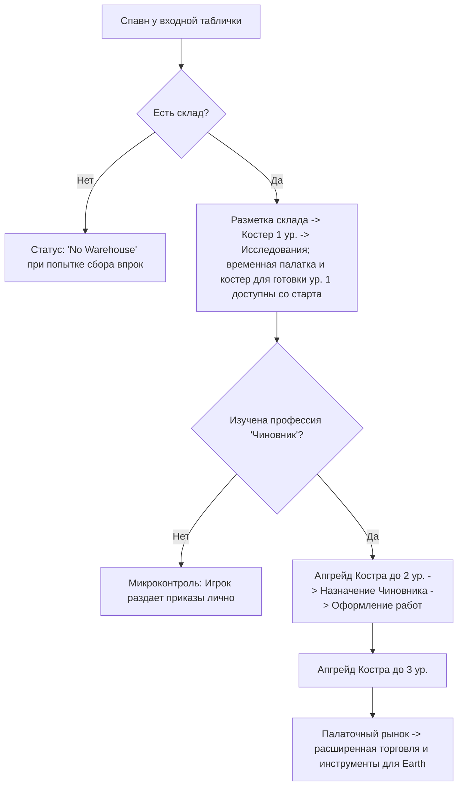

# Дизайн-документ: Выживание в Палаточной Эре (Tent Era Survival)

## 1. Введение и общая концепция

Настоящий документ описывает игровой процесс, стартовые условия и механику выживания на самом раннем этапе игры — в **Палаточной эре** (`Era.TENT`). Фокус этой фазы смещен с макро-планирования на интенсивный микроменеджмент, индивидуальные потребности поселенцев и непосредственное участие игрока в жизни лагеря.

Цель этапа — заложить основу поселения, пережить первые критические ночи, преодолеть погодные трудности и перейти от ручного распределения задач к базовой автоматизации управления.

---

## 2. Стартовые условия и снаряжение

### 2.1. Состав группы
Игра начинается с прибытия группы из 4 энтузиастов:
*   **Гендерный баланс:** 2 мужчины, 2 женщины.
*   **Случайные навыки:** Каждый поселенец генерируется со случайным набором небольших начальных навыков (например, повышенная скорость ходьбы, лучшее восстановление после сна, бонус к добыче дерева).
*   **Уникальный навык: «Мастер на все руки» (Jack of all Trades):**
    *   Случайно выпадает одному из поселенцев.
    *   Увеличивает скорость выполнения любых подручных работ (сбор мелких веток, травы) на 30%.
    *   Ускоряет освоение любых других профессий физического труда на 20%.

### 2.2. Стартовый общак (Ресурсы группы)
Группа прибывает с пустыми руками в плане сырья, но объединяет свои личные запасы:
*   **Провизия (Еда):** 16 единиц консервов/сухпайков. Этого запаса хватает ровно на **4 дня** автономного существования группы (потребление: 1 единица еды на человека в сутки). Данный лимит мотивирует игрока в течение 4 дней исследовать и построить *Палатку охотников и собирателей*.
*   **Капитал (Деньги):** 500 монет в «общаке» общины. Деньги используются для экстренной закупки расходников через входную табличку поселения.

### 2.3. Стартовое снаряжение и инструменты
*   **Бесконечное огниво (Flint & Steel):**
    *   Инструмент первой необходимости. Не имеет прочности/износа и не может быть потерян.
    *   Гарантирует невозможность софт-лока (ситуации, когда костер потух, а разжечь его нечем).
*   **Комплект строительных перчаток (Construction Gloves Set):**
    *   Перчатки используются и хранятся как общий ресурс на складе (в виде комплектов).
    *   Комплект имеет общий запас прочности (**Durability: 100%**).
    *   При выполнении физических работ (рубка веток, сбор колючего кустарника, переноска камней, строительство) прочность текущего комплекта постепенно снижается.
    *   Когда прочность текущего активного комплекта падает до 0%, он считается изношенным, и автоматически начинает расходоваться (изнашиваться) следующий комплект, хранящийся на складе.
    *   Если на складе не осталось целых комплектов перчаток (все изношены):
        *   Все поселенцы, занятые физическим трудом, получают постоянный дебаф настроения «Ободранные руки» (Wellbeing падает на 1% в час во время работы).
        *   Скорость выполнения физических работ для всех снижается на 40%.
        *   Поселенцы отказываются работать, если уровень их Wellbeing падает ниже 30% и на складе нет перчаток.
        *   Новые комплекты перчаток закупаются через входную табличку поселения.

---

## 3. Минимальная торговля через входную табличку

Входная табличка обозначает начало поселения и является единственным связующим звеном с внешним миром на старте. Минимальная аварийная торговля доступна сразу, но это не полноценный рынок и не экспортная экономика. Позже появится возможность написать на табличке выбранное игроком название поселения.

### 3.1. Механика заказа
1.  Игрок кликает на входную табличку для открытия интерфейса заказа.
2.  Начальный ассортимент ограничен: **Еда (сухпайки)** и **Комплекты строительных перчаток**.
3.  Игрок набирает товары в «корзину» и оплачивает заказ из стартового общака.

### 3.2. Экспедиция за покупками
*   После оплаты заказ не появляется мгновенно. Он переходит в статус «Ожидает доставки».
*   За покупками отправляется житель с дневным приказом **«Помощник»**, либо постоянный курьер, если такая профессия уже открыта. Игрок не может пойти сам, так как физически присутствует на карте и не может временно исчезать. Жителю выдается срочный приказ `&"trade_trip"`.
*   Срочный приказ не выдергивает жителя посреди текущего действия. Он резервируется как следующая работа и стартует, когда житель завершит текущий микро-шаг, если только игрок не отдаст прямой ручной приказ.
*   Юнит подходит к входной табличке и временно исчезает с карты (уходит во внешний мир).
*   **Время отсутствия:** 2 часа внутриигрового времени.
*   Через 2 часа юнит возвращается (спавнится у таблички) и относит товары на склад. Если склада нет, он сбрасывает их на землю рядом с табличкой, образуя «открытую кучу ресурсов», которую необходимо разобрать (это стандартное поведение ИИ при отсутствии доступного склада).

### 3.3. Логистика входной таблички
Входная табличка публикует особые логистические задачи, которые раньше закрывал
абстрактный резерв. В новой модели их выполняют только:

- **Помощник** — если игрок выдал дневной приказ конкретному жителю;
- **Курьер** — если профессия уже открыта и оформлена через чиновника.

К этим задачам относятся:

- встреча новых жителей у таблички и сопровождение их в лагерь;
- поездка за покупками после оплаченного заказа;
- поденная работа/заработки во внешнем поселении;
- перенос доставленных товаров от таблички на склад или в открытую кучу.

Если нет активного Помощника и нет постоянного курьера, задача остается в
ожидании и UI должен явно показывать, что нужен Помощник или Курьер.

---

## 4. Стартовая прогрессия и фазы управления

### 4.1. Фаза 1: Ручной микроконтроль (Игрок-ускоритель)
*   **Спавн:** Группа появляется на поляне у входной таблички.
*   **Блокировка сбора:** Пока не построен склад, поселенцы не могут накапливать ресурсы «впрок» (складывать в инвентарь или переносить без цели). При попытке отправить юнита просто собирать ветки или траву, он выполняет анимацию сбора, но не может положить ресурс в инвентарь, сбрасывает его и получает статус **«Нет склада»** (`status_no_warehouse`).
    *   *Исключение:* Перенос ресурсов с земли напрямую на чертеж строящегося здания разрешен без склада.
*   **Постройка склада:**
    1.  Игрок размещает чертеж склада (`Warehouse Level 1`). 
    2.  *Важная механика:* **Склад 1-го уровня — это просто открытая размеченная куча под открытым небом.** Он не имеет крыши и не защищает ресурсы от осадков, но выполняет роль логистического центра (позволяет накапливать ресурсы и использовать их для чертежей).
    3.  Игрок должен лично собирать ресурсы (ветки, траву) руками и носить их на стройплощадку склада, либо направлять поселенцев вручную переносить ресурсы непосредственно к чертежу.
    4.  Ранние поручения являются дневными приказами. Их можно выдать заранее,
        даже если сейчас нет подходящей работы: например, назначить строителя до
        размещения следующего чертежа. Если житель сегодня помогает стройке,
        собирает траву или работает «Помощником», поручение сбрасывается в конце
        рабочего дня. Вечером игрок может назначить новые поручения на следующий
        `workday_id`; утром жители начнут выполнять именно их.
*   **Баланс раннего сбора:** Первый цикл не должен превращаться в ожидание. Ориентир: полноценный стартовый набор (костер, палатка, костер для готовки, палатка собирателей, сборщик росы) должен собираться примерно за 2 игровых дня. Для этого:
    *   Новичок в палаточной эре переносит минимум 2 единицы веток/травы за ходку; навык влияет на скорость цикла, а не на порог «1 или 2».
    *   Герой в режиме от первого лица работает как ускоритель дефицита: за один сбор приносит несколько единиц и может закрывать нужный ресурс быстрее, чем авто-план.
    *   Стартовый запас может включать 6 веток, чтобы первый костер ставился сразу и показывал основную петлю без гринда.
*   **Разблокировка Костра 1-го уровня (Campfire Lvl 1):**
    *   Как только склад построен, поселенцы могут собирать ресурсы впрок. Игрок может улучшить стартовое тлеющее кострище до полноценного Костра 1-го уровня.
    *   **Механика апгрейда костра:** Костер является ключевым ориентиром лагеря (landmark) и не считается обычным зданием — его **нельзя сносить или свободно строить в произвольных местах**. Вместо этого игрок выбирает костер и нажимает кнопку **«Улучшить» (Upgrade)**, что запускает процесс улучшения с расходом ресурсов со склада.
    *   **Эффекты Костра 1-го уровня:**
        *   Снимает дебаф «Страх темноты и холода» (отсутствие активного огня в лагере).
        *   Открывает доступ к **Системе Изучения (Research System)**.
        *   *Временная палатка* (Temporary Tent) и *Костер для готовки ур. 1*
            доступны со старта. Изучения требуют уже улучшенные уровни и
            специализированные постройки.
    *   **Постройка и снос зданий:** В отличие от костра, все палатки, склады и костры для готовки являются зданиями. Игрок волен размещать их чертежи, строить силами поселенцев или сносить при необходимости перепланировки лагеря.

#### 4.1.1. Хранение, порча и аварийные кучи
Палаточная эра использует два уровня хранения, чтобы игрок почувствовал переход от временного лагеря к организованному быту.

| Уровень | Образ | Вместимость | Правило |
| :--- | :--- | :---: | :--- |
| **Склад ур. 1** (`warehouse`) | Размеченная куча материалов под открытым небом | 24 | Бесплатен, разрешает накопление и логистику, но не защищает ресурсы. |
| **Склад ур. 2** (`warehouse_lvl2`) | Палаточный навес | 48 | Требует исследования и ресурсов, защищает содержимое от обычной порчи. |

Открытые кучи каждый день теряют часть органики даже без дождя: еда — до 10% в сутки, трава/ветки/бревна/доски — до 5% в сутки. Камень, глина и кирпич не распадаются. Дождь ускоряет этот процесс по правилам раздела 6.1.

Если суммарный запас поселения превышает защищенную вместимость складов, излишек считается лежащим в открытых кучах и попадает под порчу. При сносе или разрушении здания на месте появляется временная куча: в нее возвращается часть материалов здания, а при сносе склада — еще и его содержимое. Такие кучи должны быстро разбираться Помощниками или курьерами, иначе органика в них продолжает пропадать.

### 4.2. Фаза 2: Автоматизация (Костер 2-го уровня и Чиновник)
*   Изначально в игре нет автоматического распределения труда. Игрок должен самостоятельно управлять жителями и отдавать приказы вручную.
*   Для перехода к автоматизации труда необходимо:
    1.  Разблокировать в системе исследований технологию **«Чиновник» (Official)**.
    2.  Накопить ресурсы, выбрать Костер 1-го уровня и нажать кнопку **«Улучшить»** для перехода на **Костер 2-го уровня** (Главный костер).
    3.  Назначить юнита (это может быть сам игрок в режиме мэра или любой из компаньонов) на рабочее место Чиновника у Главного костра.
*   **Результат:** Чиновник берет на себя оформление труда: ведет учет жителей без постоянной работы и направляет их на свободные вакансии зданий (например, в палатку собирателей или двор материалов) согласно приоритетам на `OrderBoard`.
*   **Режимы авторитета:** Главный герой не получает роль чиновника на старте и является обычным жителем без постоянной работы. Игрок сам выбирает, кого назначить чиновником. До назначения чиновника автоматизированная система работников недоступна: пользователь лично раздает указания каждому жителю. После назначения чиновник ведет учет постоянных вакансий, но дневные команды игрока остаются доступны.

### 4.3. Автоматизация сбора через двор материалов
Ручной сбор должен иметь понятную точку выхода. `materials_yard` в палаточной эре дает постоянные рабочие места сборщикам материалов и автоматизирует добычу веток/травы.

До постройки двора игрок выдает жителям дневные приказы на сбор. После постройки двора и назначения работников через чиновника сбор становится штатной профессией: работники двора сами выбирают, что важнее для лагеря сейчас, и сдают ресурсы на склад. Это обучающая арка: сначала игрок гоняет людей вручную, затем строит двор и освобождает внимание для выживания, стройки и планирования.

### 4.4. Палаточный рынок и инструменты перехода
Костер 3-го уровня открывает строительство палаточного рынка у входной таблички. Рынок превращает аварийную закупку в расширенную торговлю:

*   появляются более дорогие товары и инструменты, нужные для перехода в `Era.EARTH`;
*   торговые поездки продолжают выполняться через `trade_trip`, но становятся плановой работой курьеров; до постоянного курьера их можно закрывать дневным приказом «Помощник»;
*   экспортная торговля и широкий ассортимент остаются будущим развитием рынка, а не условием самого перехода эпохи.

Переход в Земляную эру проверяет только наличие набора инструментов. Остальные требования являются естественными предпосылками: чтобы купить инструменты, игроку уже нужно развить костер, рынок и базовую экономику лагеря.

---

## 5. Механика Первой Ночи и Убежища

Выживание в первую ночь — ключевой челлендж палаточной эры. Игроку необходимо правильно рассчитать тайм-менеджмент первого дня.

### 5.1. Временная палатка (Temporary Tent)
*   **Вместимость:** Вмещает всю группу (4 человека).
*   **Стоимость постройки:** Требует небольшого количества веток и сухой травы. На сбор ресурсов и постройку уходит около 4-5 игровых часов совместной работы.
*   **Дедлайн:** Строительство должно быть завершено строго до **22:00**.
*   **Срок службы:** Временная палатка автоматически разрушается на следующее утро в **06:00**. При разрушении на землю выпадает 30% ресурсов, потраченных на её постройку.

### 5.2. Дебафы отсутствия жилья (Wellbeing Decay)
*   В **22:00** все жители, не имеющие спального места, получают статус **«Ночлег под открытым небом»**.
*   Данный статус запускает быстрое снижение удовлетворенности (Wellbeing) — по **3% в час**.
*   Дополнительно снижается качество восстановления во время сна на земле (на 50%).
*   При падении Wellbeing до 0% житель впадает в депрессию и при первой возможности навсегда уходит из поселения во внешний мир через входную табличку.

#### 5.2.1. Механика мягкого перезапуска (Lone Player Protection & Gradual Recovery)
*   **Правило:** Игра не допускает ситуации, когда на карте остается только сам игрок без рабочей силы, что привело бы к завершению игры (Game Over). Вместо этого запускается система мягкого восстановления лагеря.
*   **Первая стадия (Прибытие лидера спасения):** Если из-за низкого Wellbeing последний (четвертый) NPC-поселенец покидает карту:
    *   Запускается таймер ожидания (24 часа).
    *   Через входную табличку в лагерь приходит **один новый случайный NPC-беженец**.
    *   Его встречает Помощник или курьер. Если такого исполнителя нет, новичок ждет у таблички, а UI показывает задачу встречи.
    *   Он приносит минимальный аварийный комплект припасов: 100 монет, 4 единицы еды, 1 комплект строительных перчаток.
*   **Вторая стадия (Постепенное восполнение группы):**
    *   Пока численность NPC-поселенцев в лагере меньше стартовых 4 человек, игра продолжает с периодичностью в 24–48 часов присылать по одному новому выжившему.
    *   Каждый новый поселенец прибывает через входную табличку.
    *   Процесс продолжается до тех пор, пока группа снова не достигнет **4 человек**.
    *   *Игровой смысл:* Это позволяет игроку сделать «работу над ошибками», не теряя прогресс постройки лагеря, и начать выживание заново с новыми силами.

### 5.3. Механика пропуска ночи (Skip Night)
*   Игрок может нажать кнопку «Пропустить ночь» после окончания выбранного рабочего дня (в том числе до 22:00). Это сознательно завершает оставшуюся вечернюю часть дня и перематывает время на 06:00. Кнопка недоступна только при разрешенных ночных сменах.
*   **22:00 — не условие пропуска:** это время начала ночных дебафов для жителей без жилья и/или огня. При пропуске ночи эти дебафы и их последствия все равно рассчитываются для периода с 22:00 до 06:00.
*   Перемотка сохраняет мировые позиции жителей. Утром им выдаются новые рабочие задания, но они не телепортируются к входной табличке.
*   **Ночные происшествия:** Пропуск ночи запускает генерацию случайного негативного события, которое выводится в лог сообщений утром:
    *   *«Барсуки-воришки пробрались в лагерь и утащили [3-5] единиц еды со склада/кучи.»*
    *   *«Бродячая дикая корова забрела на поляну и сжевала [10-15] единиц травы, приготовленной для строительства.»*
    *   *«Ночной порыв ветра раскидал незакрепленные ветки. Потеряно [5-8] единиц дерева.»*
    *   *«В лагерь забежали еноты и погрызли запасные строительные перчатки (снижение прочности случайных перчаток на складе на 20%).»*

---

### 5.4. Промысел и поденная работа
*   **Дом охотников и собирателей:** одно рабочее место на первом уровне, два на втором и три на третьем. Работники выбирают свободный источник пищи возле леса: дикое растение или животное на поляне.
*   **Источники пищи:** растение дает один сбор и появляется вновь спустя некоторое игровое время. Животные отображаются временными прямоугольниками, перемещаются по поляне и также появляются вновь после добычи.
*   **Логистика пищи:** работник возвращает добычу к своему дому и ожидает курьера; до появления курьера игрок может закрыть разовую перевозку дневным приказом «Помощник».
*   **Поденная работа:** через меню входной таблички можно отправить выбранного NPC в соседний населенный пункт. До почты и постоянных курьеров это делается дневным приказом «Помощник»; после появления почты поездку оформляет курьерская логистика. Исполнитель отсутствует одни сутки и по возвращении приносит 8 монет.

---

## 6. Влияние погоды и потребность в огне

### 6.1. Утренний прогноз погоды
Каждое утро в **06:00** в интерфейсе появляется уведомление с прогнозом на день:
1.  **Потепление (Warming):** Идеальная погода. Утомление от работы стандартное, дебафы минимальны.
2.  **Похолодание (Cooling):**
    *   Дебаф «Ночлег под открытым небом» удваивает скорость падения настроения (Wellbeing падает на **6% в час** вместо 3%).
    *   Расход калорий (голод) увеличивается на 25%.
3.  **Дождь (Rain):**
    *   **Тушение костров:** Дождь с вероятностью 100% тушит все открытые костры каждые несколько часов. Игрок должен подойти к костру и заново разжечь его с помощью огнива.
    *   **Порча сырья:** Так как Склад 1-го уровня является открытым, все лежащие на нем ресурсы (трава, еда, дерево) мокнут под дождем, начинают гнить и пропадать со скоростью **5% объема в час**.

### 6.2. Потребность в тепле (Fire Requirement)
*   В лагере круглосуточно должен гореть хотя бы один костер.
*   Если в поселении гаснет последний источник огня (из-за дождя или отсутствия дров):
    *   Все поселенцы мгновенно получают дебаф **«Страх темноты и холода»**.
    *   Wellbeing падает на **2% в час** (даже днем).
    *   При наступлении ночи (после 22:00) без костра дебаф холода суммируется с дебафом отсутствия жилья, приводя к критическому падению параметров выживших.

---

## 7. Идеи для углубления геймплея выживания (Вовлекающие механики)

Для того чтобы этап выживания не превращался в рутинное ожидание и "кликер", предлагаются следующие взаимосвязанные механики, завязанные на решениях игрока, рисках и планировании:

### 7.1. Посиделки у костра (Campfire Stories)
Каждый вечер после 20:00, когда поселенцы собираются у костра поужинать, игрок может выбрать одну из тем для обсуждения на ночь (задается через интерфейс костра):
*   **«Оптимистичные истории»:** Повышают скорость восстановления Wellbeing за ночь на 25%, но жители засыпают на час позже (хуже восстанавливаются утром).
*   **«Обучающие байки»:** Позволяют жителям поделиться опытом. Случайный житель получает +10% к прогрессу одного из физических навыков на следующий день.
*   **«План на завтра»:** Увеличивает скорость работы над выбранным типом задач (например, сбор дерева) на 15% на следующий день, но повышает ночной расход калорий из-за стресса планирования.

### 7.2. Панель жизненных решений (Frostpunk-style Decision Board)
Иногда утром (в 06:00 одновременно с прогнозом погоды и сообщением о надвигающемся дожде) на экране появляется интерактивная панель принятия решений, требующая от игрока сделать сложный выбор. Эти события создают риск-награду и влияют на баланс сил в общине.

#### Событие 1: «Угроза намокания дров» (Защита запасов дров)
*   *Контекст:* Утренний прогноз сообщает о сильном ливне. Склад 1-го уровня открыт, и все дрова для костра промокнут. Сырые дрова при горении дымят (накладывая дебаф **«Слезящиеся глаза»** в определенном радиусе от костра, что снижает скорость работы поселенцев на 30% и заставляет игрока менять приказы на добычу в отдаленных точках).
*   *Выбор 1: Выделить человека на спасение дров.*
    *   *Цена:* Один случайный NPC-выживший на 3 часа выбывает из экономики поселения. Он занят спасением дров (укрывает кучу дров на открытом складе ветками, листьями или брезентом).
    *   *Результат:* Дрова спасены. Костер будет гореть чисто, без дыма и дебафов.
*   *Выбор 2: Игнорировать угрозу.*
    *   *Цена:* Никто не отвлекается от текущей работы.
    *   *Результат:* Все дрова промокают. На следующий день при горении костер дымит в радиусе 15 метров, накладывая дебаф «Слезящиеся глаза» на всех, кто находится рядом.

#### Событие 2: «Неопознанные лесные дары» (Грибы и ягоды)
*   *Контекст:* Собиратели нашли в лесу кусты с неизвестными ягодами.
*   *Выбор 1: Рискнуть и попробовать.*
    *   *Шанс 50% (Успех):* Дары съедобны. Они превращаются в еду высокого качества, временно повышающую Wellbeing всей группы на 20%.
    *   *Шанс 50% (Провал):* Тяжелое отравление. Один случайный поселенец заболевает на 24 часа. Он не может работать (статус безработного), медленно ходит и, если у него есть палатка, весь день проводит дома.
*   *Выбор 2: Выбросить дары.*
    *   *Результат:* Ресурсы утилизируются без последствий.

### 7.3. Случайные гости и бартер
Поскольку лагерь находится у дороги (входная табличка), раз в 3-4 дня мимо может проходить случайный путник, турист или местный лесник:
*   Они не вступают в поселение, но предлагают быстрый бартер у таблички.
*   Например, заблудившийся турист готов отдать качественный брезент (защищает кучу ресурсов от дождя) за порцию горячего супа и ночлег у костра.
*   Лесник может предупредить о грядущем нашествии диких кабанов (что позволяет игроку вовремя спрятать еду в склад) в обмен на пару пачек сигарет или батарейки из машины.
